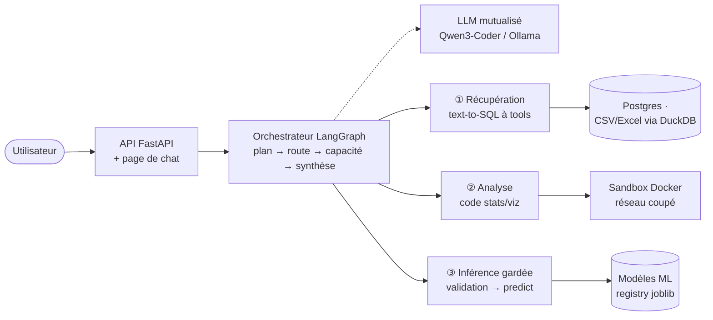

# data-analyst-agent

Agent conversationnel sur données, **on-premise**. À partir d'une source déclarée (fichier Excel/CSV ou base Postgres multi-tables), l'utilisateur pose une question en langage naturel et le système sait :

1. **Récupérer** — générer la requête SQL (jointures comprises) sur Postgres, ou interroger le fichier via DuckDB ;
2. **Analyser** — calculer KPI, statistiques (χ², ANOVA…) et visualisations en exécutant du code dans un bac à sable durci (réseau coupé) ;
3. **Prédire** — appeler un modèle de ML sur des features validées (Pydantic), en redemandant ce qui manque avant tout predict.

Réponse en langage naturel + objets affichables (tableau, figure). Un seul LLM mutualisé (Qwen3-Coder via Ollama), orchestration explicite et traçable, licences 100 % permissives (MIT/Apache/BSD).


## Architecture en un coup d'œil



Le fonctionnement détaillé (schéma fonctionnel du graphe, séquences, durcissement de la sandbox, explication service par service) est dans **[docs/ARCHITECTURE.md](docs/ARCHITECTURE.md)**.

## Documentation

| Document | Contenu |
|---|---|
| [docs/ARCHITECTURE.md](docs/ARCHITECTURE.md) | schémas architectural et fonctionnel, description de chaque service, sécurité, configuration, stratégie de tests |
| [docs/CADRAGE.md](docs/CADRAGE.md) | cahier des charges : contraintes, décisions, stack, roadmap, exigences de tests |
| [docs/spike-vanna.md](docs/spike-vanna.md) | spike text-to-SQL Vanna vs socle maison (verdict : socle maison conservé) |

## Démarrage

Prérequis : [uv](https://docs.astral.sh/uv/) (Python 3.12 géré automatiquement), **Docker** (sandbox d'exécution + tests d'intégration), et [Ollama](https://ollama.com) avec `qwen3-coder:30b` pour l'usage réel.

```bash
uv sync                                              # environnement + dépendances
uv run pytest                                        # suite de tests (couverture >= 85 %)
uv run uvicorn data_analyst_agent.api.app:app        # API + chat sur http://localhost:8000
```

Sous Windows, les tests nécessitant Docker (intégration, e2e) se lancent depuis WSL ; sans Docker ils sont automatiquement sautés. Le test live du LLM (`-m live`) est exclu par défaut.

L'image de la sandbox se construit une fois : `docker build -t data-analyst-agent-sandbox:0.1 src/data_analyst_agent/sandbox/image/` (sinon elle est construite au premier usage).

## Configuration

Tout se règle par variables d'environnement `DAA_*` (ou fichier `.env`) : modèle (`DAA_LLM_MODEL`), URL Ollama (`DAA_OLLAMA_BASE_URL`), quotas sandbox, chemins du catalogue et du registre — tableau complet dans [docs/ARCHITECTURE.md §7](docs/ARCHITECTURE.md). Les sources de données se déclarent dans `sources/catalogue.yaml` (livré avec deux sources : `titanic` et `iris`).

### Sources livrées

| Source | Type | Contenu |
|---|---|---|
| `titanic` | Postgres | Base multi-tables `passengers` + `classes` (jointes par la clé étrangère `class_id`) — pour les jointures SQL. |
| `iris` | Fichier CSV | Dataset Iris (`sources/iris.csv`) : `sepal_length, sepal_width, petal_length, petal_width, species` — requêtable en SQL/stats/viz. |

**La source `titanic` requiert un Postgres lancé et seedé.** En local :

```bash
# 1. un Postgres jetable
docker run -d --name daa-postgres -p 5432:5432 \
  -e POSTGRES_PASSWORD=change-me postgres:16-alpine

# 2. les variables de connexion (défauts alignés sur .env.example)
export DAA_PG_HOST=localhost DAA_PG_PORT=5432 \
       DAA_PG_USER=postgres DAA_PG_PASSWORD=change-me

# 3. création de la base 'titanic' + schéma 2 tables + seed depuis le CSV
uv run python scripts/seed_titanic_postgres.py
```

La source `iris` ne demande aucun service (fichier local lu via DuckDB).

## API / Endpoints

| Méthode | Route | Rôle |
|---|---|---|
| `POST` | `/chat` | Question en langage naturel → réponse + artefacts + trace (contrat `ChatAnswer`) |
| `GET` | `/health` | Sonde de vie |
| `GET` | `/` | Page de chat inline (rendu des PNG base64 et des tables JSON, zéro asset externe) |
| `GET` | `/conversations` | Liste des conversations, de la plus récente à la plus ancienne |
| `GET` | `/conversations/{id}` | Le fil complet (messages + artefacts) pour le reprendre |
| `POST` | `/conversations/{id}/duplicate` | Duplique une conversation |
| `DELETE` | `/conversations/{id}` | Supprime une conversation et sa mémoire |

## Mémoire de conversation

Chaque conversation (`conversation_id`) dispose d'un espace de travail qui **persiste les tableaux intermédiaires en CSV** (`DAA_WORKSPACE_DIR`). Aux tours suivants, ces objets sont réexposés : interrogeables comme des sources (« et pour les femmes ? »), réutilisables pour une prédiction (« prédis **ces** lignes ») et **montés dans la sandbox** pour que le code d'analyse généré les relise (`pd.read_csv('/data/resultat_1.csv')`).

Le **fil lui-même est persisté** au même endroit (`transcript.json`) : la barre latérale de la page de chat liste les conversations précédentes, on en rouvre une pour reprendre où on en était (figures et tableaux compris), on la duplique ou on la supprime. Comme une conversation est un simple dossier, la duplication emporte la mémoire ci-dessus — la copie sait encore « prédire ces lignes » — et la suppression ne laisse aucun CSV orphelin.

## Observabilité

Chaque réponse embarque une trace typée par nœud du graphe (plan, capacité exécutée, synthèse, durées) — visible dans le JSON de `/chat` — et le serveur journalise chaque nœud (logger `data_analyst_agent.orchestrator`).

## Qualité

```bash
uv run ruff format           # formatage
uv run ruff check --fix      # lint
uv run pre-commit install    # hooks git (une seule fois)
```

Les tests marqués `live` (LLM local requis) sont exclus par défaut : `uv run pytest -m live` pour les lancer explicitement.

## Structure

```
src/data_analyst_agent/   # package (orchestrator, agents, sandbox, api)
docs/                     # ARCHITECTURE, CADRAGE, spike-vanna
models/                   # artefacts ML jouets + registry.yaml (Titanic, Iris, California)
sources/                  # catalogue des sources + datasets vendorisés
notebooks/                # entraînement des modèles jouets (jupytext .md + .ipynb)
tests/                    # unit / integration / e2e golden / helpers
```

---

## Licences & composants

| Composant | Rôle | Licence |
|---|---|---|
| DuckDB | Moteur SQL analytique | MIT |
| FastAPI | API | MIT |
| LangGraph | Orchestration de l'agent | MIT |
| Pydantic / pydantic-ai | Typage & agent LLM | MIT |
| pandas | Manipulation de données | BSD-3-Clause |
| pg8000 | Driver PostgreSQL | BSD-3-Clause |
| joblib | Sérialisation des modèles | BSD-3-Clause |
| Ollama (Qwen3-Coder) | LLM mutualisé local | MIT (Ollama) / Apache-2.0 (Qwen) `<à confirmer selon le modèle>` |
| **Ce projet** | Code applicatif | MIT — Copyright (c) 2026 floSa `<à confirmer : aucun fichier LICENSE présent>` |
