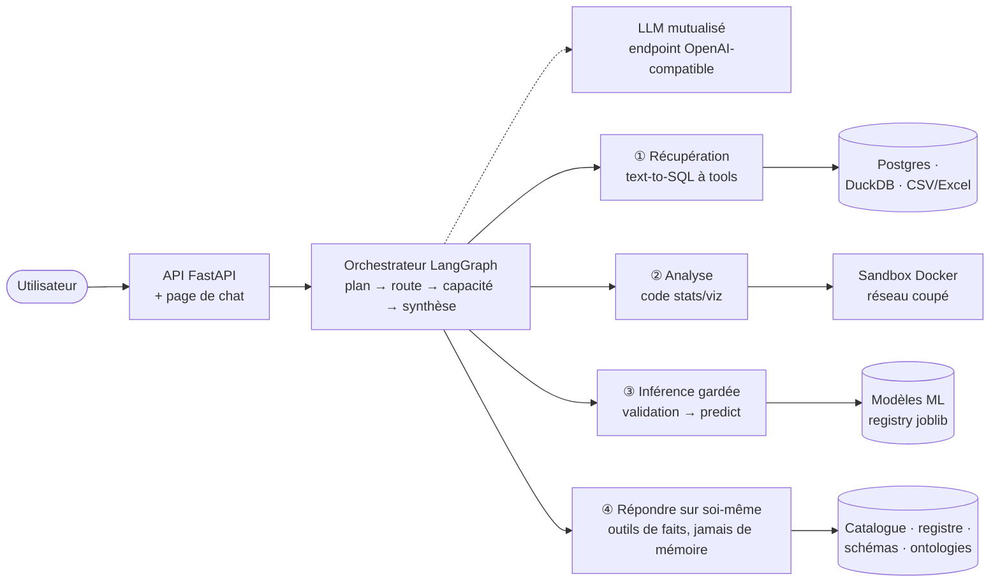

# data-analyst-agent

Agent conversationnel sur données, **on-premise**. À partir d'une source déclarée (fichier Excel/CSV, base DuckDB ou base Postgres multi-tables), l'utilisateur pose une question en langage naturel et le système sait :

1. **Récupérer** — générer la requête SQL (jointures comprises) sur Postgres, ou interroger le fichier/la base via DuckDB ;
2. **Analyser** — calculer KPI, statistiques (χ², ANOVA…) et visualisations en exécutant du code dans un bac à sable durci (réseau coupé) ;
3. **Prédire** — appeler un modèle de ML sur des features validées (Pydantic), en redemandant ce qui manque avant tout predict.

Réponse en langage naturel + objets affichables (tableau, figure). Un seul LLM mutualisé, joint par un **endpoint OpenAI-compatible** — Ollama aujourd'hui, vLLM sans changer une ligne de code ; le service en place sert `gemma4:e4b`. Orchestration explicite et traçable, licences 100 % permissives (MIT/Apache/BSD).

La base de démonstration livrée est un **jeu retail animalerie** (1,66 M de lignes, données synthétiques) conçu pour ce genre d'agent : jointures non triviales, pièges de modélisation documentés, et 13 questions dont on connaît les vraies réponses — de quoi mesurer si l'agent a raison, et pas seulement s'il en a l'air.


## Sommaire

- [Architecture en un coup d'œil](#architecture-en-un-coup-dœil)
- [Deux branches durables, aux exigences opposées](#deux-branches-durables-aux-exigences-opposées)
- [Documentation](#documentation)
- [Démarrage](#démarrage)
- [Configuration](#configuration)
- [API / Endpoints](#api--endpoints)
- [Le début d'une conversation : choisir la source](#le-début-dune-conversation--choisir-la-source)
- [Ce que l'agent sait dire de lui-même](#ce-que-lagent-sait-dire-de-lui-même)
- [Mémoire de conversation](#mémoire-de-conversation)
- [Observabilité](#observabilité)
- [Qualité](#qualité)
- [Structure](#structure)
- [Licences & composants](#licences--composants)

## Architecture en un coup d'œil


```mermaid
flowchart LR
    U(["Utilisateur"]) --> API["API FastAPI<br/>+ page de chat"]
    API --> O["Orchestrateur LangGraph<br/>plan → route → capacité → synthèse"]
    O -.-> L["LLM mutualisé<br/>endpoint OpenAI-compatible"]
    O --> R["① Récupération<br/>text-to-SQL à tools"]
    O --> A["② Analyse<br/>code stats/viz"]
    O --> I["③ Inférence gardée<br/>validation → predict"]
    O --> Y["④ Répondre sur soi-même<br/>outils de faits, jamais de mémoire"]
    Y --> C[("Catalogue · registre ·<br/>schémas · ontologies")]
    R --> D[("Postgres ·<br/>DuckDB · CSV/Excel")]
    A --> S["Sandbox Docker<br/>réseau coupé"]
    I --> M[("Modèles ML<br/>registry joblib")]
```

Le fonctionnement détaillé (schéma fonctionnel du graphe, séquences, durcissement de la sandbox, explication service par service) est dans **[docs/ARCHITECTURE.md](docs/ARCHITECTURE.md)**.

## Deux branches durables, aux exigences opposées

**À lire avant de « corriger » quoi que ce soit sur l'une ou l'autre.** Ce dépôt
porte deux branches qui ne convergeront pas, et qui n'ont pas le même cahier des
charges :

| Branche | Ce qu'elle est | Authentification |
|---|---|---|
| **`main`** | le **socle produit** : la base sur laquelle plusieurs cas d'usage clients seront bâtis | **exigée** — hormis `/health`, aucune route n'est atteignable sans session, et chaque compte est cloisonné dans son dossier |
| **`Maxizoo`** | une **démonstration client**, qu'on ouvre à quelqu'un en lui envoyant un lien | **absente, et c'est un choix** — pas un retard, pas un oubli |

Une démonstration derrière un écran de connexion n'est plus une démonstration : il
faudrait créer un compte pour chaque personne à qui on la montre, et le premier
geste demandé à un prospect serait de taper un mot de passe. L'absence
d'authentification sur `Maxizoo` est donc **une décision de périmètre**, tenable
parce que la branche ne sert que des données de démonstration et ne vit que le temps
d'une présentation.

Concrètement :

- **ne pas porter l'authentification de `main` vers `Maxizoo`.** Si un durcissement
  de `main` touche `auth/`, il ne remonte pas — c'est le seul écart attendu entre
  les deux branches ;
- **ne pas déployer `Maxizoo` sur une adresse publique durable** ni y brancher de
  données réelles : c'est là, et seulement là, que l'absence de compte devient un
  vrai problème ;
- tout le reste — correctifs de sécurité SQL, plafonds de contexte, libération des
  ressources, découpages — vaut pour les deux et doit être reporté.

Le récapitulatif des garde-fous de
[ARCHITECTURE §5](docs/ARCHITECTURE.md#5-sécurité--récapitulatif-des-garde-fous)
décrit `main`. Sur `Maxizoo`, en retirer le point 1.

## Documentation

| Document | Contenu |
|---|---|
| [docs/ARCHITECTURE.md](docs/ARCHITECTURE.md) | schémas architectural et fonctionnel, description de chaque service, sécurité, configuration, stratégie de tests |
| [docs/CADRAGE.md](docs/CADRAGE.md) | cahier des charges : contraintes, décisions, stack, roadmap, arborescence, exigences de tests |
| [docs/AUDIT-2026-09.md](docs/AUDIT-2026-09.md) | état des lieux mesuré et backlog priorisé (multi-utilisateurs, mémoire, moteur LLM, sécurité, qualité) |
| [docs/spike-vanna.md](docs/spike-vanna.md) | spike text-to-SQL Vanna vs socle maison (verdict : socle maison conservé) |
| [docs/VLLM.md](docs/VLLM.md) | banc d'essai vLLM : le tool calling mesuré, ce qui casse sans les bonnes options, ce qui reste à vérifier |
| [docs/surface-conversationnelle.md](docs/surface-conversationnelle.md) | ce que l'agent sait répondre **sur lui-même** : la batterie de mesure, les comptes avant/après, le coût en appels LLM, et les décisions déjà mesurées et retirées |
| [docs/axes-amelioration.md](docs/axes-amelioration.md) | dette technique et chantiers ouverts, ancrés `fichier:ligne`, avec un récapitulatif priorisé |

## Démarrage

Prérequis : [uv](https://docs.astral.sh/uv/) (Python 3.12 géré automatiquement), **Docker** (sandbox d'exécution + tests d'intégration), et un serveur LLM à endpoint OpenAI-compatible pour l'usage réel — [Ollama](https://ollama.com) aujourd'hui, [vLLM](https://docs.vllm.ai) sans changer une ligne de code ([docs/VLLM.md](docs/VLLM.md)).

```bash
uv sync                                              # environnement + dépendances
uv run pytest                                        # suite de tests (couverture >= 85 %)
uv run playwright install chromium                   # une fois, pour les tests de la page
uv run pytest -m ui --no-cov                         # page de chat dans un vrai navigateur
uv run python scripts/manage_users.py create alice   # un compte (aucun n'existe au départ)
uv run uvicorn data_analyst_agent.api.app:app        # API + chat sur http://localhost:8000
```

**L'application est authentifiée** : hormis `/health`, aucune route n'est
atteignable sans session. Il n'y a ni inscription ouverte ni compte par défaut —
le premier compte se crée avec `scripts/manage_users.py` (le mot de passe est
demandé au terminal). En développement local, l'accès se fait en http : le
cookie de session étant `Secure` par défaut, il faut poser
`DAA_SESSION_COOKIE_SECURE=false` dans le `.env`, et rien d'autre.

Sous Windows, les tests nécessitant Docker (intégration, e2e) se lancent depuis WSL ; sans Docker ils sont automatiquement sautés. Le test live du LLM (`-m live`) est exclu par défaut.

**L'image de la sandbox se construit à la main, une fois**, et elle n'est *pas* construite au premier usage :

```bash
docker build -t data-analyst-agent-sandbox:0.1 src/data_analyst_agent/sandbox/image/
```

`ensure_image()` sait la construire, mais rien dans le chemin applicatif ne l'appelle — seuls les tests d'intégration et e2e s'en servent. Sans image, une analyse échoue au `docker run` ; elle ne déclenche pas de build.

## Configuration

Tout se règle par variables d'environnement `DAA_*` (ou fichier `.env`). Une quarantaine de réglages, groupés par domaine dans **[docs/ARCHITECTURE.md §7](docs/ARCHITECTURE.md#7-configuration-daa_)** : LLM, sources et capacités, mémoire de conversation et contexte, authentification et sessions, surface HTTP et débit, sandbox. Les plus souvent touchés :

| Réglage | Défaut | Quand y toucher |
|---|---|---|
| `DAA_LLM_BASE_URL` | `http://localhost:11434/v1` | changer de serveur LLM (Ollama → vLLM) |
| `DAA_LLM_MODEL` | `gemma4:e4b` | changer de modèle servi |
| `DAA_SESSION_COOKIE_SECURE` | `true` | `false` pour un développement local en http |
| `DAA_WORKSPACE_DIR` | `var/workspaces` | pointer un volume dédié en production |
| `DAA_API_DOCS_ENABLED` | `false` | `true` pour développer contre l'OpenAPI |
| `DAA_SANDBOX_MAX_SESSIONS` | `4` | régler sur la RAM réellement disponible |

Les sources de données se déclarent dans `sources/catalogue.yaml` (livré avec une source : `maxizoo`).

### La base de démonstration

| Source | Type | Contenu |
|---|---|---|
| `maxizoo` | Base DuckDB | Retail animalerie (données **synthétiques**) — schéma en étoile, 1,66 M de lignes, 10 tables : `sales_daily` (ventes au grain magasin × SKU × jour) entourée de `stores`, `products`, `promo_calendar`/`promo_scope`, plus `traffic_daily`, `sales_hourly`, `weather`, `inflation`, `store_hours`. Historique du 2021-07-01 au 2026-06-30. |

**La base n'est pas versionnée** (180 Mo) : elle vit dans un dépôt d'export dédié et se construit en une commande.

```bash
# 1. récupérer l'export (branche orpheline : la base et sa doc, rien d'autre)
git clone --branch export-db --single-branch \
    https://github.com/floSa/sales-ops-planning-poc.git ../base_demo

# 2. construire sources/maxizoo.duckdb + recopier le dictionnaire
uv run python scripts/load_maxizoo_duckdb.py --export ../base_demo
```

Le script charge le DDL et les 1,66 M de lignes contraintes actives (PK, FK, CHECK), et **refuse d'écrire** si un volume ne tombe pas juste : une base à moitié chargée ferait répondre des chiffres faux avec aplomb.

#### Le dictionnaire, et pourquoi il compte

`sources/maxizoo_dictionnaire.md` (recopié par le script) est **chargé dans le contexte de l'agent SQL** à chaque question. Il décrit chaque colonne, mais surtout **6 pièges de modélisation** qui ne s'infèrent d'aucun DDL et qui font écrire du SQL plausible et faux :

1. **Le e-commerce est un magasin** — `ONLINE` est une ligne de `stores` et pèse ~20 % du CA ; toute requête « par magasin » l'inclut.
2. **`quantity = 0` est une vraie ligne** — 46 % des lignes ; un jour sans vente, pas une donnée manquante.
3. **Absence de ligne ≠ zéro** — 4 SKU sont lancés en cours d'historique (cold start).
4. **`revenue` est le CA réalisé, pas la demande** — en rupture (`is_rupture = 1`), la vente est censurée.
5. **Une campagne sans `promo_scope` porte sur tout le catalogue** — un `JOIN` la fait disparaître en silence.
6. **La base contient du futur** — météo et promos vont jusqu'au 2026-12-31, les ventes s'arrêtent au 2026-06-30.

Le dépôt d'export livre aussi `questions_reference.md` : 13 questions en langage naturel dont **les réponses ont été vérifiées** en exécutant le SQL hors de tout agent. C'est le jeu d'évaluation — voir « Ce que l'agent sait faire, et où il échoue » ci-dessous.

#### Servir la même base par Postgres

Le catalogue accepte aussi bien un DSN Postgres (`type: postgres`) qu'un fichier DuckDB. Le DDL de l'export est du PostgreSQL standard : `psql -d poc_retail -f ../base_demo/schema.sql`, puis `../base_demo/chargement/postgres.sql`.

## Ce que l'agent sait faire, et où il échoue

Les 13 questions de référence ont été passées à l'agent réel (`gemma4:e4b`, dictionnaire en contexte, base complète), et comparées aux réponses vérifiées de l'export. **7 sur 13** au contrôle automatique strict, 8 à 10 selon la sévérité — et ce score, obtenu sur des questions **isolées**, est le plus flatteur des deux : en conversation en cascade, c'est 10 invariants violés sur 15 tours (voir plus bas). Le détail vaut mieux que le score :

| Ce qui passe | Ce qui casse |
|---|---|
| Agrégats et jointures (Q1, Q3, Q6) — au centime près | **Q5, le panier article** : l'agent joint `traffic_daily` à `sales_daily` sans agréger d'abord au grain magasin × jour. `nb_tickets` est dupliqué une fois par SKU, et le panier ressort à **0,047 au lieu de 2,76** — exactement 60 fois trop petit. |
| **Q2, le piège du e-commerce** : `Canal Online` sort bien en tête du CA par magasin | **Q10, l'uplift promo** : la requête à trois CTE (pendant vs 4 semaines avant) dépasse le modèle. |
| **Q9, le cold start** : les 4 SKU lancés en cours d'historique, avec les bonnes dates | **Q13, la cohérence des grains** : l'agent somme les deux grains au lieu de comparer leur écart maximum. |
| **Q11, l'effet météo** : raisonne sur `temp_anomaly` et non sur la température absolue | Q8 : trouve les 3 041 lignes en rupture, mais pas le pourcentage ni le CA associés. |

**Ce que ça dit.** Le dictionnaire en contexte fait gagner les pièges qu'il **énonce** (e-commerce, cold start, anomalie de température) : ce sont précisément les questions où un agent sans dictionnaire répond du plausible et du faux. Il ne sauve pas les pièges qu'il ne fait que **sous-entendre** : le piège de grain de Q5 n'est pas dans la liste des 6, et le dictionnaire se contente d'y donner l'ordre de grandeur attendu (~2,1 à 2,8). Le modèle rend 0,047 sans sourciller.

Ajouter au prompt une consigne de relecture (« si tu es loin de l'ordre de grandeur documenté, ta requête est fausse ») a été **essayé et n'a rien changé** : même requête naïve, même résultat, aucune auto-correction en deux essais. La consigne a donc été retirée plutôt que gardée pour la forme. Le levier est ailleurs — un modèle plus fort, ou le piège de grain écrit noir sur blanc dans le dictionnaire.

### En conversation réelle, c'est plus dur

Les 13 questions ci-dessus sont posées **isolément**. Passées en conversation en cascade sur le système entier (API + sandbox + modèle), les mêmes capacités décrochent davantage : **15 tours joués, 10 invariants de données violés**. Trois familles d'échecs, toutes reproductibles :

**1. Les questions sur le système, pas sur les données.** « Peux-tu me décrire la base : quelles tables ? » et « de quels attributs as-tu besoin pour une prévision ? » échouent toutes deux sur « Je n'ai pas bien compris ta demande ». Le planificateur n'a pas de route pour une question *méta* : il attend une question sur les données, et le schéma comme la liste des features lui sont pourtant déjà fournis dans son prompt. C'est le premier tour de deux conversations sur trois — la pire place pour un échec.

**2. L'anaphore vers une figure est instable.** « Fais-moi un diagramme en barres de ces CA » et « montre-moi ça en barres groupées » passent ; « fais-en un diagramme en barres » est routé en `query` et rend un tableau. Même intention, trois formulations, deux réussites — le routage tient à la tournure.

**3. Les questions à deux dimensions perdent la seconde.** « Comment se répartit le CA par univers ? » rend les montants mais pas les parts. « Quel jour vend le mieux, en magasin **et en ligne** ? » agrège les deux canaux au lieu de les séparer — et écrase justement le signal recherché (samedi en magasin, dimanche en ligne).

**Ce qui marche bien, en revanche :** le slot-filling. « Prédis les ventes de croquettes chien en grand magasin » → relance sur les features manquantes → complément → prédiction → « et si le produit était en promo à −30 % ? » → ajustement correct. Quatre tours sur cinq, sans accroc.

Pour rejouer l'exercice :

```bash
uv run python scripts/live_scenarios.py
```

Les valeurs attendues sont la vérité terrain de l'export, pas des estimations : une réponse bien tournée sur des chiffres faux y échoue. Le runner **sort en échec aujourd'hui** — c'est voulu : il mesure l'écart réel, il ne certifie pas que tout va bien.

## API / Endpoints

Toutes les routes exigent une session valide, **sauf `/health`** — une sonde de
disponibilité n'en a pas, et lui refuser l'accès ferait passer le service pour
tombé. Sans session : `401` sur l'API, page de connexion en navigation. Les
routes qui modifient l'état exigent en plus l'en-tête `X-CSRF-Token`, repris du
cookie posé à la connexion.

**Chacun ne voit que ses conversations.** Les routes `/conversations…` et le
`conversation_id` accepté par `POST /chat` sont résolus sous le dossier de
l'utilisateur de la session, et il n'existe pas de vue plus large : le fil d'un
autre compte répond **`404`, jamais `403`** — un `403` confirmerait son
existence. Reprendre l'identifiant du fil de quelqu'un d'autre dans `POST /chat`
n'y écrit rien : cela ouvre un fil neuf et vide chez soi.

| Méthode | Route | Session | Rôle |
|---|---|---|---|
| `GET` | `/health` | non | Sonde de vie |
| `GET` | `/login` | non | Page de connexion (formulaire HTML, sans JavaScript) |
| `POST` | `/login` | non | Ouvre une session ; pose le cookie de session et le jeton anti-CSRF |
| `POST` | `/logout` | oui | Révoque la session **côté serveur** et efface les cookies |
| `GET` | `/me` | oui | Le compte de la session en cours (`{"login": …}`) |
| `POST` | `/chat` | oui | Question en langage naturel → réponse + artefacts + trace (contrat `ChatAnswer`) |
| `GET` | `/` | oui | Page de chat (rendu des PNG base64 et des tables JSON, zéro asset externe) |
| `GET` | `/conversations` | oui | **Ses** conversations, de la plus récente à la plus ancienne |
| `GET` | `/conversations/{id}` | oui | Le fil complet (messages + artefacts) pour le reprendre ; `404` s'il est à quelqu'un d'autre |
| `POST` | `/conversations/{id}/duplicate` | oui | Duplique une de ses conversations |
| `DELETE` | `/conversations/{id}` | oui | Supprime une de ses conversations et sa mémoire |

### Comptes et sessions

Les comptes vivent dans un fichier YAML non versionné (`var/users.yaml` par
défaut, 0600), mots de passe hachés en **argon2id**. Le fichier ne se peuple que
par le CLI — forme du fichier dans `users.example.yaml` :

```bash
uv run python scripts/manage_users.py create alice          # ouvre un compte
uv run python scripts/manage_users.py list                  # état des comptes
uv run python scripts/manage_users.py disable alice         # ferme le compte et ses sessions
uv run python scripts/manage_users.py reset-password alice  # nouveau mot de passe
```

Les sessions sont **côté serveur** : le navigateur ne reçoit qu'un identifiant
opaque, tout l'état est sur disque. C'est ce qui rend la déconnexion effective —
et ce qui permet à `disable` de couper immédiatement les onglets déjà ouverts.

**Le login est normalisé** à la création comme à la connexion : normalisation
unicode NFKC, espaces de bord retirés, casse repliée (`casefold`). `floSa`,
`FLOSA` et ` flosa ` désignent donc un seul et même compte — ce qui compte
d'autant plus que le login est aussi le nom du dossier où vivent ses
conversations. L'espace interne, le caractère de contrôle et le login de plus de
64 caractères sont refusés ; l'unicode, lui, est accepté.

## Le modèle de prévision

`models/maxizoo_sales.joblib` prédit la **quantité vendue** d'un SKU, dans un magasin, un jour donné (entraînement : [notebooks/train_maxizoo_sales.md](notebooks/train_maxizoo_sales.md), 1,35 M de lignes, MAE ~1,56 unité contre ~2,44 pour la moyenne, R² ~0,49).

Deux choix méritent d'être connus avant de s'en servir :

- **Il ne prend ni `sku_id` ni `store_id`**, seulement des attributs (univers, type de marque, prix catalogue, format de magasin, calendrier, remise, anomalie de température). Les identifiants n'apportaient presque rien — R² 0,487 → 0,493, mesuré — et coûtaient la capacité à prédire un SKU jamais vu. Or le dictionnaire documente 4 lancements en cours d'historique, et l'enseigne en fera d'autres : **un produit référencé demain se prédit sans réentraînement**.
- **Il est entraîné sans les lignes en rupture** (`is_rupture = 1`, piège n°4). Quand le stock est épuisé, la quantité observée n'est pas la demande : entraîner dessus apprendrait au modèle à reproduire nos ruptures.

**Ce qu'il a appris, et ce qu'il n'a pas appris.** Il capte la présence d'une campagne (uplift ~×1,6, dans la fourchette de ce qu'on mesure dans les données brutes) mais **pas la profondeur de la remise** : sa prévision est quasi plate de −15 % à −30 %. Ce n'est pas un défaut de modélisation — l'uplift empirique par palier de remise n'est lui-même pas monotone (×1,43 à 15 %, ×1,34 à 25 %, ×1,95 à 30 %), avec 25 à 100 campagnes par palier et une saisonnalité confondue avec la remise (les −30 % sont les Black Friday, donc novembre). En clair : il répond bien à « combien vendra-t-on pendant une campagne ? », et mal à « faut-il remiser à 20 ou à 30 % ? » — cette seconde question demanderait un plan d'expérience, pas ce jeu d'observations.

## La source de travail d'une conversation

Le catalogue peut déclarer plusieurs sources. Plutôt que de laisser le planificateur en deviner une à chaque tour, l'agent **propose**, l'utilisateur **valide**, et c'est celle sur laquelle on travaille ensuite. La source est portée par le fil, persistée dans `transcript.json` comme son propriétaire.

Ici, le catalogue n'en déclare **qu'une** — `maxizoo` — et le mécanisme se replie sur son cas dégénéré, qui est aussi le plus utile : au lieu de poser une question dont la réponse est connue d'avance, l'agent **annonce** la source qu'il prend et la garde.

```
> Quel est le chiffre d'affaires 2024 ?
  Je travaille sur la source `maxizoo`.        ← annoncée une fois, puis plus jamais répétée

  Le chiffre d'affaires 2024 s'élève à 34 787 976,80 €.

> et 2025 ?                                     ← la source n'est plus devinée à chaque tour
  Le chiffre d'affaires 2025 s'élève à 36 268 022,89 €.
```

Ce qu'il faut savoir de ce mécanisme :

- **S'il n'y a qu'une source, elle est annoncée** au lieu d'être demandée. Avec deux sources ou plus, l'agent énumère ce que le catalogue dit de chacune et demande laquelle prendre.
- **La proposition n'arrive que si une source est nécessaire.** « Combien vendra-t-on un samedi de novembre en promo −30 % ? » n'interroge aucune source : la question est répondue directement.
- **La validation ne coûte aucun appel LLM** : c'est le nom d'une source du catalogue, reconnu dans le message. Un message qui n'en nomme aucune n'est pas un choix et repart comme une question ordinaire — on ne reste pas coincé dans une question qu'on ne veut pas trancher.
- **Un message qui nomme une source ET pose une question est traité comme la question qu'il est** : il lie la source *en chemin* et répond, au lieu de se contenter d'accuser réception.
- **Nommer une autre source la remplace, et l'agent le dit** : « Je passe sur la source `X` — on travaillait sur `Y`. » Refuser obligerait à ouvrir un fil pour une question d'une ligne ; ce qui est dangereux n'est pas de changer de source, c'est de changer sans le dire. Une source choisie par le *planificateur*, elle, ne fait jamais basculer quoi que ce soit — seul le texte de l'utilisateur compte.
- **Une conversation ouverte avant ce mécanisme** fonctionne comme avant, sans migration.
- Le champ `source` de `POST /chat` reste ce qu'il était : une source **imposée pour ce tour**, qui ne lie rien.

Le parcours complet — proposition, validation, question sans nommer la source, bascule — est mesuré contre le serveur réel dans **[docs/surface-conversationnelle.md](docs/surface-conversationnelle.md)**.

## Ce que l'agent sait dire de lui-même

« Quelles données as-tu ? », « c'est quoi ton périmètre ? », « quelles colonnes a `sales_daily` ? », « que signifie `store_id` ? », « de quels attributs as-tu besoin pour prédire ? », « que sais-tu faire ? » — ces questions ne portent pas *sur* les données mais **sur l'agent**, et elles sont le premier tour d'une conversation sur deux.

Le premier nœud du graphe leur est consacré, et c'est le **modèle** qui décide : il reçoit la question avec cinq outils qui rendent les faits du dépôt — catalogue, registre des modèles, schémas d'attributs, schéma réel de la source et son dictionnaire — puis il les formule. S'il n'appelle aucun outil, la question repart au planificateur comme n'importe quelle question sur les données.

**Rien ne vient de la mémoire du modèle**, et ce n'est pas une intention mais une vérification : une formulation qui cite un nom qu'aucun outil n'a rendu, ou qui oublie un nom qu'un outil a rendu, est **écartée** — ce sont alors les faits eux-mêmes qui partent à l'utilisateur. Un nom de table inventé est plus nocif qu'une réponse absente : il a l'air d'une lecture de la source.

La frontière : l'agent répond sur ce qu'il **EST**, jamais sur ce que les données **CONTIENNENT**. « Combien de lignes dans `sales_daily` ? » et « sur quelle période portent les données ? » sont des `COUNT` et des `MIN`/`MAX` : elles suivent le chemin SQL.

La mesure de cette surface — les formulations posées au vrai serveur, sur les dix tables réelles, avec le coût en appels LLM — est dans **[docs/surface-conversationnelle.md](docs/surface-conversationnelle.md)**.

## Mémoire de conversation

Chaque conversation (`conversation_id`) dispose d'un espace de travail qui **persiste les tableaux intermédiaires en CSV** (`DAA_WORKSPACE_DIR`). Aux tours suivants, ces objets sont réexposés : interrogeables comme des sources (« et pour les femmes ? »), réutilisables pour une prédiction (« prédis **ces** lignes ») et **montés dans la sandbox** pour que le code d'analyse généré les relise (`pd.read_csv('/data/resultat_1.csv')`).

Le **fil lui-même est persisté** au même endroit (`transcript.json`) : la barre latérale de la page de chat liste les conversations précédentes, on en rouvre une pour reprendre où on en était (figures et tableaux compris), on la duplique ou on la supprime. Comme une conversation est un simple dossier, la duplication emporte la mémoire ci-dessus — la copie sait encore « prédire ces lignes » — et la suppression ne laisse aucun CSV orphelin.

### Ce que l'agent se rappelle vraiment

Moins que ce que la persistance laisse croire, et il vaut mieux le savoir :

- **le transcript n'est jamais renvoyé au modèle** — il sert l'affichage ;
- **le contexte conversationnel ne retient qu'UN tour** (`context.json`) : la
  question précédente, l'action, la source, le code de figure, les features de
  la dernière prédiction réussie. Deux tours en arrière est déjà oublié ;
- ce qui remonte vraiment au modèle, c'est **la liste des tableaux
  intermédiaires** — et c'est elle, et elle seule, qui grossissait sans fin.

### Ce qui entre dans le contexte est plafonné

Réinjecter tous les tableaux à chaque tour n'avait aucune borne : mesuré à
100 tours, le `docker run` de l'analyse portait 100 arguments `--volume` et le
prompt du planificateur 13 348 caractères de catalogue d'objets. Au-delà de la
fenêtre du serveur, Ollama tronque **sans erreur ni message** — 48 350 tokens
envoyés pour 32 768 servis, et l'agent répond « je n'ai pas bien compris ».

Deux plafonds, appliqués **aux trois axes à la fois** (prompt du planificateur,
montages de la sandbox, catalogue des sources éphémères) — les désaccorder
donnerait un tableau décrit au modèle mais introuvable à l'exécution :

| Réglage | Défaut | Ce qu'il borne |
|---|---|---|
| `DAA_CONTEXT_ARTIFACT_WINDOW` | `8` | nombre de tableaux réinjectés, les plus récents (`0` = pas de fenêtre) |
| `DAA_CONTEXT_TOKEN_BUDGET` | `8000` | taille du prompt du planificateur, décomptée **avant** l'appel (`0` = pas de budget) |

**On plafonne ce qu'on injecte, pas ce qu'on conserve** : les tableaux évincés
restent sur le disque, dans le manifeste et dans le fil affiché. Au dépassement
du budget, ce sont les **plus anciens** qui sortent en premier — la dégradation
est ordonnée, pas subie.

### Quand du contexte est coupé, l'application le dit

C'est le corollaire : une mémoire plafonnée qui ne s'annonce pas est une
mémoire qui ment. La coupe apparaît dans la trace (`prompt_tokens`,
`server_prompt_tokens`, `truncated`, `truncation`) **et** dans la réponse rendue
— la trace n'est pas dépliée par défaut :

```
Il y a 150 lignes dans la table `iris`.

Contexte tronqué : 892 des 900 tableaux intermédiaires de cette conversation ne
sont plus transmis au modèle (fenêtre DAA_CONTEXT_ARTIFACT_WINDOW=8). Ils
restent enregistrés — le fil, lui, reste complet.
```

Quatre situations sont distinguées, et se cumulent :

1. **éviction délibérée** — la fenêtre ou le budget ont retiré des tableaux ;
2. **prompt plus long que la fenêtre du serveur** (`DAA_CONTEXT_MODEL_WINDOW`,
   `32768`) — constaté *avant* l'envoi, parce qu'au-delà le modèle ne rend plus
   de sortie exploitable et qu'il n'y aurait alors plus rien à mesurer ;
3. **troncature constatée côté serveur** — `prompt_eval_count` confronté à ce
   qu'on a envoyé. Le compteur de tokens local est approché (3 caractères par
   token) et **surestime** de 1 à 17 % (mesuré contre `gemma4:e4b`) : il coupe
   donc un peu trop tôt plutôt que trop tard ;
4. **table matérialisée coupée** — analyser une source SQL matérialise chaque table
   en CSV, plafonnée à `DAA_ANALYSIS_TABLE_MAX_ROWS`. Un CSV coupé reste
   parfaitement lisible : rien, dans le fichier, ne dit qu'il manque des lignes, et
   un agrégat calculé dessus est faux tout en se présentant comme juste. L'avis part
   donc à la fois dans le contexte du code généré et dans la réponse rendue.

Un serveur qui **refuse** au lieu de tronquer (vLLM répond `400 … maximum
context length`) est reconnu comme tel et dit en clair, au lieu de finir en
`ModelHTTPError` illisible.

Pour mesurer soi-même ce qu'une conversation injecte, tour après tour :

```bash
uv run python scripts/mesure_contexte.py --tours 1 10 30 100
```

### Arborescence

Tout est rangé **par utilisateur**, et c'est ce rangement qui cloisonne : une
route ne peut pas oublier un filtre qui n'existe pas, elle n'a jamais eu qu'une
racine sous les yeux. Les verrous suivent — ils sont posés à côté de la
ressource qu'ils sérialisent — ce qui cloisonne aussi la contention entre
comptes. Les dossiers sont créés en `0o700`.

```
$DAA_WORKSPACE_DIR/
└── <utilisateur>/            # login normalisé, encodé pour le système de fichiers
    ├── .locks/               # verrous de CET utilisateur
    └── <conversation_id>/
        ├── transcript.json   # le fil : messages, titre, propriétaire, prédiction en attente
        ├── manifest.json     # les tableaux intermédiaires mémorisés
        ├── context.json      # le tour précédent (pour résoudre un ajustement)
        └── resultat_*.csv    # les tableaux eux-mêmes
```

Les deux segments variables passent par le même encodage : tout octet hors
`[0-9A-Za-z_-]` devient `~XX`. Il est réversible, donc **sans collision** — deux
logins qui ne diffèrent que par la ponctuation ne peuvent pas se retrouver dans
le même dossier — et il ne peut produire ni `/` ni `.`, donc ni `..` ni chemin
absolu.

### Reprise d'un dossier antérieur au cloisonnement

Un `workspace_dir` où les conversations sont posées **à la racine** date d'avant
le rangement par utilisateur : l'application ne les y cherche plus. Un script
dédié les range, sans rien réécrire d'autre que leur propriétaire :

```bash
# à blanc (défaut) : montre ce qui serait fait, n'écrit rien
uv run python scripts/migrate_workspace_owner.py --workspace <dossier> --owner <login>
# pour de vrai
uv run python scripts/migrate_workspace_owner.py --workspace <dossier> --owner <login> --appliquer
```

Il est idempotent (relancé, il ne trouve plus rien), il refuse tout le lot
plutôt que d'écraser un fil en cas de collision de noms, et il estampille avant
de déplacer — une interruption laisse donc soit un fil encore à la racine, que
la relance reprendra, soit un fil rangé et lisible par son compte.

## Observabilité

Chaque réponse embarque une trace typée par nœud du graphe (plan, capacité exécutée, synthèse, durées) — visible dans le JSON de `/chat` — et le serveur journalise chaque nœud (logger `data_analyst_agent.orchestrator`). Le nœud `plan` y ajoute ce qu'a pesé le prompt (`prompt_tokens`), ce que le serveur dit en avoir lu (`server_prompt_tokens`) et ce qui a été coupé du contexte (`truncated`, `truncation`).

## Qualité

```bash
uv run ruff format           # formatage
uv run ruff check --fix      # lint
uv run pre-commit install    # hooks git (une seule fois)
```

Les tests marqués `live` (LLM local requis) sont exclus par défaut : `uv run pytest -m live` pour les lancer explicitement.

## Structure

```
src/data_analyst_agent/   # package
├── orchestrator/         # graphe, plan et ses règles, budget de contexte, mémoire des fils
├── agents/               # ① retrieval  ② analysis  ③ inference
│                         #   (④ « répondre sur soi-même » vit dans orchestrator/)
├── auth/                 # comptes argon2id, sessions côté serveur, anti-force brute
├── prompts/              # les 5 prompts système et leurs fragments, hors du code (.txt)
├── sandbox/              # client durci + image/ (Dockerfile, bridge Jupyter)
└── api/                  # app.py (HTTP seul) + templates/ (chat, connexion)
docs/                     # ARCHITECTURE, CADRAGE, AUDIT, VLLM, spike-vanna, surface-conversationnelle
models/                   # maxizoo_sales.joblib + registry.yaml
sources/                  # catalogue ; la base et son dictionnaire (non versionnés) atterrissent ici
notebooks/                # entraînement du modèle (jupytext .md + .ipynb)
scripts/                  # comptes, migration du workspace, chargement de la base, échantillon, runners de mesure, bancs
tests/                    # unit / integration / e2e golden / helpers
tests/fixtures/maxizoo_mini/  # échantillon versionné (425 Ko) : la base réelle en miniature
var/                      # NON versionné : comptes, sessions, conversations (0o700)
```

L'arborescence détaillée, fichier par fichier, est dans [docs/CADRAGE.md §10](docs/CADRAGE.md).

---

## Licences & composants

| Composant | Rôle | Licence |
|---|---|---|
| DuckDB | Moteur SQL analytique | MIT |
| FastAPI | API | MIT |
| uvicorn | Serveur ASGI | BSD-3-Clause |
| LangGraph | Orchestration de l'agent | MIT |
| Pydantic / pydantic-ai | Typage & agent LLM | MIT |
| pydantic-settings | Lecture des réglages `DAA_*` et du `.env` | MIT |
| SQLAlchemy | Accès Postgres | MIT |
| pg8000 | Driver PostgreSQL | BSD-3-Clause |
| pandas | Manipulation de données | BSD-3-Clause |
| scikit-learn | Modèles de prédiction | BSD-3-Clause |
| joblib | Sérialisation des modèles | BSD-3-Clause |
| openpyxl | Lecture des classeurs Excel | MIT |
| PyYAML | Catalogue de sources, registre de modèles, comptes | MIT |
| argon2-cffi | Empreintes de mots de passe (argon2id) | MIT |
| python-multipart | Lecture du formulaire de connexion | Apache-2.0 |
| Ollama | Serveur du LLM mutualisé, local | MIT |
| `gemma4:e4b` | Modèle servi par l'instance en place | Apache-2.0 — licence **déclarée par le modèle lui-même** (`POST /api/show`), à revérifier si le modèle servi change |
| **Ce projet** | Code applicatif | MIT annoncé, **mais aucun fichier `LICENSE` n'est présent** et `pyproject.toml` ne déclare rien : l'annonce est donc sans portée juridique en l'état (cf. [axes-amelioration](docs/axes-amelioration.md)) |
