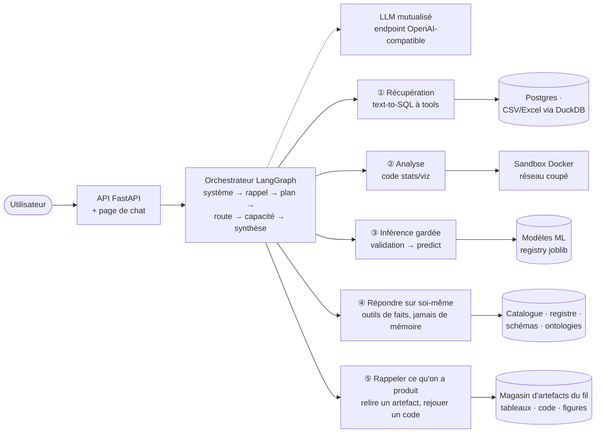

# data-analyst-agent

Agent conversationnel sur données, **on-premise**. À partir d'une source déclarée (fichier Excel/CSV ou base Postgres multi-tables), l'utilisateur pose une question en langage naturel et le système sait :

1. **Récupérer** — générer la requête SQL (jointures comprises) sur Postgres, ou interroger le fichier via DuckDB ;
2. **Analyser** — calculer KPI, statistiques (χ², ANOVA…) et visualisations en exécutant du code dans un bac à sable durci (réseau coupé) ;
3. **Prédire** — appeler un modèle de ML sur des features validées (Pydantic), en redemandant ce qui manque avant tout predict.

Réponse en langage naturel + objets affichables (tableau, figure). Un seul LLM mutualisé, joint par un **endpoint OpenAI-compatible** : le moteur n'est nommé nulle part dans le code, il se change en changeant une URL. En service : **vLLM**, servant `google/gemma-4-E4B-it-qat-w4a16-ct` ([docs/MOTEUR.md](docs/MOTEUR.md)). Orchestration explicite et traçable, **composants logiciels** sous licences 100 % permissives (MIT/Apache/BSD) — les poids du modèle relèvent, eux, de la licence de son éditeur.


## Sommaire

- [Architecture en un coup d'œil](#architecture-en-un-coup-dœil)
- [Deux branches durables, aux exigences opposées](#deux-branches-durables-aux-exigences-opposées)
- [Documentation](#documentation)
- [Démarrage](#démarrage)
- [Configuration](#configuration)
- [API / Endpoints](#api--endpoints)
- [Le début d'une conversation : choisir la source](#le-début-dune-conversation--choisir-la-source)
- [Ce que l'agent sait dire de lui-même](#ce-que-lagent-sait-dire-de-lui-même)
- [Ce que l'agent a produit, et sait reprendre](#ce-que-lagent-a-produit-et-sait-reprendre)
- [Mémoire de conversation](#mémoire-de-conversation)
- [Observabilité](#observabilité)
- [Qualité](#qualité)
- [Structure](#structure)
- [Licences & composants](#licences--composants)

## Architecture en un coup d'œil


```mermaid
flowchart LR
    U(["Utilisateur"]) --> API["API FastAPI<br/>+ page de chat"]
    API --> O["Orchestrateur LangGraph<br/>système → rappel → plan →<br/>route → capacité → synthèse"]
    O -.-> L["LLM mutualisé<br/>endpoint OpenAI-compatible"]
    O --> R["① Récupération<br/>text-to-SQL à tools"]
    O --> A["② Analyse<br/>code stats/viz"]
    O --> I["③ Inférence gardée<br/>validation → predict"]
    O --> Y["④ Répondre sur soi-même<br/>outils de faits, jamais de mémoire"]
    O --> W["⑤ Rappeler ce qu'on a produit<br/>relire un artefact, rejouer un code"]
    Y --> C[("Catalogue · registre ·<br/>schémas · ontologies")]
    W --> Z[("Magasin d'artefacts du fil<br/>tableaux · code · figures")]
    R --> D[("Postgres ·<br/>CSV/Excel via DuckDB")]
    A --> S["Sandbox Docker<br/>réseau coupé"]
    I --> M[("Modèles ML<br/>registry joblib")]
```

Le fonctionnement détaillé (schéma fonctionnel du graphe, séquences, durcissement de la sandbox, explication service par service) est dans **[docs/ARCHITECTURE.md](docs/ARCHITECTURE.md)**.

## Deux branches durables, aux exigences opposées

**À lire avant de « corriger » quoi que ce soit sur l'une ou l'autre.** Ce dépôt
porte deux branches qui ne convergeront pas, et qui n'ont pas le même cahier des
charges :

| Branche | Ce qu'elle est | Authentification |
|---|---|---|
| **`main`** | le **socle produit** : la base sur laquelle plusieurs cas d'usage clients seront bâtis | **exigée** — hormis `/health`, aucune route n'est atteignable sans session, et chaque compte est cloisonné dans son dossier |
| **`Maxizoo`** | une **démonstration client**, qu'on ouvre à quelqu'un en lui envoyant un lien | **absente, et c'est un choix** — pas un retard, pas un oubli |

Une démonstration derrière un écran de connexion n'est plus une démonstration : il
faudrait créer un compte pour chaque personne à qui on la montre, et le premier
geste demandé à un prospect serait de taper un mot de passe. L'absence
d'authentification sur `Maxizoo` est donc **une décision de périmètre**, tenable
parce que la branche ne sert que des données de démonstration et ne vit que le temps
d'une présentation.

Concrètement :

- **ne pas porter l'authentification de `main` vers `Maxizoo`.** Si un durcissement
  de `main` touche `auth/`, il ne remonte pas — c'est le seul écart attendu entre
  les deux branches ;
- **ne pas déployer `Maxizoo` sur une adresse publique durable** ni y brancher de
  données réelles : c'est là, et seulement là, que l'absence de compte devient un
  vrai problème ;
- tout le reste — correctifs de sécurité SQL, plafonds de contexte, libération des
  ressources, découpages — vaut pour les deux et doit être reporté.

Le récapitulatif des garde-fous de
[ARCHITECTURE §5](docs/ARCHITECTURE.md#5-sécurité--récapitulatif-des-garde-fous)
décrit `main`. Sur `Maxizoo`, en retirer le point 1.

## Documentation

| Document | Contenu |
|---|---|
| [docs/INSTALLATION.md](docs/INSTALLATION.md) | installer le service sur une machine nue : prérequis, variables obligatoires, certificat et exposition HTTPS, premier compte, première source, la question qui vérifie — et ce qui manquait à la procédure quand elle a été suivie |
| [docs/EXPLOITATION.md](docs/EXPLOITATION.md) | commander le service, l'exposer en HTTPS (certificat, en-têtes de mandataire, pare-feu), lire ses journaux, sauvegarder et faire tourner les archives, restaurer, ranger les conversations par propriétaire |
| [docs/ARCHITECTURE.md](docs/ARCHITECTURE.md) | schémas architectural et fonctionnel, description de chaque service, sécurité, configuration, stratégie de tests |
| [docs/CADRAGE.md](docs/CADRAGE.md) | cahier des charges : contraintes, décisions, stack, roadmap, arborescence, exigences de tests |
| [docs/AUDIT-2026-09.md](docs/AUDIT-2026-09.md) | état des lieux mesuré et backlog priorisé (multi-utilisateurs, mémoire, moteur LLM, sécurité, qualité) |
| [docs/spike-vanna.md](docs/spike-vanna.md) | spike text-to-SQL Vanna vs socle maison (verdict : socle maison conservé) |
| [docs/MOTEUR.md](docs/MOTEUR.md) | le moteur d'inférence : les options dont le système dépend, ce qui casse sans elles, la mémoire, la fenêtre, et les mesures qui l'établissent |
| [docs/parcours-de-l-agent.md](docs/parcours-de-l-agent.md) | **comprendre comment il répond** : huit conversations, huit diagrammes de séquence, chacun établi sur une trace relevée — nœuds traversés, outils appelés, coût en appels LLM, et les défauts connus |
| [docs/surface-conversationnelle.md](docs/surface-conversationnelle.md) | ce que l'agent sait répondre **sur lui-même** : la batterie de mesure, les comptes avant/après, le coût en appels LLM, et les décisions déjà mesurées et retirées |
| [docs/sources-metier.md](docs/sources-metier.md) | **le catalogue qu'on montre** : un fabricant de vélos, cinq sources, des volumes qui tiennent dans la tête, trois pièges de modélisation de trois familles, et les douze questions de démonstration mesurées |
| [docs/sources-de-demonstration.md](docs/sources-de-demonstration.md) | le catalogue qui a **durci** le socle, et qui porte les campagnes de mesure : cinq sources, quatre pièges de modélisation, les questions métier et leurs oracles, et ce que ce catalogue a fait apparaître dans le socle |
| [docs/rediger-un-dictionnaire-de-source.md](docs/rediger-un-dictionnaire-de-source.md) | comment écrire le dictionnaire d'une source pour qu'il tienne devant l'agent : six règles, le relevé qui les fonde, et ce que l'ambiguïté coûte en chiffres faux |
| [docs/axes-amelioration.md](docs/axes-amelioration.md) | dette technique et chantiers ouverts, ancrés `fichier:ligne`, avec un récapitulatif priorisé |

## Démarrage

**Pour installer le service**, ce n'est pas ici : c'est **[docs/INSTALLATION.md](docs/INSTALLATION.md)**, qui part d'une machine nue et n'exige que Docker. Ce qui suit est le démarrage d'un poste de **développement**.

Prérequis : [uv](https://docs.astral.sh/uv/) (Python 3.12 géré automatiquement), **Docker** (sandbox d'exécution + tests d'intégration), et un serveur LLM à endpoint OpenAI-compatible pour l'usage réel. En service : [vLLM](https://docs.vllm.ai) sur le port 8100 ([docs/MOTEUR.md](docs/MOTEUR.md)). L'application ne nomme pas le serveur : `DAA_LLM_BASE_URL` suffit à en désigner un autre, pourvu qu'il serve `/v1/chat/completions` avec le tool calling.

```bash
uv sync                                              # environnement + dépendances
uv run pytest                                        # suite de tests (couverture >= 85 %)
uv run playwright install chromium                   # une fois, pour les tests de la page
uv run pytest -m ui --no-cov                         # page de chat dans un vrai navigateur
uv run python scripts/manage_users.py create alice   # un compte (aucun n'existe au départ)
uv run uvicorn data_analyst_agent.api.app:app        # API + chat sur http://localhost:8000
```

**L'application est authentifiée** : hormis `/health`, aucune route n'est
atteignable sans session. Il n'y a ni inscription ouverte ni compte par défaut —
le premier compte se crée avec `scripts/manage_users.py` (le mot de passe est
demandé au terminal). En développement local, l'accès se fait en http : le
cookie de session étant `Secure` par défaut, il faut poser
`DAA_SESSION_COOKIE_SECURE=false` dans le `.env`, et rien d'autre.

Sous Windows, les tests nécessitant Docker (intégration, e2e) se lancent depuis WSL ; sans Docker ils sont automatiquement sautés. Le test live du LLM (`-m live`) est exclu par défaut.

**L'image de la sandbox se construit à la main, une fois**, et elle n'est *pas* construite au premier usage :

```bash
docker build -t data-analyst-agent-sandbox:0.1 src/data_analyst_agent/sandbox/image/
```

`ensure_image()` sait la construire, mais rien dans le chemin applicatif ne l'appelle — seuls les tests d'intégration et e2e s'en servent. Sans image, une analyse échoue au `docker run` ; elle ne déclenche pas de build.

## Configuration

Tout se règle par variables d'environnement `DAA_*` (ou fichier `.env`). 51 réglages, groupés par domaine dans **[docs/ARCHITECTURE.md §7](docs/ARCHITECTURE.md#7-configuration-daa_)** : LLM, sources et capacités, mémoire de conversation et contexte, authentification et sessions, surface HTTP et débit, sandbox. Les plus souvent touchés :

| Réglage | Défaut | Quand y toucher |
|---|---|---|
| `DAA_LLM_BASE_URL` | `http://localhost:8100/v1` | le moteur en service ; `http://host.docker.internal:8100/v1` depuis un conteneur |
| `DAA_LLM_MODEL` | `google/gemma-4-E4B-it-qat-w4a16-ct` | le modèle réellement servi par le central |
| `DAA_SESSION_COOKIE_SECURE` | `true` | `false` pour un développement local en http |
| `DAA_WORKSPACE_DIR` | `var/workspaces` | pointer un volume dédié en production |
| `DAA_API_DOCS_ENABLED` | `false` | `true` pour développer contre l'OpenAPI |
| `DAA_SANDBOX_MAX_SESSIONS` | `4` | régler sur la RAM réellement disponible |

Les sources de données se déclarent dans `sources/catalogue.yaml` (livré avec deux sources : `titanic` et `iris`). Outre son type et son accès, une source peut déclarer trois blocs **facultatifs**, et chacun répond à une question que le schéma seul ne répond pas :

| Bloc | À qui il s'adresse | Ce qu'il dit |
|---|---|---|
| `dictionary` | au **modèle de langage** | ce que les données *veulent dire*, là où le DDL ne dit que des types |
| `features` | au **code** | quelle colonne de CETTE source alimente quelle feature de quel modèle — le même modèle `titanic` est alimenté par `classes.level` dans la base Postgres et par `Pclass` dans le CSV. Relu contre le schéma réel **avant toute requête** : une colonne déclarée qui n'existe pas est nommée, avec celles qui existent, au lieu de finir en SQL en erreur puis en feature absente |
| `date_reference` | au **relevé** | la colonne sur laquelle se lit la période couverte. Sans elle, c'est la première colonne de date du schéma — juste, mais choisie par l'ordre du DDL. Une source qui porte une date de commande *et* une date de livraison a une colonne qui compte, et elle seule le sait |

### Sources livrées

| Source | Type | Contenu |
|---|---|---|
| `titanic` | Postgres | Base multi-tables `passengers` + `classes` (jointes par la clé étrangère `class_id`) — pour les jointures SQL. |
| `iris` | Fichier CSV | Dataset Iris (`sources/iris.csv`) : `sepal_length, sepal_width, petal_length, petal_width, species` — requêtable en SQL/stats/viz. |

**La source `titanic` requiert un Postgres lancé et seedé.** En local :

```bash
# 1. un Postgres jetable
docker run -d --name daa-postgres -p 5432:5432 \
  -e POSTGRES_PASSWORD=change-me postgres:16-alpine

# 2. les variables de connexion (défauts alignés sur .env.example)
export DAA_PG_HOST=localhost DAA_PG_PORT=5432 \
       DAA_PG_USER=postgres DAA_PG_PASSWORD=change-me

# 3. création de la base 'titanic' + schéma 2 tables + seed depuis le CSV
uv run python scripts/seed_titanic_postgres.py
```

La source `iris` ne demande aucun service (fichier local lu via DuckDB).

## API / Endpoints

Toutes les routes exigent une session valide, **sauf `/health`** — une sonde de
disponibilité n'en a pas, et lui refuser l'accès ferait passer le service pour
tombé. Sans session : `401` sur l'API, page de connexion en navigation. Les
routes qui modifient l'état exigent en plus l'en-tête `X-CSRF-Token`, repris du
cookie posé à la connexion.

**Chacun ne voit que ses conversations.** Les routes `/conversations…` et le
`conversation_id` accepté par `POST /chat` sont résolus sous le dossier de
l'utilisateur de la session, et il n'existe pas de vue plus large : le fil d'un
autre compte répond **`404`, jamais `403`** — un `403` confirmerait son
existence. Reprendre l'identifiant du fil de quelqu'un d'autre dans `POST /chat`
n'y écrit rien : cela ouvre un fil neuf et vide chez soi. Les deux routes
d'artefacts suivent la même règle et rendent **le même `404`** dans les trois cas
qui doivent rester indiscernables : le fil d'un autre, un fil inventé, un nom
d'artefact qui n'existe pas chez soi.

| Méthode | Route | Session | Rôle |
|---|---|---|---|
| `GET` | `/health` | non | Sonde de vie |
| `GET` | `/login` | non | Page de connexion (formulaire HTML, sans JavaScript) |
| `POST` | `/login` | non | Ouvre une session ; pose le cookie de session et le jeton anti-CSRF |
| `POST` | `/logout` | oui | Révoque la session **côté serveur** et efface les cookies |
| `GET` | `/me` | oui | Le compte de la session en cours (`{"login": …}`) |
| `POST` | `/chat` | oui | Question en langage naturel → réponse + artefacts + trace (contrat `ChatAnswer`) |
| `GET` | `/` | oui | Page de chat (rendu des PNG base64 et des tables JSON, zéro asset externe) |
| `GET` | `/sources` | oui | Le catalogue déclaré, augmenté de ce qu'on **lit** dans chaque source (tables, lignes, période) — alimente le menu de la page de chat |
| `GET` | `/conversations` | oui | **Ses** conversations, de la plus récente à la plus ancienne |
| `POST` | `/conversations` | oui | Ouvre un fil vide, pour choisir sa source avant de poser la première question |
| `PUT` | `/conversations/{id}/source` | oui | Fixe la source de travail du fil sans avoir à la taper ; seule une source **déclarée** est acceptée |
| `GET` | `/conversations/{id}` | oui | Le fil complet (messages + artefacts) pour le reprendre ; `404` s'il est à quelqu'un d'autre |
| `GET` | `/conversations/{id}/artefacts` | oui | Le **catalogue** des artefacts du fil — nom, nature, description, question d'origine, et `retenu` (encore dans le contexte, ou évincé). Jamais leur contenu |
| `GET` | `/conversations/{id}/artefacts/{nom}` | oui | Le **contenu** d'un artefact : le code Python d'une figure, la tête d'un tableau. Récupérer un code sans repasser par la conversation |
| `POST` | `/conversations/{id}/duplicate` | oui | Duplique une de ses conversations |
| `DELETE` | `/conversations/{id}` | oui | Supprime une de ses conversations et sa mémoire |

### Comptes et sessions

Les comptes vivent dans un fichier YAML non versionné (`var/users.yaml` par
défaut, 0600), mots de passe hachés en **argon2id**. Le fichier ne se peuple que
par le CLI — forme du fichier dans `users.example.yaml` :

```bash
uv run python scripts/manage_users.py create alice          # ouvre un compte
uv run python scripts/manage_users.py list                  # état des comptes
uv run python scripts/manage_users.py disable alice         # ferme le compte et ses sessions
uv run python scripts/manage_users.py reset-password alice  # nouveau mot de passe
```

Les sessions sont **côté serveur** : le navigateur ne reçoit qu'un identifiant
opaque, tout l'état est sur disque. C'est ce qui rend la déconnexion effective —
et ce qui permet à `disable` de couper immédiatement les onglets déjà ouverts.

**Le login est normalisé** à la création comme à la connexion : normalisation
unicode NFKC, espaces de bord retirés, casse repliée (`casefold`). `floSa`,
`FLOSA` et ` flosa ` désignent donc un seul et même compte — ce qui compte
d'autant plus que le login est aussi le nom du dossier où vivent ses
conversations. L'espace interne, le caractère de contrôle et le login de plus de
64 caractères sont refusés ; l'unicode, lui, est accepté.

## Le début d'une conversation : choisir la source

Le catalogue peut déclarer plusieurs sources. Plutôt que de laisser le planificateur en deviner une à chaque tour, l'agent **propose**, l'utilisateur **valide**, et c'est celle sur laquelle on travaille ensuite.

```
> bonjour, je voudrais regarder des données
  J'ai accès à 2 source(s) de données :
  - **titanic** (postgres) — Base Titanic multi-tables (passengers + classes…)
  - **iris** (file) — Dataset Iris (fichier CSV local)…
  Donne-moi le nom de celle qui t'intéresse : je la garde pour la suite de la conversation.
  Sur laquelle veux-tu travailler ?

> titanic
  Entendu : on travaille sur **titanic** (postgres) — Base Titanic multi-tables…

> combien de lignes en tout ?          ← la source n'est plus nommée, et n'est plus devinée
  Il y a un total de 891 lignes dans la table des passagers.

> et dans iris, combien de lignes ?    ← une autre source nommée : on bascule, et on le dit
  Je passe sur la source `iris` — on travaillait sur `titanic`.
  La table `iris` contient un total de 150 lignes.
```

*(Transcription réelle, mesurée contre le serveur — cf. [docs/surface-conversationnelle.md](docs/surface-conversationnelle.md) §12.)*

Ce qu'il faut savoir de ce mécanisme :

- **S'il n'y a qu'une source, elle est annoncée** au lieu d'être demandée : « Je travaille sur la source `iris`. » Poser une question dont la réponse est déjà connue serait un tour perdu.
- **La proposition n'arrive que si une source est nécessaire.** « Prédis pour une passagère de 1re classe, 28 ans… » n'interroge aucune source : la question est répondue directement.
- **La validation ne coûte aucun appel LLM** : c'est le nom d'une source du catalogue, reconnu dans le message. Un message qui n'en nomme aucune n'est pas un choix et repart comme une question ordinaire — on ne reste pas coincé dans une question qu'on ne veut pas trancher.
- **Un message qui nomme une source ET pose une question est traité comme la question qu'il est** : « et dans iris, combien de lignes ? » lie la source *en chemin* et répond, au lieu de se contenter d'accuser réception.
- **La source est portée par la conversation** : elle se persiste dans `transcript.json` comme le propriétaire du fil, et la reprise d'un ancien fil la retrouve. Une conversation ouverte **avant** ce mécanisme fonctionne comme avant, sans migration.
- **Nommer une autre source la remplace, et l'agent le dit** : « Je passe sur la source `iris` — on travaillait sur `titanic`. » Le choix a été de basculer plutôt que de refuser ou de redemander : refuser obligerait à ouvrir un fil pour une question d'une ligne. Ce qui est dangereux n'est pas de changer de source, c'est de changer sans le dire. Une source choisie par le *planificateur*, elle, ne fait jamais basculer quoi que ce soit — seul le texte de l'utilisateur compte.
- Le champ `source` de `POST /chat` reste ce qu'il était : une source **imposée pour ce tour**, qui ne lie rien.

## Ce que l'agent sait dire de lui-même

« Quelles données as-tu ? », « c'est quoi ton périmètre ? », « quelles colonnes dans `passengers` ? », « de quels attributs as-tu besoin pour prédire ? », « que sais-tu faire ? » — ces questions ne portent pas *sur* les données mais **sur l'agent**, et elles sont le premier tour d'une conversation sur deux.

Le premier nœud du graphe leur est consacré, et c'est le **modèle** qui décide : il reçoit la question avec six outils — cinq qui rendent les faits du dépôt (ses capacités, le catalogue des sources, le schéma réel d'une source, le registre des modèles, les attributs qu'un modèle attend), et un qui RETIENT une source comme source de travail de la conversation — puis il les formule. S'il n'appelle aucun outil, la question repart au planificateur comme n'importe quelle question sur les données. Le plafond d'allers-retours de ce nœud est `DAA_SYSTEME_REQUEST_LIMIT` (`6`) : un appel par outil ouvert, un dernier pour formuler.

**Rien ne vient de la mémoire du modèle**, et ce n'est pas une intention mais une vérification : une formulation qui cite un nom qu'aucun outil n'a rendu, ou qui oublie un nom qu'un outil a rendu, est **écartée** — ce sont alors les faits eux-mêmes qui partent à l'utilisateur. Un nom de table inventé est plus nocif qu'une réponse absente : il a l'air d'une lecture de la source.

La frontière : l'agent répond sur ce qu'il **EST**, jamais sur ce que les données **CONTIENNENT**. « Combien de lignes dans `passengers` ? » et « sur quelle période portent les données ? » sont des `COUNT` et des `MIN`/`MAX` : elles suivent le chemin SQL.

La mesure de cette surface — quarante formulations posées au vrai serveur, avant et après, avec le coût en appels LLM — est dans **[docs/surface-conversationnelle.md](docs/surface-conversationnelle.md)**.

## Ce que l'agent a produit, et sait reprendre

« Reprends le graphe de tout à l'heure et mets les barres en bleu », « remontre-moi
le tableau des survivants ». Ces demandes ne portent ni sur les données ni sur
l'agent : elles portent sur **ce que la conversation a déjà produit**.

Chaque conversation tient un **magasin d'artefacts nommés**, de trois natures :

| Nature | Ce que c'est | Nom | Fichier |
|---|---|---|---|
| `table` | un résultat de requête ou un lot de prédiction | `resultat_1`, `resultat_2`… | `.csv` |
| `figure` | le **code Python** d'une analyse qui a rendu une image | `graphique_1`… | `.py` |
| `code` | le code Python d'une analyse sans image | `analyse_1`… | `.py` |

`figure` n'est pas l'image, c'est le code qui l'a produite : repeindre un PNG ne
rend rien, rejouer son code rend une image neuve. Seul le code d'une analyse **qui
a abouti** entre au magasin — un code qui n'a pas tourné est une tentative, pas un
artefact.

Le **deuxième** nœud du graphe leur est consacré, juste après celui des questions
sur l'agent et avant le planificateur. Même mécanique : c'est le modèle qui décide,
avec deux outils — `lire_un_artefact(nom)` rend le contenu (le code tel quel, la
tête d'un tableau), `rejouer_un_code(nom, modification)` reprend le code, y applique
la modification et le **réexécute**. Un rejeu **est** une analyse : il repasse par le
même bac à sable, sans un garde-fou de moins, et son résultat est lui-même un
artefact nommé — on peut rejouer un rejeu.

Ce qu'il faut savoir de ce mécanisme :

- **Un fil qui n'a rien produit ne paie pas ce nœud** : le catalogue est vide, les
  deux outils ne pourraient que refuser, et le nœud se retire **sans appeler le
  modèle**. Ce n'est pas une optimisation, c'est une précondition.
- **Ce qui entre dans le prompt est le catalogue, jamais le contenu** — une ligne par
  artefact. Mesuré sur `scripts/mesure_rappel_dartefact.py`, tokens rendus par le
  serveur : le prompt du planificateur passe de **1 439 tokens** au premier tour,
  magasin vide, à **1 911 au huitième** avec sept artefacts — *+472 tokens pour sept
  objets*, là où leur contenu en pèserait des dizaines de milliers. On injecte
  l'index, on ouvre à la demande.
- **Un refus dit lequel des deux cas c'est** : « il n'existe pas » et « il a été
  évincé du contexte » sont deux refus distincts, et les confondre reviendrait à dire
  à quelqu'un qu'il n'a jamais demandé ce graphique. Les deux énumèrent ce qui reste.
- **Une désignation sans artefact est avouée, et le tour continue.** « Reprends le
  camembert des ports que tu m'avais fait », dans un fil qui n'en porte aucun,
  n'appelle aucun outil : rien ne dirait qu'il n'a jamais existé. La désignation d'un
  artefact passé se lit donc **dans le message**, par sa grammaire, et l'absence
  **dans le catalogue** — hors du modèle. Quand les deux se rencontrent, la réponse
  s'ouvre sur *« ce qui suit est neuf, pas un rappel »* et la figure est tout de même
  produite. Le défaut n'est pas de produire, c'est de laisser croire qu'on a retrouvé.
- **Le catalogue dit aussi ce qui a été évincé.** Un catalogue qui montre ce qui reste
  sans dire ce qui est sorti fait croire au modèle qu'il voit tout : mesuré, fenêtre
  de code resserrée à un, « reviens au tout premier graphique » a rejoué le plus
  récent et l'a présenté comme le premier.
- Le plafond d'allers-retours du nœud est `DAA_RAPPEL_REQUEST_LIMIT` (`5`).

Le détail — les trois façons de ne pas servir la formulation du modèle, le décor de
données remonté au rejeu, la compatibilité des anciens manifestes — est dans
**[ARCHITECTURE §4.12](docs/ARCHITECTURE.md#412-les-artefacts-nommés-dune-conversation--relire-rejouer)**.

## Mémoire de conversation

Chaque conversation (`conversation_id`) dispose d'un espace de travail qui **persiste ce qu'elle produit** (`DAA_WORKSPACE_DIR`) — les tableaux en CSV, le code des analyses et des figures en `.py` (section précédente). Aux tours suivants, les tableaux sont réexposés : interrogeables comme des sources (« et pour les femmes ? »), réutilisables pour une prédiction (« prédis **ces** lignes ») et **montés dans la sandbox** pour que le code d'analyse généré les relise (`pd.read_csv('/data/resultat_1.csv')`).

Le **fil lui-même est persisté** au même endroit (`transcript.json`) : la barre latérale de la page de chat liste les conversations précédentes, on en rouvre une pour reprendre où on en était (figures et tableaux compris), on la duplique ou on la supprime. Comme une conversation est un simple dossier, la duplication emporte la mémoire ci-dessus — la copie sait encore « prédire ces lignes » — et la suppression ne laisse aucun CSV orphelin.

### Ce que l'agent se rappelle vraiment

Trois mémoires distinctes, qui ne portent pas à la même distance — et il vaut
mieux savoir laquelle répond :

- **le transcript n'est jamais renvoyé au modèle** (`transcript.json`) — il sert
  l'affichage, et rien d'autre ;
- **le contexte conversationnel ne retient qu'UN tour** (`context.json`) : la
  question précédente, l'action, la source, le dernier code d'analyse, les
  features de la dernière prédiction réussie. C'est lui qui résout « et pour les
  femmes ? » ; deux tours en arrière, il a déjà oublié ;
- **le magasin d'artefacts, lui, porte aussi loin que le fil** (`manifest.json`) :
  tableaux, code et figures y sont nommés, persistés et **désignables** au tour
  +10 comme au tour +1, par les deux outils de rappel. C'est la mémoire qui
  répond à « reprends le graphe de tout à l'heure », et c'est ce que le contexte
  d'un tour ne savait pas faire — le code d'analyse vivait dans un unique champ
  écrasé à chaque tour, et seulement réutilisable si la source n'avait pas changé.

Ce qui remonte au modèle, c'est **le catalogue du magasin** — une ligne par
artefact, jamais son contenu — et c'est lui qui grossissait sans fin ; les deux
mémoires ci-dessus ne pèsent rien. Il ne remonte pas à *chaque tour* et pas à
tous les nœuds, et c'est mesuré : sur les huit nœuds du graphe, trois en
reçoivent un texte — le planificateur, le rappel, et le nœud d'analyse pour les
tableaux qu'il monte. Les autres voient ces tableaux comme des sources
*interrogeables*, sans qu'aucune ligne de catalogue n'entre dans leur prompt.
Le détail, nœud par nœud et en caractères, est dans
[docs/memoire-de-conversation.md](docs/memoire-de-conversation.md).

### Ce qui entre dans le contexte est plafonné

Réinjecter tous les tableaux à chaque tour n'avait aucune borne : mesuré à
100 tours, le `docker run` de l'analyse portait 100 arguments `--volume` et le
prompt du planificateur 13 348 caractères de catalogue d'objets. Au-delà de la
fenêtre du serveur, le prompt est refusé en 400 — et un serveur mal accordé
peut aussi le tronquer **sans erreur ni message** : mesuré, 48 350 tokens
envoyés pour 32 768 servis, et l'agent répond « je n'ai pas bien compris ». Les
deux plafonds ci-dessous valent contre les deux pannes, l'une par une réponse
fausse, l'autre par un refus.

Deux plafonds, appliqués **aux trois axes à la fois** (prompt du planificateur,
montages de la sandbox, catalogue des sources éphémères) — les désaccorder
donnerait un tableau décrit au modèle mais introuvable à l'exécution. La fenêtre
se dédouble par nature, et c'est délibéré : un tableau retenu coûte un montage
`--volume`, une source éphémère et la liste de ses colonnes ; un code retenu coûte
**une ligne** de catalogue. Les faire partager une fenêtre de huit ferait évincer
la figure du tour 1 au bout de quatre tours qui produisent chacun un tableau —
exactement ce qu'on corrige. Le budget de tokens, lui, reste commun et ignore les
natures : il coupe dans ce qui pèse, les plus anciens d'abord.

| Réglage | Défaut | Ce qu'il borne |
|---|---|---|
| `DAA_CONTEXT_ARTIFACT_WINDOW` | `8` | nombre de **tableaux** réinjectés, les plus récents (`0` = pas de fenêtre) |
| `DAA_CONTEXT_CODE_WINDOW` | `8` | nombre de **codes** d'analyse et de figure réinjectés au catalogue (`0` = pas de fenêtre) |
| `DAA_CONTEXT_TOKEN_BUDGET` | `8000` | taille du prompt du planificateur, décomptée **avant** l'appel (`0` = pas de budget) |

**On plafonne ce qu'on injecte, pas ce qu'on conserve** : les tableaux évincés
restent sur le disque, dans le manifeste et dans le fil affiché. Au dépassement
du budget, ce sont les **plus anciens** qui sortent en premier — la dégradation
est ordonnée, pas subie.

### Quand du contexte est coupé, l'application le dit

C'est le corollaire : une mémoire plafonnée qui ne s'annonce pas est une
mémoire qui ment. La coupe apparaît dans la trace (`prompt_tokens`,
`server_prompt_tokens`, `truncated`, `truncation`) **et** dans la réponse rendue
— la trace n'est pas dépliée par défaut :

```
Il y a 150 lignes dans la table `iris`.

Contexte tronqué : 892 des 900 tableaux intermédiaires de cette conversation ne
sont plus transmis au modèle (fenêtre DAA_CONTEXT_ARTIFACT_WINDOW=8). Ils
restent enregistrés — le fil, lui, reste complet.
```

Quatre situations sont distinguées, et se cumulent :

1. **éviction délibérée** — la fenêtre ou le budget ont retiré des tableaux ;
2. **prompt plus long que la fenêtre du serveur** (`DAA_CONTEXT_MODEL_WINDOW`,
   `32768`) — constaté *avant* l'envoi, parce qu'au-delà le modèle ne rend plus
   de sortie exploitable et qu'il n'y aurait alors plus rien à mesurer ;
3. **troncature constatée côté serveur** — `prompt_eval_count` confronté à ce
   qu'on a envoyé. Le compteur de tokens local est approché (3 caractères par
   token) et **surestime** de 1 à 17 % (mesuré contre le modèle servi) : il coupe
   donc un peu trop tôt plutôt que trop tard ;
4. **table matérialisée coupée** — analyser une source SQL matérialise chaque table
   en CSV, plafonnée à `DAA_ANALYSIS_TABLE_MAX_ROWS`. Un CSV coupé reste
   parfaitement lisible : rien, dans le fichier, ne dit qu'il manque des lignes, et
   un agrégat calculé dessus est faux tout en se présentant comme juste. L'avis part
   donc à la fois dans le contexte du code généré et dans la réponse rendue.

Un serveur qui **refuse** au lieu de tronquer (vLLM répond `400 … maximum
context length`) est reconnu comme tel et dit en clair, au lieu de finir en
`ModelHTTPError` illisible.

Pour mesurer soi-même ce qu'une conversation injecte, tour après tour :

```bash
uv run python scripts/mesure_contexte.py --tours 1 10 30 100
```

### Arborescence

Tout est rangé **par utilisateur**, et c'est ce rangement qui cloisonne : une
route ne peut pas oublier un filtre qui n'existe pas, elle n'a jamais eu qu'une
racine sous les yeux. Les verrous suivent — ils sont posés à côté de la
ressource qu'ils sérialisent — ce qui cloisonne aussi la contention entre
comptes. Les dossiers sont créés en `0o700`.

```
$DAA_WORKSPACE_DIR/
└── <utilisateur>/            # login normalisé, encodé pour le système de fichiers
    ├── .locks/               # verrous de CET utilisateur
    └── <conversation_id>/
        ├── transcript.json   # le fil : messages, titre, propriétaire, prédiction en attente
        ├── manifest.json     # le magasin d'artefacts : nom, nature, description, origine
        ├── context.json      # le tour précédent (pour résoudre un ajustement)
        ├── resultat_*.csv    # les tableaux eux-mêmes
        ├── graphique_*.py    # le code des analyses qui ont rendu une image
        └── analyse_*.py      # le code des analyses sans image
```

Les deux segments variables passent par le même encodage : tout octet hors
`[0-9A-Za-z_-]` devient `~XX`. Il est réversible, donc **sans collision** — deux
logins qui ne diffèrent que par la ponctuation ne peuvent pas se retrouver dans
le même dossier — et il ne peut produire ni `/` ni `.`, donc ni `..` ni chemin
absolu.

### Reprise d'un dossier antérieur au cloisonnement

Un `workspace_dir` où les conversations sont posées **à la racine** date d'avant
le rangement par utilisateur : l'application ne les y cherche plus. Un script
dédié les range, sans rien réécrire d'autre que leur propriétaire :

```bash
# à blanc (défaut) : montre ce qui serait fait, n'écrit rien
uv run python scripts/migrate_workspace_owner.py --workspace <dossier> --owner <login>
# pour de vrai
uv run python scripts/migrate_workspace_owner.py --workspace <dossier> --owner <login> --appliquer
```

Il est idempotent (relancé, il ne trouve plus rien), il refuse tout le lot
plutôt que d'écraser un fil en cas de collision de noms, et il estampille avant
de déplacer — une interruption laisse donc soit un fil encore à la racine, que
la relance reprendra, soit un fil rangé et lisible par son compte.

## Observabilité

Chaque réponse embarque une trace typée par nœud du graphe (plan, capacité exécutée, synthèse, durées) — visible dans le JSON de `/chat` — et le serveur journalise chaque nœud (logger `data_analyst_agent.orchestrator`). Le nœud `plan` y ajoute ce qu'a pesé le prompt (`prompt_tokens`), ce que le serveur dit en avoir lu (`server_prompt_tokens`) et ce qui a été coupé du contexte (`truncated`, `truncation`).

## Qualité

```bash
uv run ruff format           # formatage
uv run ruff check --fix      # lint
uv run pre-commit install    # hooks git (une seule fois)
```

Les tests marqués `live` (LLM local requis) sont exclus par défaut : `uv run pytest -m live` pour les lancer explicitement.

## Structure

```
src/data_analyst_agent/   # package
├── orchestrator/         # graphe, plan et ses règles, budget de contexte, mémoire des fils
│                         #   systeme.py + introspection.py → ④ répondre sur soi-même
│                         #   rappel.py → ⑤ relire et rejouer un artefact du fil
│                         #   workspace.py → le magasin d'artefacts ; conversations.py → les fils
├── agents/               # ① retrieval  ② analysis  ③ inference
├── auth/                 # comptes argon2id, sessions côté serveur, anti-force brute
├── prompts/              # les 6 prompts système, hors du code (.txt)
├── sandbox/              # client durci + image/ (Dockerfile, bridge Jupyter)
└── api/                  # app.py (HTTP seul) + templates/ (chat, connexion)
deploy/                   # la livraison : image de l'app (Dockerfile), compose, unité
                          #   systemd, daactl (pilote), backup.sh / restore.sh,
                          #   tls-cert.sh + proxy/ (la terminaison TLS, nginx)
docs/                     # INSTALLATION, EXPLOITATION, ARCHITECTURE, CADRAGE, AUDIT,
                          #   VLLM, spike-vanna, surface-conversationnelle, axes-amelioration
models/                   # artefacts ML jouets + registry.yaml (Titanic, Iris, California)
sources/                  # catalogue des sources + datasets vendorisés
scripts/                  # comptes, migration du workspace, seed Postgres, runners de mesure, bancs
notebooks/                # entraînement des modèles jouets (jupytext .md + .ipynb)
tests/                    # unit / integration / e2e golden / helpers / fakes / catalogues
var/                      # NON versionné : comptes, sessions, conversations (0o700)
```

L'arborescence détaillée, fichier par fichier, est dans [docs/CADRAGE.md §10](docs/CADRAGE.md).

---

## Licences & composants

| Composant | Rôle | Licence |
|---|---|---|
| DuckDB | Moteur SQL analytique | MIT |
| FastAPI | API | MIT |
| uvicorn | Serveur ASGI | BSD-3-Clause |
| LangGraph | Orchestration de l'agent | MIT |
| Pydantic / pydantic-ai | Typage & agent LLM | MIT |
| pydantic-settings | Lecture des réglages `DAA_*` et du `.env` | MIT |
| SQLAlchemy | Accès Postgres | MIT |
| pg8000 | Driver PostgreSQL | BSD-3-Clause |
| pandas | Manipulation de données | BSD-3-Clause |
| scikit-learn | Modèles de prédiction | BSD-3-Clause |
| joblib | Sérialisation des modèles | BSD-3-Clause |
| openpyxl | Lecture des classeurs Excel | MIT |
| PyYAML | Catalogue de sources, registre de modèles, comptes | MIT |
| argon2-cffi | Empreintes de mots de passe (argon2id) | MIT |
| python-multipart | Lecture du formulaire de connexion | Apache-2.0 |
| vLLM | Serveur du LLM mutualisé, local (moteur en service) | Apache-2.0 |
| vLLM | Serveur du LLM mutualisé, local (autre serveur possible, même endpoint) | Apache-2.0 |
| `google/gemma-4-E4B-it-qat-w4a16-ct` | Modèle servi par l'instance en place | **non vérifiée ici, et non lisible depuis l'application.** vLLM n'expose aucune déclaration de licence du modèle : elle se lit sur la fiche du modèle chez son éditeur, et doit y être relue à chaque changement de modèle servi |
| **Ce projet** | Code applicatif | MIT annoncé, **mais aucun fichier `LICENSE` n'est présent** et `pyproject.toml` ne déclare rien : l'annonce est donc sans portée juridique en l'état (cf. [axes-amelioration](docs/axes-amelioration.md)) |
