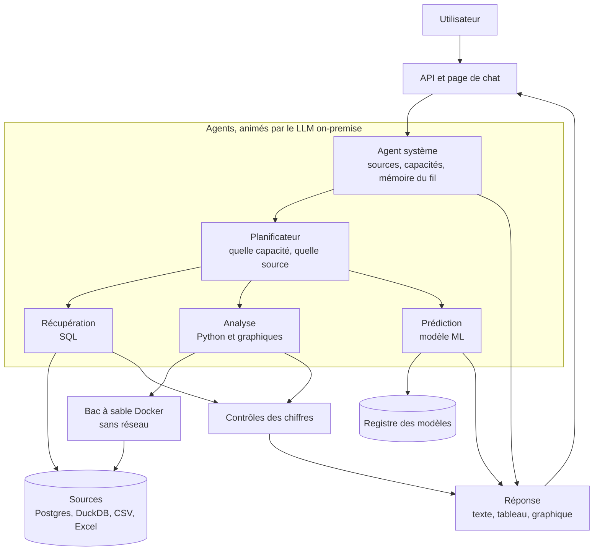

# data-analyst-agent


Un agent d'analyse de données, on-premise.
On lui branche ses sources, on lui pose des questions en français, il y répond
avec ses chiffres, ses tableaux et ses graphiques.
Rien ne sort de la machine.

## Ce qu'il fait

- **Interroge** une source : il écrit le SQL, jointures comprises, et l'exécute en lecture seule.
- **Analyse et trace** : il écrit du Python et l'exécute dans un bac à sable isolé du réseau.
- **Prédit** : il appelle un modèle de machine learning déclaré, et réclame ce qui lui manque.
- **Croise** deux sources reliées par une clé commune.
- **Explique** ce que veut dire une donnée, à partir du dictionnaire de la source.
- **Vérifie** ses propres chiffres : une somme multipliée par une jointure ou privée de son filtre est corrigée ou signalée.

## Technologies

- Python 3.12, uv
- LangGraph et pydantic-ai : l'orchestration et les agents
- FastAPI : l'API et la page de chat
- Postgres, DuckDB, CSV, Excel : les sources
- sqlglot : la relecture du SQL produit
- Docker : le bac à sable d'exécution
- **N'importe quel LLM on-premise**, derrière une API compatible OpenAI avec appel d'outils

## Comment il fonctionne


```mermaid
flowchart TD
    U["Utilisateur"] --> API["API et page de chat"]
    API --> SYS
    subgraph AG["Agents, animés par le LLM on-premise"]
        SYS["Agent système<br/>sources, capacités, mémoire du fil"] --> PLAN["Planificateur<br/>quelle capacité, quelle source"]
        PLAN --> RET["Récupération<br/>SQL"]
        PLAN --> ANA["Analyse<br/>Python et graphiques"]
        PLAN --> INF["Prédiction<br/>modèle ML"]
    end
    RET --> SRC[("Sources<br/>Postgres, DuckDB, CSV, Excel")]
    ANA --> BAC["Bac à sable Docker<br/>sans réseau"]
    BAC --> SRC
    INF --> REG[("Registre des modèles")]
    RET --> CTL["Contrôles des chiffres"]
    ANA --> CTL
    CTL --> REP["Réponse<br/>texte, tableau, graphique"]
    INF --> REP
    SYS --> REP
    REP --> API
```

## Documentation

- [Livraison](docs/LIVRAISON.md)
- [Démonstration](docs/DEMONSTRATION.md)
- [Guide utilisateur](docs/GUIDE-UTILISATEUR.md)
- [Ajouter une source](docs/AJOUTER-UNE-SOURCE.md)
- [Rédiger un dictionnaire de source](docs/rediger-un-dictionnaire-de-source.md)
- [Installation](docs/INSTALLATION.md)
- [Exploitation](docs/EXPLOITATION.md)
- [Développement](docs/DEVELOPPEMENT.md)
- [Architecture](docs/ARCHITECTURE.md)
- [Moteur](docs/MOTEUR.md)
- [Relevé de livraison](docs/releve-de-livraison.md)
- [Campagnes de mesure](scripts/README.md)
- [Historique](docs/historique/README.md)

## Structure

```
src/data_analyst_agent/
├── orchestrator/   le graphe, le plan, la mémoire des conversations
├── agents/         récupération, analyse, prédiction
├── auth/           comptes, sessions
├── prompts/        les prompts système
├── sandbox/        le bac à sable et son image
└── api/            l'API et la page de chat
deploy/             l'installation en service
docs/               la documentation
sources/            les catalogues de sources livrés
models/             les modèles de prédiction et leur registre
scripts/            comptes, semis des sources, campagnes de mesure
tests/              la suite de tests
```

## Licences

**Composants logiciels sous licences 100 % permissives** (MIT / Apache-2.0 / BSD) —
le tableau composant par composant est dans
[ARCHITECTURE §9](docs/ARCHITECTURE.md#9-licences--composants). Les **poids du
modèle** relèvent, eux, de la licence de son éditeur, qui n'est pas lisible depuis
l'application et doit être relue à chaque changement de modèle servi.

Le code applicatif est annoncé MIT, **mais aucun fichier `LICENSE` n'est présent**
et `pyproject.toml` ne déclare rien : l'annonce est sans portée juridique en l'état
(cf. [axes-amelioration](docs/axes-amelioration.md)).
