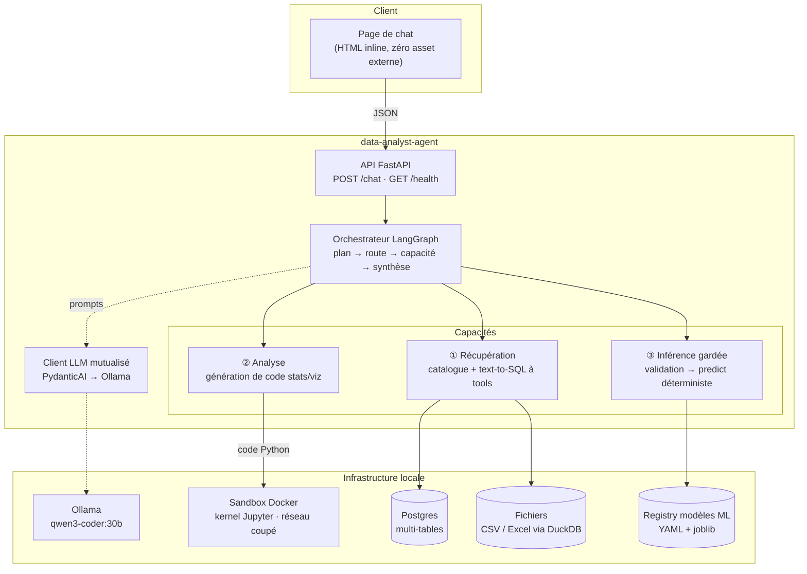
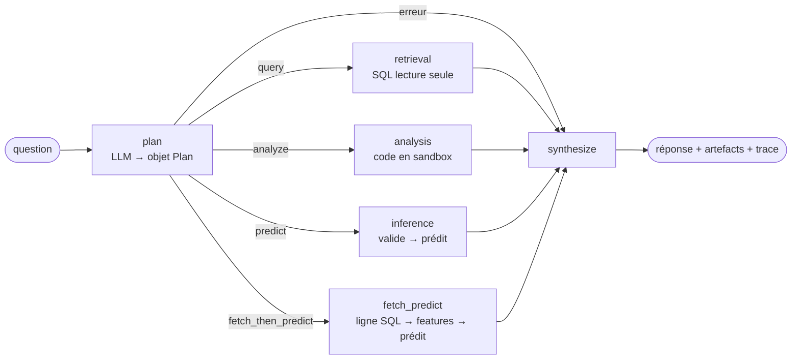
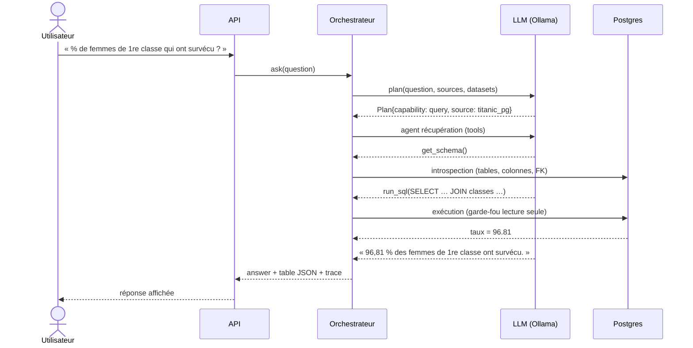

# Architecture — data-analyst-agent

Document de référence technique. Le *pourquoi* (contraintes, décisions, roadmap) est
dans [CADRAGE.md](CADRAGE.md) ; ici on décrit le *comment* : les schémas d'ensemble,
puis chaque service du package.

## 1. Principes directeurs

- **Orchestration explicite** : un graphe LangGraph typé, inspectable, tracé. La règle
  de routage est du code, pas du prompt.
- **Un seul LLM mutualisé** (Qwen3-Coder via Ollama) pour tous les rôles langage :
  planification, SQL, code d'analyse, synthèse. Les modèles ML métier (predict) sont
  des artefacts scikit-learn séparés — aucun LLM dans le calcul.
- **Tout code généré s'exécute en sandbox durcie** : conteneur éphémère, réseau coupé,
  rootfs en lecture seule.
- **Contrats Pydantic aux frontières** : les erreurs éclatent à la frontière du nœud,
  avec un message clair, sans faire tomber le graphe.
- **Licences permissives uniquement** (MIT / Apache-2.0 / BSD) — produit on-premise et
  commercialisable.

## 2. Schéma architectural (composants)



Réponse renvoyée au client : `{answer, artifacts[{mime,data}], plan, error, trace}` —
le texte en langage naturel plus les objets affichables (figure PNG en base64, table
JSON) et la trace d'exécution.

## 3. Schéma fonctionnel (le graphe)



Le planificateur classe la demande dans une capacité et en extrait les paramètres
(source, dataset, features). Le routage est ensuite mécanique. Chaque nœud est
« gardé » : une exception renseigne `error` dans le state et la synthèse produit une
réponse d'échec honnête au lieu d'un crash.

La synthèse choisit le mode le moins coûteux et le plus sûr :

| Situation | Mode de synthèse |
|---|---|
| Erreur d'un nœud | template déterministe (« Je n'ai pas pu répondre : … ») |
| Features invalides/incomplètes | la relance structurée, telle quelle (pas de LLM) |
| Prédiction réussie | template déterministe (classe, probabilité, unité) |
| Requête SQL réussie | le résumé déjà produit par l'agent récupération |
| Analyse réussie | LLM (transforme le stdout du code en 1-4 phrases) |

### Séquence type — scénario golden n°1 (requête SQL)



En cas d'erreur SQL, le tool `run_sql` renvoie le message d'erreur au modèle qui
corrige sa requête — borné par `retrieval_request_limit` pour couper toute boucle.

## 4. Les services, un par un

### 4.1 `api/` — serveur HTTP et chat

`app.py` expose `POST /chat` (contrat `ChatAnswer` complet, trace comprise),
`GET /health` et `GET /` (page de chat inline : rendu des PNG base64 et des tables
JSON, aucun CDN — compatible réseau coupé). L'orchestrateur est construit
paresseusement au premier appel : le serveur démarre sans Ollama ni Docker.

### 4.2 `orchestrator/` — plan et graphe

- `plan.py` — le modèle `Plan` (capability, source, dataset, features,
  data_question) et l'agent planificateur PydanticAI à **sortie structurée** : le
  prompt liste les sources du catalogue et les modèles ML avec leurs features
  attendues ; le LLM n'a le droit de choisir que dans ces listes.
- `graph.py` — le `StateGraph` LangGraph : state typé (`TypedDict` avec accumulation
  des artefacts et de la trace), nœuds gardés, routage code, chaînage
  `fetch_then_predict` (une ligne SQL → intersection avec les champs du schéma de
  features → validation → predict ; ce que l'utilisateur a fourni explicitement
  prime sur la ligne lue). Chaque nœud produit un `TraceStep{node, detail,
  duration_ms}` et journalise (logger `data_analyst_agent.orchestrator`).

### 4.3 `llm.py` + `config.py` — LLM mutualisé et réglages

`build_model()` fabrique l'unique modèle PydanticAI, pointé sur l'endpoint
OpenAI-compatible d'Ollama, température 0 par défaut. `Settings`
(pydantic-settings) centralise tous les réglages, surchargeables par variables
d'environnement `DAA_*` ou `.env` (tableau complet en §7).

### 4.4 `agents/retrieval/` — capacité ① Récupération

- `catalog.py` — catalogue **déclaratif** des sources (`sources/catalogue.yaml`) :
  `postgres` (DSN SQLAlchemy, `${VARIABLES}` d'environnement autorisées) ou `file`
  (CSV/Excel, chemin relatif au YAML). `open_source()` renvoie l'adaptateur adapté.
- `sql.py` — l'ontologie (tables, colonnes, types, clés primaires/étrangères) rendue
  en DDL compact pour le prompt ; le **garde-fou lecture seule** (une seule
  instruction, `SELECT`/`WITH` uniquement, mots-clés d'écriture bloqués) ;
  l'adaptateur Postgres via **pg8000** (BSD — psycopg est LGPL, écarté par la règle
  licences) ; les résultats normalisés (`Decimal`→float, dates→ISO) et tronqués à
  `retrieval_max_rows`.
- `duckdb_excel.py` — les fichiers requêtés en SQL : CSV nativement
  (`read_csv_auto`), Excel lu par pandas/openpyxl puis chaque feuille enregistrée
  comme table DuckDB (une feuille = une table, jointures inter-feuilles possibles).
  Aucune extension DuckDB à télécharger — compatible on-prem.
- `agent.py` — l'agent text-to-SQL à **tools typés** (`list_tables`, `get_schema`,
  `run_sql`). Une erreur SQL revient au modèle en texte pour self-correction ;
  `UsageLimits` borne les allers-retours. Renvoie le SQL exécuté, le résultat, le
  résumé en français et la trace des tentatives.

### 4.5 `agents/analysis/` — capacité ② Analyse

`agent.py` : le LLM reçoit la question, la liste des fichiers montés sous `/data/`
et le contexte (schéma), et répond par un bloc de code Python (pandas, scipy,
statsmodels, prince, matplotlib…). Le code est exécuté dans la sandbox ; en cas
d'erreur, le traceback est renvoyé au modèle qui corrige — jusqu'à
`analysis_max_attempts`. Pour une source SQL, l'orchestrateur matérialise d'abord
chaque table en CSV (borné par `analysis_table_max_rows`) et les monte en lecture
seule. Les figures reviennent en `image/png` (base64) via le protocole MIME du
kernel.

### 4.6 `agents/inference/` — capacité ③ Inférence gardée

- `schemas/` — **la source de vérité** : un schéma Pydantic par dataset (bornes,
  valeurs autorisées, descriptions, `extra="forbid"`). Ajouter un dataset = 1 schéma
  + 1 artefact + 1 entrée de registre.
- `validation.py` — `validate_features()` accepte n'importe quel payload (dump
  partiel comme formulaire complet) et renvoie des anomalies **structurées** :
  `manquant`, `hors_bornes`, `valeur_non_autorisee`, `type_invalide`,
  `champ_inconnu` — plus la question de relance en français. **Pas de predict tant
  que ça ne valide pas.**
- `registry.py` — registre YAML (`models/registry.yaml`) : dataset → artefact
  joblib, tâche, libellés de classes, unité. Cache de chargement. Cible d'évolution :
  MLflow Model Registry, même interface.
- `predict.py` — predict **100 % déterministe, sans LLM** : classification → classe
  + libellé + probabilités ; régression → valeur + unité.

### 4.7 `sandbox/` — exécution durcie de code

- `image/` — le Dockerfile (python 3.12-slim + socle scientifique verrouillé par
  `uv pip compile`) et `bridge.py` : un pont stdio↔kernel Jupyter qui parle un
  protocole JSON ligne à ligne (`execute`/`ping` → `{status, stdout, results[{mime,
  data}], error}`). Le kernel donne les sorties riches (PNG matplotlib) via les
  messages MIME Jupyter standard.
- `client.py` — `SandboxSession` : lance `docker run` **durci** et dialogue avec le
  bridge. Timeout à deux étages : le bridge interrompt d'abord le kernel
  (l'exécution suivante reste possible) ; si le conteneur ne répond plus, l'hôte le
  tue (`sandbox_kill_grace`).

| Durcissement appliqué au `docker run` | Effet |
|---|---|
| `--network=none` | aucun accès réseau, même DNS |
| `--read-only` + `--tmpfs /tmp` | rootfs immuable, /tmp éphémère |
| `--cap-drop=ALL`, `--security-opt=no-new-privileges` | aucun privilège |
| `--memory`, `--cpus`, `--pids-limit` | quotas ressources |
| montages `-v …:ro` sous `/data/` | données en lecture seule |
| utilisateur non-root (uid 1000) | pas de root dans le conteneur |
| `--rm`, conteneur par session | rien ne persiste |

## 5. Sécurité — récapitulatif des garde-fous

1. **SQL** : lecture seule vérifiée *avant* exécution (première instruction
   `SELECT`/`WITH`, une seule instruction, mots-clés d'écriture refusés).
2. **Code généré** : jamais exécuté sur l'hôte — uniquement dans la sandbox du §4.7.
3. **Prédiction** : features validées par schéma strict (`extra="forbid"`), aucune
   valeur inventée, relance sinon.
4. **LLM** : boucles bornées partout (`retrieval_request_limit`,
   `analysis_max_attempts`) ; le planificateur ne choisit que dans les listes
   fournies.

## 6. Stratégie de tests

```
tests/
├── unit/          # rapide, sans Docker ni réseau : LLM scripté, sandbox doublée
├── integration/   # Docker : sandbox réelle, Postgres testcontainers, artefacts ML réels
├── e2e/           # les scénarios golden, du message à la réponse (LLM scripté)
└── helpers/       # ScriptedLLM (réponses par agent), doublures, seed + oracle Titanic
```

- Le **LLM est scripté** dans toute la suite (déterminisme, zéro réseau en CI) : le
  helper `ScriptedLLM` route des réponses préparées vers chaque agent via un
  marqueur de son prompt système. Le test « live » (`-m live`) parle au vrai Ollama,
  exclu par défaut.
- Le scénario golden n°1 est vérifié contre un **oracle pandas** calculé
  indépendamment du pipeline.
- CI GitHub Actions : lint (ruff) + suite complète avec build de l'image sandbox
  (cache buildx) — couverture exigée ≥ 85 %.

## 7. Configuration (`DAA_*`)

| Variable | Défaut | Rôle |
|---|---|---|
| `DAA_OLLAMA_BASE_URL` | `http://localhost:11434/v1` | endpoint OpenAI-compatible d'Ollama |
| `DAA_LLM_MODEL` | `qwen3-coder:30b` | le modèle mutualisé |
| `DAA_LLM_TEMPERATURE` | `0.0` | déterminisme des générations |
| `DAA_CATALOG_PATH` | `sources/catalogue.yaml` | catalogue des sources |
| `DAA_RETRIEVAL_MAX_ROWS` | `200` | lignes max renvoyées par requête |
| `DAA_RETRIEVAL_REQUEST_LIMIT` | `10` | allers-retours LLM max (anti-boucle) |
| `DAA_ANALYSIS_MAX_ATTEMPTS` | `3` | essais de self-debug du code |
| `DAA_ANALYSIS_TABLE_MAX_ROWS` | `10000` | lignes matérialisées par table pour l'analyse |
| `DAA_MODELS_REGISTRY_PATH` | `models/registry.yaml` | registre des modèles ML |
| `DAA_SANDBOX_DOCKER_CMD` | `["docker"]` | commande docker (ex. `["wsl","docker"]`) |
| `DAA_SANDBOX_IMAGE` | `data-analyst-agent-sandbox:0.1` | image de la sandbox |
| `DAA_SANDBOX_MEM_LIMIT` / `_CPUS` / `_PIDS_LIMIT` | `1g` / `1.0` / `256` | quotas conteneur |
| `DAA_SANDBOX_START_TIMEOUT` / `_EXEC_TIMEOUT` / `_KILL_GRACE` | `60` / `30` / `10` s | délais sandbox |

## 8. Limites connues et pistes V2

- **Mono-tour** : la relance de features fonctionne, mais la réponse de
  l'utilisateur repart d'un message complet (pas de mémoire conversationnelle).
- **Registry maison** → migration MLflow prévue (même interface).
- **Mémoire RAG de paires question→SQL validées** (idée retenue du
  [spike Vanna](spike-vanna.md)) pour améliorer les questions récurrentes.
- **Extension de la sandbox en prod** : prévoir un miroir PyPI local (l'image est
  figée par lockfile, rien ne s'installe au runtime).
