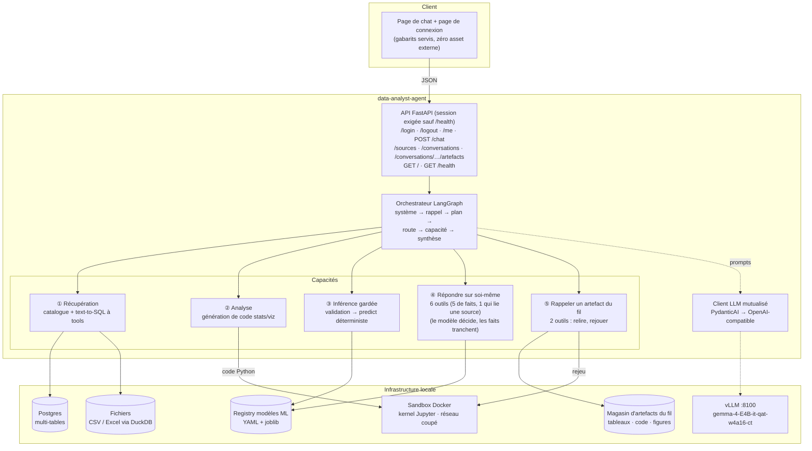
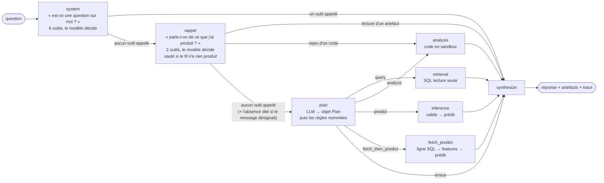
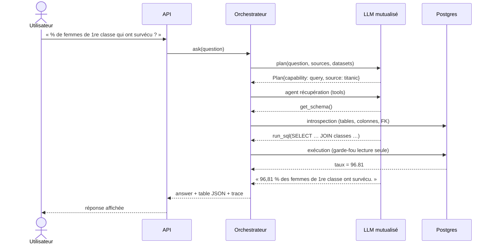

# Architecture — data-analyst-agent

Document de référence technique. Le *pourquoi* (contraintes, décisions, roadmap) est
dans [CADRAGE.md](CADRAGE.md) ; ici on décrit le *comment* : les schémas d'ensemble,
puis chaque service du package.

Pour voir le graphe à l'œuvre plutôt que décrit — huit conversations, huit
diagrammes de séquence établis sur une trace relevée : [parcours-de-l-agent.md](parcours-de-l-agent.md).

## 1. Principes directeurs

- **Orchestration explicite** : un graphe LangGraph typé, inspectable, tracé. La règle
  de routage est du code, pas du prompt.
- **Un seul LLM mutualisé** pour tous les rôles langage : planification, SQL, code
  d'analyse, synthèse. Il est joint par un endpoint OpenAI-compatible et n'est pas
  nommé dans le code (§4.3) ; le service en place sert
  `google/gemma-4-E4B-it-qat-w4a16-ct`. Les modèles ML
  métier (predict) sont des artefacts scikit-learn séparés — aucun LLM dans le calcul.
- **Les prompts système vivent hors du code**, dans `prompts/*.txt` : ce dépôt est un
  socle, et le prompt est le premier endroit qu'on ajuste par cas d'usage (§4.9).
- **Tout code généré s'exécute en sandbox durcie** : conteneur éphémère, réseau coupé,
  rootfs en lecture seule.
- **Contrats Pydantic aux frontières** : les erreurs éclatent à la frontière du nœud,
  avec un message clair, sans faire tomber le graphe.
- **Licences permissives uniquement** (MIT / Apache-2.0 / BSD) — produit on-premise et
  commercialisable.

## 2. Schéma architectural (composants)


```mermaid
flowchart TB
    subgraph client["Client"]
        UI["Page de chat + page de connexion<br/>(gabarits servis, zéro asset externe)"]
    end

    subgraph app["data-analyst-agent"]
        API["API FastAPI (session exigée sauf /health)<br/>/login · /logout · /me · POST /chat<br/>/sources · /conversations · /conversations/…/artefacts<br/>GET / · GET /health"]
        ORCH["Orchestrateur LangGraph<br/>système → rappel → plan →<br/>route → capacité → synthèse"]
        LLM["Client LLM mutualisé<br/>PydanticAI → OpenAI-compatible"]

        subgraph caps["Capacités"]
            RET["① Récupération<br/>catalogue + text-to-SQL à tools"]
            ANA["② Analyse<br/>génération de code stats/viz"]
            INF["③ Inférence gardée<br/>validation → predict déterministe"]
            SYS["④ Répondre sur soi-même<br/>6 outils (5 de faits, 1 qui lie une source)<br/>(le modèle décide, les faits tranchent)"]
            RAP["⑤ Rappeler un artefact du fil<br/>2 outils : relire, rejouer"]
        end
    end

    subgraph infra["Infrastructure locale"]
        MOTEUR["vLLM :8100<br/>gemma-4-E4B-it-qat-w4a16-ct"]
        SBX["Sandbox Docker<br/>kernel Jupyter · réseau coupé"]
        PG[("Postgres<br/>multi-tables")]
        FILES[("Fichiers<br/>CSV / Excel via DuckDB")]
        REG[("Registry modèles ML<br/>YAML + joblib")]
        WS[("Magasin d'artefacts du fil<br/>tableaux · code · figures")]
    end

    UI -->|JSON| API --> ORCH
    ORCH --> RET & ANA & INF & SYS & RAP
    ORCH -.->|prompts| LLM -.-> MOTEUR
    RET --> PG & FILES
    ANA -->|code Python| SBX
    INF --> REG
    SYS --> REG
    RAP --> WS
    RAP -->|rejeu| SBX
```

Réponse renvoyée au client : `{answer, artifacts[{mime,data}], plan, error, trace}` —
le texte en langage naturel plus les objets affichables (figure PNG en base64, table
JSON) et la trace d'exécution.

## 3. Schéma fonctionnel (le graphe)


```mermaid
flowchart LR
    Q(["question"]) --> SYS["system<br/>« est-ce une question sur moi ? »<br/>6 outils, le modèle décide"]
    SYS -->|"un outil appelé"| SYN["synthesize"]
    SYS -->|"aucun outil appelé"| RAP["rappel<br/>« parle-t-on de ce que j'ai produit ? »<br/>2 outils, le modèle décide<br/><i>sauté si le fil n'a rien produit</i>"]
    RAP -->|"lecture d'un artefact"| SYN
    RAP -->|"rejeu d'un code"| ANAL
    RAP -->|"aucun outil appelé<br/>(+ l'absence dite si le message désignait)"| PLAN["plan<br/>LLM → objet Plan<br/>puis les règles nommées"]
    PLAN -->|"query"| RETR["retrieval<br/>SQL lecture seule"]
    PLAN -->|"analyze"| ANAL["analysis<br/>code en sandbox"]
    PLAN -->|"predict"| INFE["inference<br/>valide → prédit"]
    PLAN -->|"fetch_then_predict"| FP["fetch_predict<br/>ligne SQL → features → prédit"]
    PLAN -->|"erreur"| SYN
    RETR --> SYN
    ANAL --> SYN
    INFE --> SYN
    FP --> SYN
    SYN --> R(["réponse + artefacts + trace"])
```

**Le premier nœud n'est pas `plan`, et ce n'est pas un détail d'ordre.** La première
question posée est « cette demande porte-t-elle sur l'agent lui-même ? », et c'est le
**modèle** qui y répond : le nœud `system` lui soumet la question avec six outils qui
rendent les faits du dépôt, et **l'appel d'un outil est le signal de routage**. Rien
d'appelé, le tour repart au planificateur exactement comme avant. C'est la seule
branche du graphe qui ne vient pas d'un `Plan` — `ChatAnswer.plan` reste vide pour une
question sur le système, parce qu'il n'y a rien eu à planifier (§4.10).

**Le deuxième non plus.** Avant le planificateur vient `rappel` : « la demande
porte-t-elle sur quelque chose que cette conversation a DÉJÀ produit ? ». Même
mécanique — deux outils, et l'appel d'un outil est le signal. Ce nœud-ci se
**retire sans appeler le modèle** quand le fil n'a encore rien produit : le
catalogue est vide, les outils ne pourraient que refuser, et l'appel serait payé
pour apprendre ce que le disque dit déjà. Une conversation neuve ne le paie donc
jamais (§4.12). Quand il décline alors que le message désignait bel et
bien un artefact passé, il le **dit** avant de laisser le planificateur produire —
déterministe, hors du modèle (§4.12).

Le planificateur classe la demande dans une capacité et en extrait les paramètres
(source, dataset, features). Le plan qu'il rend est ensuite passé dans une suite de
**règles nommées** — source imposée par l'appelant, dégradations, reprise des
features acquises, questions de clarification (§4.2) — puis le routage est
mécanique. Chaque nœud est « gardé » : une exception renseigne `error` dans le state
et la synthèse produit une réponse d'échec honnête au lieu d'un crash.

La synthèse choisit le mode le moins coûteux et le plus sûr — **le LLM ne rédige que
pour une analyse réussie**, tout le reste est déterministe :

| Situation | Mode de synthèse |
|---|---|
| Question SUR le système | la formulation du modèle, **telle quelle** — ou les faits eux-mêmes si elle ne les porte pas (§4.10) |
| Rappel d'un artefact (lecture) | la formulation du modèle, **telle quelle** — ou le contenu lu, si elle invente un nom, rend la sentinelle ou ne porte rien de ce que l'outil a rendu (§4.12) |
| Rappel d'un artefact absent ou évincé | le **refus**, tel quel : il dit lequel des deux cas c'est, et ce qui reste disponible |
| Rejeu d'un code | celle d'une analyse — un rejeu **est** une analyse (§4.12) |
| Erreur d'un nœud | phrase normalisée + référence d'incident (le détail reste dans la trace) |
| Clarification demandée par une règle du plan | la question, telle quelle |
| Features invalides/incomplètes | la relance structurée, telle quelle |
| Prédiction réussie | template déterministe (classe, probabilité, unité) |
| Prédiction en lot | template déterministe (répartition des classes, ou moyenne et bornes) |
| Requête SQL — aucune ligne | phrase déterministe : un tableau vide doit se dire vide, sinon le LLM raconte le résultat qu'il attendait |
| Requête SQL — plusieurs lignes | phrase déterministe qui renvoie au tableau (le recopier ferait doublon) |
| Requête SQL — un agrégat d'une ligne | le résumé déjà produit par l'agent récupération |
| Requête SQL sans aucun appel d'outil | **réponse écartée** : le modèle a répondu de mémoire, pas d'après la source |
| Analyse réussie | LLM (transforme le stdout du code en 1-4 phrases) |

### Séquence type — scénario golden n°1 (requête SQL)


```mermaid
sequenceDiagram
    actor U as Utilisateur
    participant A as API
    participant O as Orchestrateur
    participant L as LLM mutualisé
    participant P as Postgres

    U->>A: « % de femmes de 1re classe qui ont survécu ? »
    A->>O: ask(question)
    O->>L: plan(question, sources, datasets)
    L-->>O: Plan{capability: query, source: titanic}
    O->>L: agent récupération (tools)
    L-->>O: get_schema()
    O->>P: introspection (tables, colonnes, FK)
    L-->>O: run_sql(SELECT … JOIN classes …)
    O->>P: exécution (garde-fou lecture seule)
    P-->>O: taux = 96.81
    L-->>O: « 96,81 % des femmes de 1re classe ont survécu. »
    O-->>A: answer + table JSON + trace
    A-->>U: réponse affichée
```

En cas d'erreur SQL, le tool `run_sql` renvoie le message d'erreur au modèle qui
corrige sa requête — borné par `retrieval_request_limit` pour couper toute boucle.

## 4. Les services, un par un

### 4.1 `api/` — serveur HTTP, authentification et chat

`app.py` est la couche HTTP, et rien d'autre : les pages sont des gabarits servis
depuis `api/templates/` par `api/pages.py` (substitution `{{cle}}` à valeurs
systématiquement échappées), pas des chaînes Python. L'orchestrateur est construit
paresseusement au premier appel : le serveur démarre sans serveur LLM ni Docker.

**Toutes les routes exigent une session valide, sauf `GET /health`** — une sonde de
disponibilité n'en a pas, et lui refuser l'accès ferait passer le service pour tombé.
Sans session : `401` sur l'API, page de connexion en navigation. Les routes qui
modifient l'état exigent en plus l'en-tête `X-CSRF-Token`, repris du cookie posé à la
connexion. Deux middlewares encadrent tout : l'un exige la session, l'autre borne la
taille du corps (`DAA_API_MAX_BODY_BYTES`).

| Méthode | Route | Session | Rôle |
|---|---|---|---|
| `GET` | `/health` | non | sonde de vie |
| `GET` | `/login` | non | page de connexion (formulaire HTML, sans JavaScript) |
| `POST` | `/login` | non | ouvre une session ; pose le cookie de session et le jeton anti-CSRF. Anti-force brute par compte et par adresse (`DAA_LOGIN_*`) |
| `POST` | `/logout` | oui | révoque la session **côté serveur** et efface les cookies |
| `GET` | `/me` | oui | le compte de la session en cours (`{"login": …}`) |
| `POST` | `/chat` | oui | question → `ChatAnswer` complet (réponse, artefacts, plan, trace, `pending`). Longueur bornée (`DAA_CHAT_MESSAGE_MAX_CHARS`) et débit limité par compte (`DAA_CHAT_RATE_LIMIT_*`) |
| `GET` | `/` | oui | page de chat (rendu des PNG base64 et des tables JSON, zéro asset externe) |
| `GET` | `/sources` | oui | le catalogue déclaré, **augmenté de ce qu'on lit dans chaque source** (tables, lignes, période) — alimente le menu de la page de chat (§4.11) |
| `POST` | `/conversations` | oui | ouvre un fil vide, pour choisir sa source avant la première question |
| `PUT` | `/conversations/{id}/source` | oui | fixe la source de travail du fil sans avoir à la taper ; seule une source **déclarée** est acceptée (§4.11) |
| `GET` | `/conversations` | oui | **ses** résumés (id, titre, horodatages, nb de messages), du plus récent au plus ancien |
| `GET` | `/conversations/{id}` | oui | le fil complet — messages, artefacts et `pending` : de quoi reprendre où on en était |
| `GET` | `/conversations/{id}/artefacts` | oui | le **catalogue** des artefacts du fil — nom, nature, description, question d'origine, et `retenu` (dans le contexte, ou évincé). Jamais leur contenu |
| `GET` | `/conversations/{id}/artefacts/{nom}` | oui | le **contenu** d'un artefact : le code Python d'une analyse, la tête d'un tableau. C'est par là qu'on récupère le code d'une figure sans passer par la conversation |
| `POST` | `/conversations/{id}/duplicate` | oui | copie sous un nouvel id |
| `DELETE` | `/conversations/{id}` | oui | supprime le fil **et** sa mémoire |

`/docs`, `/redoc` et `/openapi.json` sont **éteints** par défaut
(`DAA_API_DOCS_ENABLED`, §7).

**Chacun ne voit que ses conversations** : les routes `/conversations…` et le
`conversation_id` accepté par `POST /chat` sont résolus sous le dossier de
l'utilisateur de la session, et il n'existe pas de vue plus large. Le fil d'un autre
compte répond **`404`, jamais `403`** — un `403` confirmerait son existence. Les
deux routes d'artefacts suivent la même règle et rendent **le même `404`** dans les
trois cas qui devraient être indiscernables : le fil d'un autre, un fil inventé, un
nom d'artefact qui n'existe pas chez soi. Un message par cas dirait à un inconnu
lequel des trois il vient de toucher.

**Multi-tours** : chaque réponse porte un `conversation_id` (généré si absent de la
requête) ; le serveur y associe l'éventuelle *prédiction en attente de features*
(`pending`). Quand l'utilisateur répond à une relance (« elle a 28 ans, billet à
80 livres... »), le planificateur reçoit le contexte (dataset, features déjà
connues, features manquantes), extrait les nouvelles valeurs, et l'orchestrateur
fusionne — le nouveau message prime sur l'acquis, ce qui permet aussi de corriger
une valeur refusée. Une digression solde le contexte.

**Persistance des conversations** (barre latérale) : le fil est écrit sur disque, il
survit donc au rechargement de la page comme au redémarrage du serveur.

Le titre est tiré du premier message. Une conversation est un **dossier unique**
(`workspace_dir/<utilisateur>/<id>/`) : `transcript.json` y voisine le manifeste et
les CSV des tableaux intermédiaires (§4.2). D'où deux propriétés : dupliquer est une
copie de dossier, donc la copie hérite de la mémoire de l'originale (« prédis ces
lignes » fonctionne encore) et évolue ensuite indépendamment ; supprimer efface aussi
les CSV, sans laisser de données orphelines.

### 4.2 `orchestrator/` — plan et graphe

- `plan.py` — le modèle `Plan` (capability, source, dataset, features,
  data_question) et l'agent planificateur PydanticAI à **sortie structurée** : le
  prompt liste les sources du catalogue et les modèles ML avec leurs features
  attendues ; le LLM n'a le droit de choisir que dans ces listes. Le prompt est
  **composé (`planner_system_prompt`) avant d'être confié à l'agent
  (`planner_agent`)** : entre les deux, l'orchestrateur le pèse, parce qu'un
  budget de tokens se décompte sur le prompt réel.
- `introspection.py` — les **faits** que le système peut dire de lui-même, construits
  depuis le catalogue, le registre, les schémas de features et l'ontologie des
  sources (§4.10) ; plus la ceinture qui juge une formulation du modèle contre eux
  (`defaut_de_fondation`). Module pur : aucun fichier, aucune connexion, aucun LLM.
- `systeme.py` — l'agent qui **reconnaît** une question sur l'agent et **formule** ces
  faits : six outils PydanticAI, sur le modèle des trois outils de l'agent SQL. Ici
  vit l'entrée/sortie que `introspection.py` s'interdit — seul l'outil de schéma
  ouvre une connexion (§4.10).
- `rappel.py` — l'agent qui **retrouve** un artefact du fil désigné en langage
  ordinaire (« le graphe de tout à l'heure »), le **relit** et le **rejoue**
  modifié : deux outils PydanticAI, sur le modèle des cinq de `systeme.py`. Il
  n'exécute rien lui-même — le rejeu passe par un rappel que le graphe lui
  fournit, qui remonte le décor de données et repasse par le bac à sable (§4.12).
  Il porte aussi la part **déterministe** du même sujet : reconnaître qu'un message
  DÉSIGNE un artefact passé, et dire l'absence quand il n'y en a pas.
- `context_budget.py` — ce qui entre dans le contexte : la fenêtre glissante et
  le budget de tokens (§7), le compteur approché, et la détection d'un
  débordement — plafonnement constaté sur `prompt_eval_count`, ou refus HTTP
  explicite d'un serveur qui rejette au lieu de tronquer.
- `conversations.py` + `workspace.py` — la persistance d'un fil et sa mémoire
  (transcription, manifeste des **artefacts nommés** — tableaux, code, figures —,
  contexte du tour précédent, **source de travail validée**), rangées **par
  utilisateur** ; écritures atomiques et verrou par conversation (§4.12).
- `graph.py` — le `StateGraph` LangGraph : state typé (`TypedDict` avec accumulation
  des artefacts et de la trace), nœuds gardés, routage code, chaînage
  `fetch_then_predict` (lignes SQL → rapprochement par la correspondance **déclarée
  par la source** (§4.6), insensible à la casse → validation → predict ; ce que
  l'utilisateur a fourni explicitement prime sur la ligne lue). **Une ligne récupérée → prédiction
  unitaire ; plusieurs lignes (« toutes les femmes ») → prédiction en lot** :
  chaque ligne validée, les valides prédites en un seul appel modèle vectorisé,
  les invalides écartées et comptées, réponse agrégée (répartition des classes ou
  moyenne) + table de détail ligne à ligne en artefact. Chaque nœud produit un
  `TraceStep{node, detail, duration_ms, prompt_tokens, server_prompt_tokens,
  truncated, truncation}` et journalise (logger
  `data_analyst_agent.orchestrator`). Une troncature de contexte est en outre
  ajoutée à la réponse rendue à l'utilisateur : la trace n'est pas dépliée par
  défaut, et une perte de contexte ne doit pas se deviner à la qualité des
  réponses.

**Le nœud `plan` n'est plus le premier** : le nœud `system` le précède et peut
répondre à sa place (§4.10). Deux états de conversation le court-circuitent
néanmoins, parce que le message y répond à une question déjà posée et n'est donc pas
à interpréter : une prédiction en attente de features, et une source qui vient d'être
proposée. Le second se tranche entièrement dans `plan`, **sans appel LLM** : le nom
d'une source du catalogue cité dans le message la lie à la conversation (§4.11).

Le premier est **borné**, et il le faut : sans borne, il confisquait la suite du
fil. Un message qui DÉSIGNE un artefact déjà produit — « reprends le tableau
précédent » — ne complète pas une prédiction, et le nœud `rappel` reste donc armé
pour lui (`designation_dun_artefact_passe`). Symétriquement, un tour qui ne s'est
pas prononcé sur la prédiction ne l'efface plus : sans quoi borner le
court-circuit n'aurait fait que déplacer la confiscation — le tableau redevenait
atteignable et la prédiction se perdait (`Orchestrator._pending_retenu`).

**Puis le nœud `plan` est une suite de règles nommées**, et l'ordre en est explicite. Le
plan que rend le LLM est rarement utilisable tel quel : il faut y imposer la source
choisie par l'appelant, dégrader un chaînage faute de source, y reposer la source de
travail de la conversation, y refusionner les features déjà obtenues, normaliser un
nom de source décoré, proposer les sources quand aucune n'est désignée, demander de
préciser quand le modèle est ambigu, lire une absence d'accompagnants que le schéma
sait nommer, promouvoir un `predict` sans features en chaînage sur le dernier
tableau affiché. Chacune de ces règles répare un incident
réel, chacune porte son nom et sa docstring, et `_REGLES_DU_PLAN` — neuf lignes —
est la seule chose à lire pour connaître leur ordre, qui est significatif. Une règle
rend soit rien (le plan continue), soit la question à poser, qui court-circuite les
suivantes.

**Ce que le planificateur n'a pas le droit de faire, et qui n'est pas une règle.**
Pour une feature à valeurs autorisées, son prompt lui impose deux temps :
*traduire* d'abord ce que l'utilisateur a dit vers la valeur autorisée qui le
désigne (« 1re classe » → `pclass=1`, « embarquée à Southampton » →
`embarked='S'`) ; et, si **aucune** valeur autorisée ne désigne ce qu'il a dit
(« 4e classe », « embarquée à Marseille »), transmettre la sienne **telle qu'il
l'a écrite** — `pclass=4`, `embarked='Marseille'`. Jamais la valeur autorisée la
plus proche, jamais un champ vide ou omis. Substituer une valeur *légale* à une
valeur *impossible* rendrait une prédiction plausible sur un individu que
l'utilisateur n'a pas décrit, et rien dans la réponse ne le dirait ; l'omettre la
ferait redemander comme si elle n'avait pas été donnée. C'est le système qui
refuse, en citant ce que l'utilisateur a écrit — même interdit que celui que
`coerce_values` respecte à l'autre bout (§4.6). La consigne vit dans
`prompts/planner.txt` et non dans une règle, parce qu'elle porte sur ce que le
modèle **extrait**, pas sur le plan une fois rendu.

Ces règles ajustent un plan que le LLM a **déjà** rendu : l'aller-retour est derrière
elles. C'est pourquoi le cas « question sur le système » ne pouvait pas y être traité
— il fallait une étape *avant*, et non une règle de plus
([surface-conversationnelle.md](surface-conversationnelle.md) §5). C'est aussi
pourquoi la proposition de sources, elle, est bien une règle : elle n'arrive qu'une
fois la capacité connue, seul moment où l'on sait qu'une source est réellement
nécessaire (§4.11).

Quand le planificateur échoue à produire un `Plan` structuré et qu'il n'y a aucun tour
précédent à reprendre, le repli **rend l'inventaire réel** — sources et modèles lus
dans le catalogue et le registre — avant de redemander de préciser. Il citait
auparavant « titanic, iris… » recopiés en dur dans la chaîne : il déclarait ne pas
comprendre tout en nommant la source qu'on lui demandait, et se trompait dès qu'un
déploiement changeait de catalogue.

### 4.3 `llm.py` + `config.py` — LLM mutualisé et réglages

`build_model()` fabrique l'unique modèle PydanticAI, pointé sur un endpoint
**OpenAI-compatible**, température 0 par défaut. Le serveur n'est pas nommé
dans le code : il expose `/v1/chat/completions` (vLLM, [MOTEUR.md](MOTEUR.md)),
et en désigner un autre ne change que `DAA_LLM_BASE_URL`. Le client HTTP est
construit explicitement pour porter la clé d'API (`DAA_LLM_API_KEY`, exigée par
un serveur lancé avec `--api-key`), le
délai et le nombre de réessais : laissés aux défauts du SDK OpenAI (600 s,
2 réessais), un appel bloqué retenait un thread ~30 min. `Settings`
(pydantic-settings) centralise tous les réglages, surchargeables par variables
d'environnement `DAA_*` ou `.env` (tableau complet en §7).

### 4.4 `agents/retrieval/` — capacité ① Récupération

- `catalog.py` — catalogue **déclaratif** des sources (`sources/catalogue.yaml`), en
  **trois** types : `postgres` (DSN SQLAlchemy, `${VARIABLES}` d'environnement
  autorisées), `file` (CSV/Excel, chemin relatif au YAML) et `duckdb` (base
  `.duckdb`, chemin relatif au YAML). `open_source()` renvoie l'adaptateur adapté.
  `duckdb` n'est pas un `file` de plus : un CSV et un classeur n'ont aucune
  contrainte à déclarer, alors qu'une base porte ses clés primaires **et
  étrangères** — un schéma en étoile arrive donc au modèle avec ses jointures au
  lieu de le laisser les deviner. C'est aussi la forme qu'a n'importe quel gros jeu
  de données local (éprouvé sur une base de 1,66 M de lignes et dix tables).
  Toute source peut déclarer un `dictionary` **facultatif** : un Markdown qui dit ce
  que les données *veulent dire*, là où le DDL ne dit que des types. C'est lui qu'on
  cite quand on demande le sens d'une colonne (§4.10).
  Elle peut aussi déclarer un bloc `features` **facultatif** — `{dataset: {feature:
  colonne}}` — qui dit quelles colonnes de CETTE source alimentent quel modèle du
  registre. Le `dictionary` s'adresse au modèle de langage ; `features` s'adresse au
  code (§4.6, `correspondance.py`). C'est la source qui le sait, et elle seule : le
  même modèle `titanic` est alimenté par `classes.level` dans la base Postgres et
  par `Pclass` dans le CSV vendorisé. Ce que la source déclare là est **relu contre
  son schéma** avant toute requête : une colonne déclarée qui n'existe pas est
  nommée, avec celles qui existent, au lieu de finir en SQL en erreur puis en
  feature absente (§4.6).
  Elle peut enfin déclarer `date_reference` **facultatif** — la colonne sur laquelle
  se lit la **période** couverte, `table.colonne` ou `colonne` seule. Sans elle, la
  période est celle de la première colonne de date du schéma (§4.11, « Ce qu'on LIT
  dans une source ») : juste, puisque
  la colonne est nommée dans la réponse, mais choisie par l'ordre du DDL. Une source
  qui porte une date de commande **et** une date de livraison a une colonne qui
  compte, et elle seule le sait.
- `sql.py` — l'ontologie (tables, colonnes, types, clés primaires/étrangères) rendue
  en DDL compact pour le prompt, valeurs des colonnes à faible cardinalité comprises
  (sans quoi le modèle devine les littéraux, et il les devine dans sa langue) ; le
  **garde-fou lecture seule** (une seule instruction, `SELECT`/`WITH` uniquement,
  mots-clés d'écriture bloqués), appliqué sur la requête **masquée** — littéraux,
  identifiants cités et commentaires blanchis, parce qu'un point-virgule dans une
  valeur n'est pas une instruction ;
  l'adaptateur Postgres via **pg8000** (BSD — psycopg est LGPL, écarté par la règle
  licences) ; les résultats normalisés (`Decimal`→float, dates→ISO) et tronqués à
  `retrieval_max_rows`.
  `to_markdown()` est ce que le **modèle lit** (le retour de `run_sql`), et une
  **ligne unique y est rendue verticalement**, un couple par ligne. Ce n'est pas une
  préférence d'écriture : un tableau d'une seule ligne oblige à aligner de tête six
  en-têtes et six valeurs, et c'est une lecture que le modèle en service rate.
  Mesuré sur « quelles colonnes de `passengers` ont des valeurs manquantes ? » — le
  SQL était devenu juste, `0 | 177 | 0 | 0 | 0 | 2` sous six en-têtes, et le modèle
  nommait `name`, mesuré à 0. Deux reformulations du prompt n'y avaient rien changé :
  le défaut était dans ce qu'on donnait à lire. C'est le seul consommateur de
  `to_markdown` — ce que voit l'utilisateur est un artefact à part, il ne bouge pas.
- `duckdb_excel.py` — ce que DuckDB requête, par deux portes. `from_file` : CSV
  nativement (`read_csv_auto`), Excel lu par pandas/openpyxl puis chaque feuille
  enregistrée comme table DuckDB (une feuille = une table, jointures inter-feuilles
  possibles). `from_database` : une base `.duckdb` ouverte **en lecture seule** —
  `read_only` n'est pas qu'une ceinture de plus par-dessus le garde-fou SQL, il
  laisse plusieurs process ouvrir la même base, sans quoi l'API et un notebook ne
  pourraient pas cohabiter. Les contraintes déclarées sont relues par
  `duckdb_constraints()` (clés primaires et étrangères), en *best-effort* : une
  source qui n'en a pas ressort sans clés, ce qui est la vérité et non un défaut
  d'introspection. Aucune extension DuckDB à télécharger — compatible on-prem.
  Le **verrou d'accès à l'hôte** (`enable_external_access=false`) est posé dans
  `__init__`, seul point de passage commun aux deux portes : `read_only` protège la
  base, pas le disque autour, et une connexion en lecture seule reste capable de
  `read_csv_auto('/etc/passwd')` tant qu'on ne l'a pas coupée.
- `agent.py` — l'agent text-to-SQL à **tools typés** (`list_tables`, `get_schema`,
  `run_sql`). Une erreur SQL revient au modèle en texte pour self-correction ;
  `UsageLimits` borne les allers-retours. Renvoie le SQL exécuté, le résultat, le
  résumé en français et la trace des tentatives.
  Son prompt nomme **trois** familles de question, et non deux : lister des lignes,
  calculer un agrégat, et *décrire une table sans la lire ligne à ligne* — compter
  les trous, les distincts, les extrêmes de **chaque** colonne. La troisième
  manquait, et une question qui y tombait partait soit en `SELECT *` (179 lignes
  rendues au lieu d'une liste de colonnes), soit en une requête **par colonne** —
  six requêtes dont quatre en erreur, dix allers-retours, 73,4 s et le plafond
  épuisé, puis une réponse tirée du schéma au lieu de la mesure.
  La consigne est donc *UNE requête, UNE ligne, TOUTES les colonnes*, avec le rappel
  que le schéma dit ce qui est **possible** quand seule la mesure dit ce qui **est**.

### 4.5 `agents/analysis/` — capacité ② Analyse

`agent.py` : le LLM reçoit la question, la liste des fichiers montés sous `/data/`
et le contexte (schéma), et répond par un bloc de code Python (pandas, scipy,
statsmodels, prince, matplotlib…). Le code est exécuté dans la sandbox ; en cas
d'erreur, le traceback est renvoyé au modèle qui corrige — jusqu'à
`analysis_max_attempts`. Pour une source SQL, l'orchestrateur matérialise d'abord
chaque table en CSV (borné par `analysis_table_max_rows`) et les monte en lecture
seule ; **une table coupée par ce plafond est annoncée** au code généré comme à
l'utilisateur, un CSV tronqué ne se distinguant en rien d'un CSV complet et un
agrégat calculé dessus étant faux sans en avoir l'air. Les figures reviennent en
`image/png` (base64) via le protocole MIME du kernel.

### 4.6 `agents/inference/` — capacité ③ Inférence gardée

- `schemas/` — **la source de vérité** : un schéma Pydantic par dataset (bornes,
  valeurs autorisées, descriptions, `extra="forbid"`). Ajouter un dataset = 1 schéma
  + 1 artefact + 1 entrée de registre.
- `validation.py` — `validate_features()` accepte n'importe quel payload (dump
  partiel comme formulaire complet) et renvoie des anomalies **structurées** :
  `manquant`, `hors_bornes`, `valeur_non_autorisee`, `type_invalide`,
  `champ_inconnu` — plus la question de relance en français. **Pas de predict tant
  que ça ne valide pas.** Deux passes précèdent le schéma : `align_keys()` rapproche
  les noms, et `coerce_values()` convertit les valeurs **textuelles** vers le type
  attendu. Cette seconde passe répare un écart réel : le serveur rend
  `pclass='1'` là où le schéma attend `pclass=1`, et une extraction pourtant juste
  était refusée. La cause n'est pas que le serveur rendrait ses arguments en
  chaînes — sur un tool dont le JSON Schema **déclare** un type, il rend ce type
  (mesuré, [MOTEUR.md](MOTEUR.md) §8.4) ; c'est que
  `Plan.features` est un `dict[str, Any]`, soit `additionalProperties: true`, **le
  seul argument d'outil du système qui arrive sans type annoncé**. Pydantic rattrape
  déjà `int`/`float` en mode souple, mais pas un `Literal[1, 2, 3]`, qui compare des
  valeurs. La conversion vit donc ici, à la frontière, devant les trois schémas —
  aucun n'a à s'en soucier, ni le prochain ; et elle ne peut pas vivre plus tôt,
  puisque le type attendu d'une feature n'existe nulle part avant ce module. Ce
  n'est pas un relâchement : on ne convertit que des chaînes, que vers un type sans
  ambiguïté, et une chaîne illisible est laissée **telle quelle** pour que le schéma
  refuse en citant ce qui a été écrit — `pclass='4'` devient `4` et reste refusé,
  `pclass='abc'` reste `'abc'` et reste refusé aussi.
- `correspondance.py` — **quelle colonne d'une source porte quelle feature**, lu
  dans le bloc `features` que la source déclare au catalogue (§4.4). Trois usages,
  et c'est ce qui distingue une déclaration d'un paragraphe de documentation : la
  consigne donnée à l'agent SQL nomme la colonne source ET son alias
  (`classes.level AS pclass`) ; la ligne récupérée est rapprochée du schéma **par le
  nom déclaré**, sans dépendre de ce que l'agent a aliasé ; et une source du
  catalogue qui ne déclare rien pour un modèle est **refusée avant d'être
  interrogée**, avec le message qui dit quoi écrire. Quatrième usage depuis, et
  c'est la moitié qui manquait : `confronter()` relit chaque colonne déclarée
  **contre le schéma réel de la source**, une fois la connexion ouverte et avant
  la moindre requête. Un `classes.levelx` écrit dans un YAML partait jusque-là en
  SQL, échouait sur une colonne inconnue, laissait l'agent se corriger au jugé et
  finissait en feature absente du payload — un symptôme à trois pas de sa cause.
  Le refus nomme la colonne introuvable, propose la colonne réelle qui lui
  ressemble, liste celles de la source, et dit que rien n'a été interrogé.
  Mesuré avant/après sur la base Postgres `titanic` : un `classes.levelx` était
  **silencieusement réparé** par l'agent SQL (une prédiction juste, 4 tirages sur
  4, et une déclaration fausse qui survit) ; un `classes.rang_du_billet` passait
  par `classes.label` et rendait « reçu `'3e classe'` », qui accuse les données là
  où la faute est au catalogue. Les deux coûtaient 5 appels LLM et une requête ;
  ils en coûtent 2 et zéro, avec un message qui dit quelle ligne du YAML corriger. Sur la
  correspondance **déclarée** seulement : un tableau du tour précédent ne déclare
  rien, et une feature qu'aucune de ses colonnes ne porte doit rester réclamée par
  le schéma, pas traitée en faute de catalogue. Une source peut aussi déclarer
  la traduction des valeurs (`values: {"3e classe": 3}`) quand elle ne représente
  pas la feature comme le schéma l'attend — deux écarts distincts, le nom et la
  représentation. Une valeur qu'aucune traduction ne couvre est laissée **telle
  quelle** et refusée par le schéma, qui la cite : substituer ici une valeur légale
  serait la faute que §4.2 interdit au planificateur. Seule exception au refus : un
  tableau du tour précédent réinjecté sous `resultat_1`, qui n'a aucun YAML où
  déclarer — ses colonnes sont rapprochées par leur nom.
- `registry.py` — registre YAML (`models/registry.yaml`) : dataset → artefact
  joblib, tâche, libellés de classes, unité. Cache de chargement. Cible d'évolution :
  MLflow Model Registry, même interface.
- `predict.py` — predict **100 % déterministe, sans LLM** : classification → classe
  + libellé + probabilités ; régression → valeur + unité.

### 4.7 `sandbox/` — exécution durcie de code

- `image/` — le Dockerfile (python 3.12-slim + socle scientifique verrouillé par
  `uv pip compile`) et `bridge.py` : un pont stdio↔kernel Jupyter qui parle un
  protocole JSON ligne à ligne (`execute`/`ping` → `{status, stdout, results[{mime,
  data}], error}`). Le kernel donne les sorties riches (PNG matplotlib) via les
  messages MIME Jupyter standard.
- `client.py` — `SandboxSession` : lance `docker run` **durci** et dialogue avec le
  bridge. Timeout à deux étages : le bridge interrompt d'abord le kernel
  (l'exécution suivante reste possible) ; si le conteneur ne répond plus, l'hôte le
  tue (`sandbox_kill_grace`).

| Durcissement appliqué au `docker run` | Effet |
|---|---|
| `--network=none` | aucun accès réseau, même DNS |
| `--read-only` + `--tmpfs /tmp` | rootfs immuable, /tmp éphémère |
| `--cap-drop=ALL`, `--security-opt=no-new-privileges` | aucun privilège |
| `--memory`, `--cpus`, `--pids-limit` | quotas ressources |
| montages `-v …:ro` sous `/data/` | données en lecture seule |
| `--rm`, conteneur par session | rien ne persiste |

À quoi s'ajoutent deux garde-fous qui ne viennent pas du `docker run` :

- **utilisateur non-root** : il vient de l'`USER 1000:1000` de l'image, et de là
  seulement. `docker_run_command` ne passe **pas** de `--user` — le commentaire du
  Dockerfile l'affirmait, c'était faux. La propriété tient donc tant que l'image
  servie est bien celle du dépôt : une image tierce désignée par
  `DAA_SANDBOX_IMAGE` tournerait en root ;
- **plafond du nombre de conteneurs** : `SandboxPlaces` (sémaphore de portée
  process) borne les sessions vivantes à `DAA_SANDBOX_MAX_SESSIONS`. Les quotas
  *par* conteneur ne disent rien de leur *nombre* : dix analyses simultanées, c'était
  dix gigaoctets réservés. Au-delà du plafond, une session attend, puis se voit
  **refusée** au bout de `DAA_SANDBOX_QUEUE_TIMEOUT`.

**L'image n'est pas construite automatiquement.** `ensure_image()` existe et sait le
faire, mais rien dans le chemin applicatif ne l'appelle — seuls les tests
d'intégration et e2e s'en servent. Une sandbox lancée sans image se solde par un
échec du `docker run`, pas par un build. Elle se construit donc à la main, une fois :

```bash
docker build -t data-analyst-agent-sandbox:0.1 src/data_analyst_agent/sandbox/image/
```

### 4.8 `auth/` — comptes, sessions, anti-force brute

- `accounts.py` — magasin YAML non versionné (`var/users.yaml`, `0600`), empreintes
  **argon2id** (lent et à mémoire dure, là où un sha256 s'essaie par milliards par
  seconde sur un GPU). Peuplé uniquement par `scripts/manage_users.py` : il n'y a ni
  inscription ouverte ni compte par défaut. Le login est normalisé (NFKC, bords
  retirés, `casefold`) à la création comme à la connexion — il sert aussi de nom de
  dossier.
- `sessions.py` — sessions **côté serveur** : le navigateur ne reçoit qu'un
  identifiant opaque, tout l'état est sur disque. C'est ce qui rend la déconnexion
  effective et permet à `manage_users.py disable` de couper immédiatement les onglets
  déjà ouverts. Deux échéances : inactivité et durée absolue (§7).
- `throttle.py` + `rate_limit.py` — verrouillage temporisé après N échecs de
  connexion (par compte **et** par adresse), et débit de `POST /chat` par compte.
- `current_user.py` — la dépendance FastAPI qui résout la session en compte.

### 4.9 `prompts/` — les prompts système, hors du code

Les six prompts — planificateur, agent SQL, agent d'analyse, synthèse, agent
système (§4.10) et agent de rappel (§4.12) — sont des fichiers `.txt` servis par un
chargeur de trente lignes, sur le modèle d'`api/pages.py`. Les deux derniers sont
arrivés avec leurs nœuds : un nœud à outils reconnaît son sujet par son prompt, et
c'est donc là qu'on ajuste ce qu'il attrape.
Ce dépôt est un socle : le prompt est le premier endroit qu'on voudra adapter par cas
d'usage, et il ne doit pas demander une modification de source.

Trois détails qui ont leur raison :

- la substitution est un **remplacement littéral** de `{cle}`, pas un `str.format` :
  un prompt qu'on édite sans relancer la suite invite à y montrer un exemple JSON au
  modèle, et `str.format` lèverait alors en pleine requête ;
- **aucun échappement**, contrairement aux gabarits HTML : la destination est un
  modèle de langage, et échapper le schéma d'une base le rendrait illisible ;
- extension `.txt` et non `.md` : ruff reformate les blocs de code des fichiers
  Markdown, et le prompt d'analyse montre du Python au modèle.

`prompts.marqueur()` en tire la ligne qui identifie chaque prompt : c'est par elle
que la doublure de test route ses réponses vers le bon agent (§6), au lieu d'une
formulation recopiée à la main.

### 4.10 `orchestrator/systeme.py` + `introspection.py` — capacité ④ Répondre sur soi-même

Les quatre capacités précédentes agissent **sur** les données. Celle-ci répond aux
questions **sur le système** : quelles sources, quelles tables, quelles colonnes, le
sens d'une colonne, quels modèles, quels attributs ils attendent, ce que l'agent sait
faire. Elle n'existait pas, et son absence ne se lisait pas comme une erreur de
classement : la demande n'avait aucune case où être rangée, et tombait dans le repli
« je n'ai pas bien compris » — **une question méta sur trois**, mesuré
([surface-conversationnelle.md](surface-conversationnelle.md)).

**Le modèle reconnaît, l'outil rend les faits, le modèle formule.** Le nœud `system`
est en tête du graphe : il soumet la question à un agent muni de six outils typés
(`pydantic-ai`, sur le modèle des trois outils de l'agent SQL, qui fonctionnent avec
le modèle en service). Le modèle décide d'appeler, l'outil rend un texte construit
depuis un artefact du dépôt, et le modèle le formule pour l'utilisateur.

| Outil | Source de vérité | Connexion ? |
|---|---|---|
| `sources_de_donnees` | `sources/catalogue.yaml` | non |
| `modeles_de_prediction` | `models/registry.yaml` | non |
| `attributs_d_un_modele` | `SCHEMAS` + `describe_features` | non |
| `capacites_de_l_agent` | les valeurs de `Capability`, plus l'inventaire | non |
| `schema_d_une_source` | l'ontologie de la source (+ son dictionnaire) | **oui** |

`schema_d_une_source` se décline à quatre niveaux de détail, selon ce que l'argument
`cible` nomme : une colonne (sa fiche, avec la clé étrangère — le nom `class_id`
n'apprend rien, la table `classes` qu'il référence tout), une table (ses colonnes),
une source (toutes ses tables), rien de décidable (le tour d'horizon : les tables de
chaque source, sans les colonnes).

**Ce qui a remplacé le lexique, et pourquoi.** La reconnaissance était un lexique de
tournures écrites à la main. Précis, pas exhaustif, et c'était son plafond : mesuré
sur dix formulations naturelles de la MÊME question (« quelles données as-tu ? »), il
en court-circuitait trois et laissait les sept autres partir au planificateur, qui les
classait `query` et écrivait du SQL pour répondre à une question de configuration.
« c'est quoi ton périmètre ? », « tu bosses sur quoi ? », « montre-moi ce que tu as » :
la famille est ouverte, un lexique est une liste
([surface-conversationnelle.md](surface-conversationnelle.md) §9).

**Le signal de routage est l'appel d'outil, jamais le texte.** Le prompt demande au
modèle de répondre `AUTRE` quand la question porte sur les données, mais rien ne
repose sur ce mot : aucun outil appelé veut dire « ce n'est pas une question sur le
système », et le tour repart au planificateur. Un modèle qui paraphrase la consigne,
ou qui répond de mémoire sans rien regarder, ne peut donc pas se faire servir.

**Le déterministe n'est pas jeté : il est devenu la ceinture.** Les textes de
`introspection.py` sont à la fois la matière du chemin principal et le repli servi tel
quel quand la formulation du modèle ne les porte pas. Deux défauts la disqualifient
(`defaut_de_fondation`), et dans les deux cas ce sont **les faits** qui partent à
l'utilisateur :

- **un nom qu'aucun fait ne porte.** C'est le défaut d'`acfd8f5` — « décris le dataset
  iris » répondu de mémoire, avec une prose de culture générale servie comme une
  lecture de la source — qu'on empêche de revenir par cette porte. Un nom inventé est
  plus nocif qu'une réponse absente : il a l'air d'une lecture de la source.
- **un nom rendu par l'outil et absent de la réponse.** Une liste incomplète n'est pas
  une réponse à « quelles colonnes ? », et c'est un défaut mesuré : la version narrée
  par le modèle avait laissé tomber deux colonnes sur dix.

Sont comptés pour des noms techniques, du côté du modèle, ce qu'il met entre accents
graves et tout jeton à blanc souligné — jamais le gras, qu'il emploie pour des mots
français ordinaires. Les échappements Markdown (`passenger\_id`) sont retirés avant
comparaison.

**Mais le repli est un garde-fou, pas une réponse : on redemande avant de le servir.**
Il est juste, il est fondé, et ce n'est pas la même chose — « parle-moi de stocks et de
titanic, en deux mots » recevait 774 caractères de fiche, en-tête compris. Quand la
ceinture écarte une formulation, les faits sont toujours là : on les rend au modèle
avec la même question, et on le laisse recommencer (`systeme.servir_la_reponse`). Si
cette seconde formulation est fondée, c'est elle qui part ; sinon le repli part comme
avant, donc la seconde chance ne peut rien faire perdre. L'agent de réparation n'a
**aucun outil** — il ne peut rien apprendre qu'on n'ait relevé, il ne peut pas boucler,
et le tour coûte donc exactement un appel LLM, sur les seuls tours rejetés. Il se juge
à la MÊME ceinture, sur les mêmes faits. Mesuré : 18 tours sur 60 servis par le repli,
aucun ne l'est plus, +18 appels pour 60 tours
([sources-metier.md](sources-metier.md)). La trace nomme la voie — `formulé par le
modèle`, `reformulé au second tour`, `faits servis tels quels (1re passe : … ; 2e
passe : …)`.

`introspection.py` reste **pur** — il n'ouvre ni fichier ni connexion, un test le
vérifie sur son propre code source. L'entrée/sortie vit dans `systeme.py`, comme pour
toute autre capacité.

**Le nœud est fail-open sur ce que le MODÈLE rate**, et seulement sur ça : sortie
invalide, plafond d'allers-retours atteint (`DAA_SYSTEME_REQUEST_LIMIT`) — le tour
repart au planificateur au lieu d'échouer, parce que ce nœud est en tête de *chaque*
tour et qu'un planificateur qui aurait su répondre ne doit pas être privé de la
question.

**Le plafond, lui, vaut 6, et c'est mesuré.** Ce qu'il borne, c'est une question
sur trente-six — « sur quoi je peux travailler ? » — qui ouvre sur tous les sujets
à la fois : elle peut demander capacités, sources, schéma et modèles avant de
formuler. Sondée seule à 6, 8 et 12, elle coûte 6 à chaque fois : le chemin
converge, il ne s'emballe pas.

| Plafond | Questions méta | Appels LLM |
|---|---|---|
| 4 | 36/36 | 78 |
| 5 | 36/36 | 78 |
| **6** | **36/36** | **78** |

Batterie complète des 36 questions méta, témoins à 4/4 et 17 appels dans les trois
exécutions. **La marge est gratuite** : même total à 4, 5 et 6, et pas une seule
question dont le coût bouge. Un plafond n'est pas un budget dépensé, c'est un budget
disponible — seule la question qui en a besoin le touche. L'atteindre coûte
d'ailleurs *plus* cher que de réussir, puisque l'échec ajoute le tour du
planificateur et celui de la synthèse : c'est ce qui justifie de garder de la marge
au-dessus du pire cas observé plutôt que de coller à lui. Ce qu'un **outil** rate — une source injoignable, un catalogue illisible —
n'est pas rattrapé : c'est un vrai défaut de configuration, il remonte au garde-fou
et il est dit.

**Trois planchers, pour les tours où le modèle n'appelle rien.** Le signal de
routage reste l'appel d'outil ; ces trois-là ne le remplacent pas, ils rattrapent
des tours où *aucun* outil n'a été appelé et où rien en aval ne sait répondre. Ils
sont **mécaniques** — ils ne parlent ni au modèle ni à l'utilisateur — et ils ne
servent que du texte qui existait déjà. C'est un choix mesuré : cinq formulations
de prompt ou de fiche d'outil ont été écrites pour dire la même chose, et les cinq
ont été retirées, chacune au prix d'une question de la surface conversationnelle.

| Plancher | Se déclenche quand | Sert |
|---|---|---|
| `decrire_les_sources` | un outil allait rendre le catalogue ENTIER alors que le message nomme ses sources | leurs fiches |
| `_plancher_des_sources_nommees` | le message nomme **deux** sources déclarées ou plus et porte une question | leurs fiches |
| `_plancher_de_la_periode` | le message demande QUAND et **aucune** source relevée n'a de date | l'inventaire, où chaque source porte son constat |

Le troisième a la garde la plus stricte, et c'est elle qui le rend inoffensif :
dès qu'une seule source du catalogue porte une période, il se retire — la question
a une réponse à calculer, et c'est au planificateur de la chercher. Sur les
catalogues dont les sources sont datées, il est muet.

**La frontière tient en une phrase**, et c'est le prompt de l'agent système qui la
porte : il répond sur ce que l'agent **EST**, jamais sur ce que les données
**CONTIENNENT**. « Combien de lignes ? » exige un `COUNT` : elle reste du ressort
de `query`. Ce n'est plus une garantie de code mais un comportement de modèle —
d'où les **témoins** de la batterie live, qui sont là pour ne pas bouger.

La **période** a changé de côté, et pour une raison qui vaut d'être dite : depuis
qu'elle est LUE au relevé du catalogue (§4.11, « Ce qu'on LIT dans une source »),
ce n'est plus un `MIN`/`MAX` à
calculer mais un fait de la fiche — y compris quand ce fait est une absence. Une
question de période est donc une question sur ce que l'agent **a**, et son chemin
est l'agent système.

**Cette capacité n'est PAS une valeur de `Capability`, et c'est mesuré.** Le `Literal`
est le JSON Schema de la sortie structurée du planificateur : l'élargir change le
contrat que lit le modèle, même sans toucher au prompt, et dégrade son extraction sur
les capacités voisines (`pcass` au lieu de `pclass`, donc une relance au lieu d'une
prédiction). Un **outil** est autre chose : il ne touche pas ce contrat, et le prompt
du planificateur ne bouge pas d'un caractère. Le détail des deux expériences est dans
[surface-conversationnelle.md](surface-conversationnelle.md) §6.

**Le coût, assumé et mesuré.** Un aller-retour de plus en tête de chaque question sur
les données ; deux appels pour une question sur le système, là où le lexique en
coûtait zéro **quand il reconnaissait la tournure** et deux à quatre quand il la
manquait. Les chiffres, avant et après, sont au §9 de
[surface-conversationnelle.md](surface-conversationnelle.md).

### 4.11 La source de travail d'une conversation

Le catalogue peut déclarer plusieurs sources, et le planificateur en choisissait une
à chaque tour, sur leurs descriptions. Quand il n'y parvenait pas, une règle posait la
question — « Sur quelle source veux-tu travailler : titanic, iris ? » — mais deux noms
nus, et **la réponse était perdue au tour suivant**.

Le parcours est maintenant : l'agent **propose**, l'utilisateur **valide**, et c'est
la source sur laquelle on travaille **ensuite**.

- **La proposition** rend ce que le catalogue dit de chaque source, et finit par la
  question (ce qu'on lit en dernier est ce à quoi on répond). Elle est portée par
  `_regle_choisir_la_source`, donc elle n'arrive qu'**après** le plan : c'est le seul
  moment où l'on sait qu'une source est réellement nécessaire — « prédis pour une
  passagère de 1re classe » n'en demande aucune, et lui proposer un catalogue serait
  un tour perdu.
- **S'il n'y en a qu'une, elle est annoncée** au lieu d'être demandée. Elle était déjà
  choisie en silence par `_resolve_source` ; ce qui change, c'est que l'utilisateur
  l'apprend.
- **La validation est du code**, pas un appel LLM : le nom d'une source du catalogue
  cité dans le message, et un seul. Comparer deux chaînes ne mérite pas un
  aller-retour. Un message qui ne nomme aucune source connue n'est **pas** un choix et
  repart au planificateur — sans cette porte de sortie, « laisse tomber, autre
  chose » se ferait reposer la même question indéfiniment. `a_valider` ne vaut donc
  qu'un seul tour.
- **La source validée est portée par la conversation** (`SourceDeTravail`, persistée
  dans `transcript.json` comme `owner`). Le planificateur la reçoit dans son contexte
  — il n'a plus à la deviner — et une règle la repose au plan quoi qu'il en fasse.

**Ce qui a été tranché : une source nommée en cours de route fait basculer**, et la
réponse le dit en tête (« Je passe sur la source `ventes` — on travaillait sur
`clients` »). Refuser aurait obligé à ouvrir un fil pour une question d'une ligne ;
demander confirmation aurait dépensé un tour pour une intention déjà écrite noir sur
blanc. Ce qui est dangereux n'est pas de changer de source, c'est de changer **sans le
dire** — d'où l'avis dans la réponse et non dans la trace, qui n'est pas dépliée par
défaut.

**La désignation est lue dans le TEXTE de l'utilisateur** (`introspection.source_nommee`),
jamais dans `plan.source`. C'est la propriété de sûreté du mécanisme : le
planificateur choisit une source à chaque tour, souvent au hasard des descriptions, et
sa supposition ne doit pas faire basculer le travail de quelqu'un.

**Et cette supposition est maintenant EFFACÉE.** `_regle_source_de_la_conversation`
avait trois branches — source nommée, source liée au fil, source unique au catalogue —
et aucun cas par défaut : quand aucune ne mordait, elle sortait en laissant la
devinette du planificateur en place, et `_regle_choisir_la_source` se taisait parce
qu'elle voyait `plan.source` remplie. La proposition ne se déclenchait donc que
lorsque le modèle avait *par hasard* laissé le champ vide.

La quatrième branche efface `plan.source` quand rien ne désigne de source — et
seulement si ce nom est une source **déclarée**, pour qu'un tableau intermédiaire du
fil y survive : ce n'est pas un choix entre sources ambiguës, c'est un résultat que la
conversation vient de produire.

Mesuré : deux sources partageant une colonne `sex`, une question ambiguë, aucune
source liée. Avant, le comportement dépendait entièrement de l'**ordre de déclaration
du YAML** — titanic en premier, l'agent répondait 35,24 % cinq fois sur cinq sans rien
demander ; employes en premier, il énumérait cinq fois sur cinq. Après, il propose et
attend dans les deux ordres. Le catalogue de mesure est versionné
(`tests/catalogues/ambiguite/`), avec ses oracles et ses relevés. Une source
**imposée par l'appelant** (`ask(source=…)`, champ `source` de `POST /chat`) ne lie
rien non plus : c'est un paramètre d'API pour un tour. Un **tableau intermédiaire** du
fil ne lie rien : il est interrogeable, ce n'est pas une source de données.

### Ce qu'on LIT dans une source, et l'indicateur permanent

Le catalogue YAML ne porte qu'une description écrite à la main. Pour choisir entre
plusieurs sources il faut savoir laquelle pèse trois cents lignes et laquelle couvre
2024 : `agents/retrieval/faits.py` **lit** chaque source — nombre de tables, de lignes,
et la période de sa colonne de date, ou le constat qu'il n'y en a pas — et
`RelevesDuCatalogue` garde le relevé.

- **L'absence de période est un fait, et elle se dit** — au même titre qu'une
  source injoignable dit la raison de son silence. Se taire coûtait une question
  de la surface conversationnelle, mesurée trois tirages sur trois : la fiche de
  `titanic` ne parlait pas de période, et le modèle comblait le trou par « une
  période non spécifiée dans sa description » (`surface-conversationnelle.md`
  §24). Deux absences sont distinguées : la source ne porte aucune colonne de
  date, ou celle qu'elle porte est vide. La première clôt la question ; la
  seconde désigne une donnée manquante en amont.

- **Quelle** colonne de date : celle que la source **désigne** (`date_reference`,
  §4.4), à défaut la première du schéma. Le défaut ne parie pas sur les noms et
  assume de ne pas choisir — la colonne retenue est nommée dans la réponse. Une
  désignation que le schéma ne porte pas ne fait pas tomber le relevé (les tables
  et les lignes restent bonnes) mais **se dit**, avec les colonnes de date
  réelles : sans ce message, le repli serait indiscernable d'une source qui ne
  désigne rien, et une faute de frappe survivrait indéfiniment. Mesuré sur
  `tests/catalogues/deux-dates/`, trois déclarations sur les mêmes octets.

- Le relevé est fait au **premier inventaire**, pas à l'ouverture du serveur : ouvrir
  toutes les sources au démarrage ferait payer le lancement à qui ne pose aucune
  question d'inventaire, et le ferait dépendre de la disponibilité de chaque base.
- Une source injoignable **se voit** dans la liste (`lu = False`) au lieu d'en
  disparaître : l'inventaire dégrade cette ligne, il ne refuse pas le catalogue.

**Gardé, et pas figé** — quatre bornes, toutes réglables (`DAA_RELEVE_*`, §7).
Le relevé était auparavant fait une fois et conservé jusqu'au redémarrage, sans
délai maximal ; trois défauts en découlaient, mesurés le 2026-09-14 avant et après
correction.

| Ce qui manquait | Avant | Après |
|---|---|---|
| une source revenue est re-tentée (`reprise`, 30 s) | Postgres arrêté puis relancé : « volumétrie non relevée » **pour toute la session** | la ligne redevient chiffrée à la première demande passé le délai de reprise |
| un relevé réussi se périme (`peremption`, 15 min) | les chiffres du premier inventaire, jusqu'au redémarrage | relus passé la péremption, une source qui grossit finit par se redire |
| une source muette ne retient personne (`delai`, 10 s) | une source dont le TCP part sans revenir bloquait le relevé **sans plafond** (mesuré : toujours bloqué au bout de 75 s) | dégradée en injoignable au bout du délai, avec sa raison |
| une grande table est estimée (`seuil_approximation`, 100 000) | `count(*)` exact partout : 88 ms sur 5 M de lignes Postgres | `reltuples`, 1,5 ms pour la même valeur — et le chiffre est affiché avec un `~` |

Les deux durées ne font qu'une seule chose chacune, et c'est pour ça qu'il y en a
deux : « ce chiffre a-t-il bougé ? » et « la panne est-elle réparée ? » n'ont pas le
même rythme. Une seule durée pour les deux les répondrait mal toutes les deux —
courte, elle recompte des millions de lignes pour rien ; longue, elle fait mentir la
réponse pendant toute la session.

Le délai est tenu par un **fil démon**, et non par un `ThreadPoolExecutor` : ce qu'on
abandonne est un appel bloquant dans un pilote de base, et `concurrent.futures` joint
ses fils à la sortie de l'interpréteur — le process aurait refusé de s'arrêter tant
que la source n'a pas répondu, ce qui déplace le blocage sans le supprimer. Le fil
abandonné finit sa requête, referme sa connexion, et son résultat est jeté.

**L'approximation est dite, jamais fondue dans le chiffre** : `~5000000 ligne(s)
(mesures : ~5000000)`. Un ordre de grandeur affiché comme un compte exact serait le
petit mensonge que ce module existe pour empêcher. En dessous du seuil rien n'est
estimé — le comptage exact y est de toute façon gratuit, et on ne dégrade pas sans
contrepartie.

**Elle ne vaut que là où compter coûte, et c'est mesuré** (`faits.ESTIMATIONS`). Seul
Postgres y figure : il balaie réellement (88 ms pour 5 M de lignes contre 1,5 ms de
`reltuples`). DuckDB en est volontairement absent — il répond `count(*)` depuis ses
métadonnées, et passer par `duckdb_tables()` a coûté **plus** cher (27,6 ms contre
13,9 ms sur une table de 5 M). L'y estimer aurait décoré d'un `~` un chiffre qui était
exact et gratuit, ce que le seuil existe précisément pour éviter.

**Ce que la mesure a démenti** : le coût redouté du premier inventaire sur une grosse
base. Sur la base DuckDB de 1,66 M de lignes et dix tables, il tient en **83,5 ms**
(médiane de neuf relevés, cache disque vidé à chaque tour), comptages compris — les dix
`count(*)` pèsent 2,7 ms à eux tous. Le bornage le porte à **95,0 ms** : les ~11 ms de
plus sont le fil démon qui tient le délai, et c'est tout ce que coûte la borne. Elle
n'a donc pas été ajoutée pour du temps CPU ; elle l'a été pour la source qui **ne
répond pas**, seul cas où l'absence de plafond se paie réellement.
- `GET /sources` rend ce catalogue augmenté, et la page de chat en fait un
  **indicateur permanent** au-dessus du fil, avec un menu pour changer de source sans
  la taper. Le changement passe par `PUT /conversations/{id}/source` et s'inscrit dans
  la transcription comme un message de l'agent — relire un fil dont les réponses
  changent de données sans que rien ne le dise serait exactement ce que la bascule
  annoncée évite. Seule une source **déclarée** y est acceptée.

**Compatibilité, sans migration.** Une transcription écrite avant ce champ le reçoit à
sa valeur par défaut — aucune source liée — et le fil continue de fonctionner comme
avant, le planificateur choisissant à chaque tour. C'est le même choix que pour
`owner`, dont la migration avait dû être écrite : ici le défaut est *le comportement
d'avant*, il n'y a donc rien à migrer.

### 4.12 Les artefacts nommés d'une conversation — relire, rejouer

Le besoin, dans les mots du propriétaire :

> Le code qui génère une image doit pouvoir être rappelé pour être modifié. Si la
> personne dit « je veux que les barres soient bleues au lieu de rouges », on doit
> être en capacité de retrouver qu'on parle de cet artefact qui est le bout de code,
> de le récupérer en contexte, de le modifier et de le réexécuter.

**Ce qui existait, et où ça s'arrêtait.** La mémoire de conversation persistait déjà
les tableaux (§4.2) ; le code d'analyse, lui, vivait dans un unique `last_code`
**écrasé à chaque tour**, et seulement réutilisable si la source du tour suivant était
la même. « Mets les barres en bleu » juste après un graphique fonctionnait donc ; la
même phrase **deux tours plus tard** ne trouvait plus rien. Les figures, elles,
n'étaient pas persistées du tout.

**Un seul magasin, trois natures.** `WorkspaceArtifact` porte désormais un `kind` :

| `kind` | ce que c'est | nom | fichier |
|---|---|---|---|
| `table` | un résultat de requête ou un lot de prédiction | `resultat_1`, `resultat_2`… | `.csv` |
| `figure` | le **code Python** d'une analyse qui a rendu une image | `graphique_1`… | `.py` |
| `code` | le code Python d'une analyse sans image | `analyse_1`… | `.py` |

`figure` n'est pas l'image : c'est le code qui l'a produite. C'est délibéré et c'est
ce que demande le besoin — repeindre un PNG ne rend rien, rejouer son code rend une
image neuve. Chaque artefact porte un **nom**, une **description d'une ligne** et la
**question qui l'a produit** ; le code retient en plus la **source** interrogée, sans
quoi un rejeu chercherait sous `/data/` des CSV que personne n'aurait montés.

Seul le code d'une analyse **qui a abouti** entre au magasin : un code qui n'a pas
tourné n'est pas un artefact, c'est une tentative, et le rappeler n'offrirait que de
rejouer un échec.

**Ce qui entre dans le prompt est le CATALOGUE, jamais le contenu.** Une ligne par
artefact — son nom, ce qu'il est, la question qui l'a produit. C'est le motif « le
système de fichiers comme contexte » : on injecte l'index, on ouvre à la demande.
Mesuré sur le parcours de `scripts/mesure_rappel_dartefact.py` (tokens rendus par le
serveur, pas estimés) : le prompt du planificateur passe de **1 439 tokens** au
premier tour, magasin vide, à **1 911 au huitième**, avec sept artefacts au magasin —
**+472 tokens pour sept objets**, là où leur contenu en pèserait plusieurs dizaines de
milliers.

**Deux fenêtres, pas une.** Les deux natures ne coûtent pas la même chose : un tableau
retenu est monté en `--volume` dans la sandbox, ouvert comme source éphémère et décrit
avec toutes ses colonnes — c'est ce que l'audit §3.4 a mesuré à 100 montages ; un code
retenu coûte une ligne de catalogue. `DAA_CONTEXT_CODE_WINDOW` est donc distincte de
`DAA_CONTEXT_ARTIFACT_WINDOW`. Partager une fenêtre de huit ferait évincer la figure
du tour 1 au bout de quatre tours produisant chacun un tableau, c'est-à-dire
exactement ce qu'on corrige. Le **budget de tokens**, lui, reste commun et ignore les
natures : il coupe dans ce qui pèse, les plus anciens d'abord.

**Deux outils, et c'est le modèle qui décide** — comme pour les questions sur le
système depuis §4.10, et pour la même raison : la façon de désigner un artefact est
une famille ouverte (« le graphe de tout à l'heure », « le camembert », « ce que tu
m'as sorti avant »), et un lexique est une liste.

- `lire_un_artefact(nom)` — rend le contenu : le code tel quel, ou la tête du tableau
  (vingt lignes, le compte complet dit).
- `rejouer_un_code(nom, modification)` — reprend le code, y applique la modification et
  le **réexécute**. Le code rappelé arrive par `previous_code`, le paramètre qui
  servait déjà à l'ajustement du tour immédiatement suivant ; ce qui change n'est pas
  le mécanisme, c'est **d'où vient le code**.

**Le rejeu repasse par le bac à sable, sans un garde-fou de moins** : même
`run_analysis`, mêmes montages en lecture seule, même image durcie — réseau coupé,
mémoire et PIDs bornés, capabilities retirées — et même sémaphore de places (§4.7). Le
code vient d'un modèle, et il a été écrit pour un décor qui a pu changer : ce n'est pas
un chemin de confiance parce qu'il vient de nous. Le décor est remonté par le même
`_decor_de_donnees` que l'analyse ordinaire, et non par une seconde copie : deux
montages qui divergent, c'est un code qui marchait au tour 1 et échoue au tour 4 sans
que rien ne le dise.

**Un rejeu EST une analyse**, et il est rendu comme telle : le state reçoit un `plan`
d'analyse et un `analysis`, donc la synthèse, l'affichage des figures, la mémorisation
du tour et l'entrée du nouveau code au catalogue passent par les chemins qui existent
déjà. Le nouveau code est lui-même un artefact nommé : on peut rejouer un rejeu.

**Le nœud ne coûte rien dans un fil qui n'a rien produit.** Ce n'est pas un lexique
déguisé, c'est une précondition structurelle : le catalogue est vide, les deux outils
ne pourraient que refuser. Conséquence mesurable — une question posée dans une
conversation neuve ne paie pas ce nœud, ce qui est exactement le régime de
`scripts/mesure_surface_conversationnelle.py` (§15 de `surface-conversationnelle.md`).

**Trois façons de ne pas servir le modèle**, les mêmes qu'au §4.10 :

1. **aucun outil appelé** — la demande n'était pas pour lui, le tour repart au
   planificateur ;
2. **tous les outils ont refusé** — c'est le refus qui part à l'utilisateur, pas la
   phrase du modèle. Le refus distingue **« il n'existe pas »** de **« il a été évincé
   du contexte »** : les deux sont des refus, mais les confondre reviendrait à dire à
   quelqu'un qu'il n'a jamais demandé ce graphique. Les deux énumèrent ce qui reste ;
3. **la formulation se disqualifie** — elle invente un nom d'artefact (famille
   `acfd8f5`), rend la sentinelle `AUTRE` alors qu'un outil a répondu, ou ne porte
   **rien** de ce que l'outil a rendu. Dans les trois cas ce sont les faits qui sont
   servis. Les deux derniers sont des défauts **mesurés sur vLLM**, cf. §20 de
   `surface-conversationnelle.md`.

**Le catalogue dit aussi ce qui a été ÉVINCÉ**, et ce n'est pas un ornement : un
catalogue qui montre ce qui reste sans dire ce qui est sorti fait croire au modèle
qu'il voit tout. Mesuré, fenêtre de code resserrée à un : le modèle a reçu « reviens au
tout premier graphique » avec un catalogue qui n'en portait qu'un — le plus récent — et
il l'a rejoué. L'utilisateur a reçu un histogramme des âges repeint en vert, présenté
comme son graphique par classe. Ça ressemblait à un rappel et ce n'en était pas un.
L'avis d'éviction dans le prompt a fait disparaître ce cas (§20).

**Et quand aucun nom n'est prononcé ?** Les trois refus ci-dessus supposent qu'un
outil ait été appelé avec un nom. « Reprends le camembert des ports que tu m'avais
fait », dans un fil qui n'en porte aucun, n'en appelle aucun : l'agent décline, le
planificateur fabrique un camembert neuf — correct — et rien ne dit qu'il n'existait
pas. Mesuré sur les deux moteurs. Le nœud tranche donc **sans le modèle** : la
désignation d'un artefact passé se lit dans le MESSAGE, par sa grammaire
(`designation_dun_artefact_passe` — un passé attribué à l'agent, un déictique du
passé ou un verbe de reprise, plus une cible), et l'absence se lit dans le CATALOGUE.
Quand les deux se rencontrent, l'aveu est mis en tête de la réponse — *« Ce qui suit
est neuf, pas un rappel »* — et **le tour continue** : la figure est produite. Le
défaut n'est pas de produire, c'est de laisser croire qu'on a retrouvé. Trois phrases
distinctes selon que le fil est vide, qu'il ne porte pas ça, ou qu'il a des artefacts
évincés — on ne peut pas affirmer l'absence de ce qu'on ne voit plus (§21 de
`surface-conversationnelle.md`).

**Récupérer le code sans passer par la conversation.** `GET
/conversations/{id}/artefacts` rend le catalogue — tout ce que porte le disque, avec
`retenu` pour distinguer ce qui est encore dans le contexte — et
`/artefacts/{nom}` rend le contenu d'un artefact, évincé compris : l'éviction borne ce
qu'on réinjecte dans un prompt, elle n'efface rien.

**Un artefact ne franchit ni la frontière d'un fil, ni celle d'un compte**, et c'est
structurel, pas filtré : le magasin est ouvert sous la racine de l'appelant, donc
l'artefact d'un autre n'existe pas de là où on regarde. Les routes rendent le même
`404` pour le fil d'un autre, un fil inventé, et un nom inconnu chez soi (§4.1).

**Compatibilité, sans migration.** Un manifeste écrit avant ce mécanisme ne porte ni
`kind`, ni `description`, ni `source` : il se relit tel quel en `table`, ce qu'il
était. Comme pour la source de travail (§4.11), le défaut *est* le comportement
d'avant.

## 5. Sécurité — récapitulatif des garde-fous

1. **Identité** : hormis `GET /health`, aucune route n'est atteignable sans session
   (§4.1) ; les fils sont rangés par utilisateur, et celui d'un autre compte répond
   `404`. Mots de passe en argon2id, sessions côté serveur, anti-force brute (§4.8).
2. **SQL** : lecture seule vérifiée *avant* exécution (première instruction
   `SELECT`/`WITH`, une seule instruction, mots-clés d'écriture refusés) — sur la
   requête **masquée**, ce qui vit dans un littéral ou un commentaire étant une
   donnée, pas une instruction. Et DuckDB tournant dans le process de l'API, tout
   accès disque et réseau de la connexion est coupé dès sa remise à l'adaptateur
   (`lock_external_access`), sans quoi un `SELECT` lirait n'importe quel fichier de
   l'hôte.
3. **Code généré** : jamais exécuté sur l'hôte — uniquement dans la sandbox du §4.7,
   dont le nombre de conteneurs simultanés est plafonné.
4. **Prédiction** : features validées par schéma strict (`extra="forbid"`), aucune
   valeur inventée, relance sinon.
5. **LLM** : boucles bornées partout — `retrieval_request_limit`,
   `analysis_max_attempts`, et les deux nœuds à outils placés en tête de **chaque**
   question, `systeme_request_limit` (§4.10) et `rappel_request_limit` (§4.12) ;
   le planificateur ne choisit que dans les listes fournies ; le contexte injecté
   est plafonné et la coupe s'annonce (§8).
6. **Surface HTTP** : documentation interactive éteinte, corps de requête borné,
   longueur de question bornée, débit de `/chat` limité par compte (§7).
7. **Erreurs** : l'utilisateur reçoit une phrase et une référence d'incident ; le
   type et le message de l'exception restent dans la trace et les logs.

> **Ce récapitulatif vaut pour `main`. La branche `Maxizoo` n'est pas authentifiée,
> et c'est voulu** — voir « Deux branches durables » dans le [README](../README.md).
> Ne pas y « rétablir » l'authentification sans avoir lu ce passage.

## 6. Stratégie de tests

```
tests/
├── unit/          # rapide, sans Docker ni réseau : LLM scripté, sandbox doublée
├── integration/   # Docker : sandbox réelle, Postgres testcontainers, artefacts ML réels
├── e2e/           # les scénarios golden, du message à la réponse (LLM scripté)
├── fakes/         # faux bridge de sandbox (protocole, sans conteneur)
├── helpers/       # ScriptedLLM (réponses par agent), doublures, seed + oracle Titanic
└── catalogues/    # catalogues et oracles des runners hors suite : ambiguite/,
                   #   deux-dates/, realiste/, trois-types/
```

- Le **LLM est scripté** dans toute la suite (déterminisme, zéro réseau en CI) : le
  helper `ScriptedLLM` route des réponses préparées vers chaque agent via un
  marqueur de son prompt système. Ce marqueur est **dérivé du fichier de prompt**
  (`prompts.marqueur`, §4.9) et non recopié : la formulation d'un prompt était
  devenue un contrat de test invisible, qu'une reformulation faisait tomber sans
  rien expliquer. Le test « live » (`-m live`) parle au vrai serveur LLM, exclu par
  défaut.
- Le scénario golden n°1 est vérifié contre un **oracle pandas** calculé
  indépendamment du pipeline.
- Des runners vivent **hors de la suite**, parce qu'ils interrogent le vrai système
  et qu'un verdict rendu par un modèle n'a rien à faire dans une CI déterministe :
  `scripts/live_scenarios.py` (cinq conversations en cascade contre l'API en marche),
  `scripts/mesure_surface_conversationnelle.py` (la batterie de questions **sur le
  système**, oracle tiré des sources de vérité et compteur d'appels LLM —
  [surface-conversationnelle.md](surface-conversationnelle.md)),
  `scripts/mesure_choix_de_source.py` (le parcours multi-tours du choix de source),
  `scripts/mesure_ouverture_de_source.py` (dix façons de DÉSIGNER une source pour
  y travailler, plus une contre-épreuve : la même phrase suivie d'une vraie
  question, qui ne doit PAS être avalée par la liaison),
  `scripts/mesure_provenance_du_sens.py` (une réponse sur le sens d'une colonne
  dit-elle d'où elle le tient — avec un témoin sur deux sources qui ne déclarent
  AUCUN dictionnaire, pour voir si l'attribution déborde),
  `scripts/mesure_rappel_dartefact.py` (la profondeur d'un rappel : rejouer une
  figure au tour +2 et au tour +5, §4.12) et `scripts/mesure_artefact_absent.py`
  (l'aveu d'un artefact désigné et jamais produit),
  `scripts/mesure_ambiguite_de_source.py`, `scripts/mesure_releve_des_sources.py`,
  `scripts/mesure_typage_des_arguments_d_outil.py` (l'écart de typage entre moteurs,
  §4.6), `scripts/mesure_contexte.py` (ce qu'une conversation injecte, tour après
  tour) et `scripts/mesure_trois_types_de_source.py` (**les trois types de source à la fois** —
  `postgres`, `file` et `duckdb` dans le même catalogue et la même conversation,
  oracle porté par des volumétries franchement distinctes : 837 / 111 / 40 052, si
  bien qu'une réponse qui prend le chiffre d'une autre source est *fausse* et non
  imprécise ; catalogue et oracles dans `tests/catalogues/trois-types/`). Ils sont
  faits pour être **rejoués** : avant/après une correction, ou après un changement de
  modèle.
- CI GitHub Actions : lint (ruff) + suite complète avec build de l'image sandbox
  (cache buildx) — couverture exigée ≥ 85 %.

## 7. Configuration (`DAA_*`)

Tout se règle par variable d'environnement ou par `.env` ; `Settings`
(pydantic-settings) est la source de vérité, ce tableau la reflète : **51 champs**,
tous présents ci-dessous. Les tables sont découpées par domaine parce qu'ils sont
devenus trop nombreux pour un tableau plat — celui-ci en avait ignoré seize
(authentification, surface HTTP, débit, plafonds de la sandbox).

### LLM mutualisé

| Variable | Défaut | Rôle |
|---|---|---|
| `DAA_LLM_BASE_URL` | `http://localhost:8100/v1` | endpoint OpenAI-compatible du serveur LLM |
| `DAA_LLM_API_KEY` | *(vide)* | clé envoyée en `Authorization` ; exigée par un serveur lancé avec `--api-key` |
| `DAA_LLM_MODEL` | `google/gemma-4-E4B-it-qat-w4a16-ct` | le modèle mutualisé, tel que le sert le central |
| `DAA_LLM_TEMPERATURE` | `0.0` | déterminisme des générations |
| `DAA_LLM_TIMEOUT` | `120.0` s | délai d'un appel LLM |
| `DAA_LLM_MAX_RETRIES` | `2` | réessais du SDK sur le transitoire (429, 5xx, coupure) |

### Sources et capacités

| Variable | Défaut | Rôle |
|---|---|---|
| `DAA_CATALOG_PATH` | `sources/catalogue.yaml` | catalogue des sources |
| `DAA_RETRIEVAL_MAX_ROWS` | `200` | lignes max renvoyées par requête |
| `DAA_RETRIEVAL_REQUEST_LIMIT` | `10` | allers-retours LLM max (anti-boucle) |
| `DAA_SYSTEME_REQUEST_LIMIT` | `6` | allers-retours LLM max de l'agent système : un par outil de faits ouvert, un dernier pour formuler. Court exprès — ce nœud est en tête de **chaque** question. 6 est la plus basse valeur qui rend 36/36 sur les deux moteurs, et elle ne coûte rien de plus que 4 (§4.10) |
| `DAA_ANALYSIS_MAX_ATTEMPTS` | `3` | essais de self-debug du code |
| `DAA_ANALYSIS_TABLE_MAX_ROWS` | `10000` | lignes matérialisées par table pour l'analyse. **Au-delà, la table est coupée** et l'avertissement part dans le contexte du code généré, dans la trace et dans la réponse : un agrégat calculé sur un échantillon ne doit pas se présenter comme complet |
| `DAA_MODELS_REGISTRY_PATH` | `models/registry.yaml` | registre des modèles ML |
| `DAA_RELEVE_DELAI` | `10.0` | délai max du relevé d'**une** source (s). Au-delà, la ligne est dégradée en injoignable avec sa raison, au lieu de retenir l'inventaire. `0` = pas de délai |
| `DAA_RELEVE_PEREMPTION` | `900.0` | durée de validité d'un relevé **réussi** (s). Une volumétrie bouge à l'échelle du chargement nocturne, pas de la minute. `0` = aucune mise en cache |
| `DAA_RELEVE_REPRISE` | `30.0` | délai avant de re-tenter une source **injoignable** (s). Bien plus court : une panne se répare en minutes, et le coût d'une reprise inutile est une connexion refusée. `0` = aucune mise en cache |
| `DAA_RELEVE_SEUIL_APPROXIMATION` | `100000` | au-dessus de ce nombre de lignes, la table est **estimée** par le moteur (`reltuples`) au lieu d'être comptée, et le chiffre est affiché avec un `~`. Sans effet sur DuckDB, qui compte depuis ses métadonnées (mesuré). `0` = jamais d'estimation |

### Dictionnaire de source

Le dictionnaire d'une source — le Markdown qui dit ce que ses valeurs veulent
dire — est recopié dans le prompt système de **chaque agent qui va s'en servir** :
celui qui écrit le SQL et celui qui écrit le Python. Comment le rédiger pour
qu'il tienne devant eux : [rediger-un-dictionnaire-de-source.md](rediger-un-dictionnaire-de-source.md).

| Variable | Défaut | Rôle |
|---|---|---|
| `DAA_DICTIONARY_MAX_CHARS` | `8000` | plafond, en **caractères**, du dictionnaire injecté. Un seul plafond pour les deux lecteurs : il règle ce qu'une **source** transmet de son sens, pas le coût d'un agent. Au-delà, la coupe garde des **sections entières** dans l'ordre du document, et l'amputation est dite au modèle **et** à l'utilisateur. ≈ 2 550 tokens ; le plus gros dictionnaire de la démonstration en pèse 6 797. `0` = pas de plafond |
| `DAA_RETRIEVAL_DICTIONARY_MAX_CHARS` | — | **déprécié** : ancien nom du précédent, du temps où seul l'agent SQL lisait le dictionnaire ; encore honoré (avertissement au démarrage) |

### Mémoire de conversation et contexte du modèle

| Variable | Défaut | Rôle |
|---|---|---|
| `DAA_WORKSPACE_DIR` | `var/workspaces` | racine de la mémoire de conversation (par utilisateur) |
| `DAA_CONTEXT_ARTIFACT_WINDOW` | `8` | tableaux intermédiaires réinjectés (0 = pas de fenêtre) |
| `DAA_CONTEXT_CODE_WINDOW` | `8` | **code** d'analyse et de figure réinjecté au catalogue (0 = pas de fenêtre). Séparé des tableaux : un tableau retenu coûte un montage `--volume`, une source et ses colonnes ; un code retenu coûte une ligne (§4.12) |
| `DAA_RAPPEL_REQUEST_LIMIT` | `5` | allers-retours de l'agent de rappel. Ne coûte rien dans un fil qui n'a rien produit : le nœud se retire avant d'appeler le modèle |
| `DAA_CONTEXT_TOKEN_BUDGET` | `8000` | budget du prompt du planificateur, décompté avant l'appel (0 = pas de budget) |
| `DAA_CONTEXT_MODEL_WINDOW` | `32768` | fenêtre réellement servie par le serveur — sert à **constater** un débordement (0 = inconnue) |
| `DAA_CONTEXT_OVERFLOW_RATIO` | `0.4` | filet de détection quand la fenêtre est inconnue ou mal déclarée |

### Authentification et sessions

| Variable | Défaut | Rôle |
|---|---|---|
| `DAA_AUTH_ACCOUNTS_PATH` | `var/users.yaml` | magasin des comptes (logins + empreintes argon2id), écrit en `0600`, peuplé uniquement par `scripts/manage_users.py` |
| `DAA_AUTH_STATE_DIR` | `var/auth` | état d'authentification : sessions ouvertes et compteurs d'échecs |
| `DAA_SESSION_COOKIE_NAME` | `daa_session` | nom du cookie portant l'identifiant opaque de session |
| `DAA_CSRF_COOKIE_NAME` | `daa_csrf` | nom du cookie portant le jeton anti-CSRF |
| `DAA_SESSION_COOKIE_SECURE` | `true` | cookie de session réservé à HTTPS. À passer à `false` **uniquement** pour un développement local en http |
| `DAA_SESSION_IDLE_TIMEOUT` | `3600.0` s | inactivité au-delà de laquelle la session se ferme (poste laissé ouvert) |
| `DAA_SESSION_ABSOLUTE_TIMEOUT` | `43200.0` s | durée de vie maximale d'une session, qu'un onglet maintiendrait sinon indéfiniment |
| `DAA_LOGIN_MAX_FAILURES` | `5` | échecs avant verrouillage temporisé, comptés par compte **et** par adresse |
| `DAA_LOGIN_LOCKOUT_SECONDS` | `300.0` s | durée du verrouillage |

### Surface HTTP exposée et débit

| Variable | Défaut | Rôle |
|---|---|---|
| `DAA_API_DOCS_ENABLED` | `false` | `/docs`, `/redoc`, `/openapi.json`. **Éteints par défaut** : ils décrivent la surface d'attaque à qui atteint le port, et chargent Swagger/ReDoc depuis un CDN — qu'un déploiement au réseau coupé ne peut de toute façon pas servir |
| `DAA_API_MAX_BODY_BYTES` | `65536` | taille maximale du corps d'une requête, tous chemins confondus |
| `DAA_CHAT_MESSAGE_MAX_CHARS` | `4000` | longueur maximale d'une question : un seul `POST /chat` peut déclencher **jusqu'à 23 appels LLM** et un conteneur Docker. Le chemin le plus long additionne les plafonds des nœuds traversés — système `6` + rappel `5` + plan `1` + récupération `10` + synthèse `1` ; le commentaire de `config.py` en annonce encore 11, chiffre d'avant les deux nœuds à outils |
| `DAA_CHAT_RATE_LIMIT_REQUESTS` | `20` | requêtes `POST /chat` par fenêtre et **par compte** |
| `DAA_CHAT_RATE_LIMIT_WINDOW` | `60.0` s | largeur de la fenêtre glissante de débit |

### Sandbox d'exécution

| Variable | Défaut | Rôle |
|---|---|---|
| `DAA_SANDBOX_DOCKER_CMD` | `["docker"]` | commande docker (ex. `["wsl","docker"]`) |
| `DAA_SANDBOX_IMAGE` | `data-analyst-agent-sandbox:0.1` | image de la sandbox. **Elle n'est pas construite automatiquement** (cf. §4.7) |
| `DAA_SANDBOX_MEM_LIMIT` / `_CPUS` / `_PIDS_LIMIT` | `1g` / `1.0` / `256` | quotas conteneur |
| `DAA_SANDBOX_START_TIMEOUT` / `_EXEC_TIMEOUT` / `_KILL_GRACE` | `60` / `30` / `10` s | délais sandbox |
| `DAA_SANDBOX_MAX_SESSIONS` | `4` | conteneurs sandbox vivants **simultanément**, par process. Chacun réserve `MEM_LIMIT` : au-delà du plafond, une session attend son tour (0 = pas de plafond) |
| `DAA_SANDBOX_QUEUE_TIMEOUT` | `60.0` s | attente maximale d'une place ; passé ce délai la demande est **refusée** plutôt que mise en attente indéfinie |

Les variables `DAA_PG_*` du `.env` ne sont pas des réglages de `Settings` : elles
sont substituées dans le DSN du catalogue (`${DAA_PG_HOST}`…) et publiées dans
l'environnement du process par `export_env_file()`. Modèle dans `.env.example`.

## 8. Limites connues et pistes V2

- **Le CONTEXTE conversationnel est limité à UN tour** — le magasin d'artefacts,
  lui, porte aussi loin que le fil (§4.12), et c'est la distinction à tenir :
  `ConversationContext` est reconstruit à chaque `record_turn`, il n'accumule pas. Ce qui remonte au modèle, c'est le
  tour précédent (question, capacité, source, code de figure, features de la
  dernière prédiction réussie) — deux tours en arrière est déjà oublié. Le
  transcript, lui, n'est jamais renvoyé au modèle. Les références anaphoriques
  générales (« et pour les hommes ? » après une requête SQL) ne sont donc pas
  couvertes au-delà du tour immédiatement précédent.
- **Ce qui entre dans le contexte est plafonné, et le plafond s'annonce** : les
  tableaux intermédiaires sont réinjectés sur trois axes (prompt du
  planificateur, montages de la sandbox, catalogue effectif) et le même
  plafond s'applique aux trois — fenêtre glissante
  (`DAA_CONTEXT_ARTIFACT_WINDOW` pour les tableaux, `DAA_CONTEXT_CODE_WINDOW`
  pour le code d'analyse et de figure, §4.12) puis budget de tokens décompté
  avant l'appel (`DAA_CONTEXT_TOKEN_BUDGET`), les plus anciens évincés en
  premier. Le budget, lui, est commun et ignore les natures. Les
  tableaux évincés restent sur le disque. La coupe est portée par la trace
  (`prompt_tokens`, `server_prompt_tokens`, `truncated`, `truncation`) et
  ajoutée à la réponse rendue. **Limite restante** : seul le prompt du
  planificateur est budgété ; l'agent SQL, l'agent d'analyse et la synthèse ne
  le sont pas — ils sont bornés par leurs propres limites d'allers-retours, et
  un dépassement chez eux n'est vu qu'au retour (`prompt_eval_count`) ou au
  refus du serveur.
- **Conversations stockées sur le disque local** (un dossier par fil) : simple et
  sans dépendance, mais lié à une instance — à externaliser si multi-instances.
  Ni purge ni quota : les fils s'accumulent jusqu'à suppression explicite, et la
  liste relit chaque `transcript.json` à l'affichage (suffisant pour les 10-20
  utilisateurs de la V1, à indexer au-delà).
- **Lot borné par `retrieval_max_rows`** : une prédiction en lot porte sur au plus
  `DAA_RETRIEVAL_MAX_ROWS` lignes (200 par défaut) ; au-delà, le résultat est
  tronqué et la réponse le signale.
- **Registry maison** → migration MLflow prévue (même interface).
- **Mémoire d'usage des tools** : mémoriser les triplets
  *question → (nom du tool, arguments)* qui ont abouti, et les proposer au modèle sur
  les questions voisines. Forme reprise de Vanna 2.0 après relecture de son code
  (cf. [spike Vanna](spike-vanna.md) §5.1) : elle couvre les trois capacités et pas
  seulement le SQL, retient les échecs autant que les réussites, et démarre sans base
  vectorielle (similarité lexicale), l'embedding n'étant qu'une amélioration.
- **Extension de la sandbox en prod** : prévoir un miroir PyPI local (l'image est
  figée par lockfile, rien ne s'installe au runtime).

### Points connus, relevés et non traités

Recensés au fil du durcissement, laissés en l'état à dessein : aucun ne se
manifeste à l'échelle visée (10-20 utilisateurs), et les corriger sans besoin
mesuré coûterait plus de complexité que de sûreté. À rouvrir si l'échelle change.

- `fit_to_budget` est quadratique dans le cas dégénéré (beaucoup d'objets, budget
  très serré).
- Tolérance à la corruption asymétrique : `_load()` du manifeste ignore un fichier
  illisible, `ConversationStore.load()` propage.
- `safe_dir_name` distingue la casse — hypothèse de déploiement Linux, à revoir sur
  un système de fichiers insensible.
- `resolve()` réécrit `sessions.json` à chaque requête authentifiée.
- argon2id réserve 64 Mio par vérification : à confronter au nombre de threads du
  serveur avant d'ouvrir la connexion à une rafale.
- Le corps de requête n'est borné que sur `Content-Length` : un envoi en
  `Transfer-Encoding: chunked` passe le middleware.
- La trace renvoie encore le détail technique au porteur d'une session valide (le
  masquage porte sur la réponse rendue, pas sur la trace).
