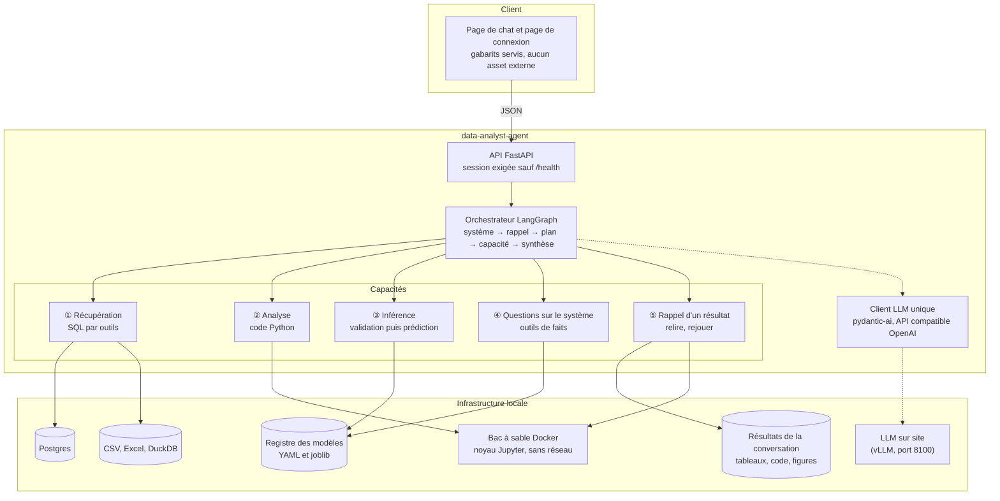
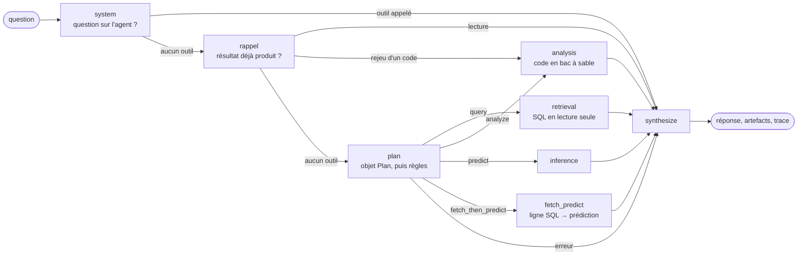

# Architecture

Ce document décrit l'architecture technique de data-analyst-agent : ses composants, son graphe d'exécution, chacun de ses modules, sa sécurité, ses tests, sa configuration et ses limites.

| Section | Contenu |
|---|---|
| [1. Principes](#1-principes) | Les choix structurants |
| [2. Composants](#2-composants) | Vue d'ensemble |
| [3. Le graphe](#3-le-graphe) | Enchaînement des nœuds, modes de réponse |
| [4. Les services, un par un](#4-les-services-un-par-un) | Chaque module du paquet |
| [5. Sécurité — récapitulatif des garde-fous](#5-sécurité--récapitulatif-des-garde-fous) | Les protections en place |
| [6. Stratégie de tests](#6-stratégie-de-tests) | Suite, doublures, campagnes |
| [7. Configuration (`DAA_*`)](#7-configuration-daa_) | Tous les réglages |
| [8. Limites connues et pistes V2](#8-limites-connues-et-pistes-v2) | Vue technique des limites |
| [9. Licences & composants](#9-licences--composants) | Dépendances et licences |

Documents associés : le cahier des charges d'origine ([CADRAGE.md](CADRAGE.md)), l'exécution de huit conversations en diagrammes de séquence ([parcours-de-l-agent.md](parcours-de-l-agent.md)), l'état de la livraison ([LIVRAISON.md](LIVRAISON.md)).

## 1. Principes

- **Orchestration explicite.** Un graphe LangGraph typé et tracé. Le routage est du code, pas du prompt.
- **Un seul LLM** pour tous les rôles de langage : planification, SQL, code d'analyse, synthèse. Il est joint par une API compatible OpenAI et n'est nommé nulle part dans le code (§4.3).
- **Aucun LLM dans le calcul.** Les prédictions viennent de modèles scikit-learn déclarés.
- **Prompts hors du code**, dans `prompts/*.txt` (§4.9).
- **Code généré exécuté en bac à sable** : conteneur éphémère, réseau coupé, racine en lecture seule (§4.7).
- **Contrats Pydantic aux frontières** : une erreur est arrêtée au nœud qui la produit, avec un message clair.
- **Vérifier ce qui est produit, pas la formulation de la question.** Les contrôles portent sur le SQL et le code écrits par le modèle : un classement porte sa grandeur, une somme n'est pas multipliée par une jointure, une somme respecte son filtre (§4.4, §4.5). En cas de doute, un contrôle se tait.
- **Licences permissives uniquement** (MIT, Apache-2.0, BSD).

## 2. Composants


```mermaid
flowchart TB
    subgraph client["Client"]
        UI["Page de chat et page de connexion<br/>gabarits servis, aucun asset externe"]
    end

    subgraph app["data-analyst-agent"]
        API["API FastAPI<br/>session exigée sauf /health"]
        ORCH["Orchestrateur LangGraph<br/>système → rappel → plan → capacité → synthèse"]
        LLM["Client LLM unique<br/>pydantic-ai, API compatible OpenAI"]

        subgraph caps["Capacités"]
            RET["① Récupération<br/>SQL par outils"]
            ANA["② Analyse<br/>code Python"]
            INF["③ Inférence<br/>validation puis prédiction"]
            SYS["④ Questions sur le système<br/>outils de faits"]
            RAP["⑤ Rappel d'un résultat<br/>relire, rejouer"]
        end
    end

    subgraph infra["Infrastructure locale"]
        MOTEUR["LLM sur site<br/>(vLLM, port 8100)"]
        SBX["Bac à sable Docker<br/>noyau Jupyter, sans réseau"]
        PG[("Postgres")]
        FILES[("CSV, Excel, DuckDB")]
        REG[("Registre des modèles<br/>YAML et joblib")]
        WS[("Résultats de la conversation<br/>tableaux, code, figures")]
    end

    UI -->|JSON| API --> ORCH
    ORCH --> RET & ANA & INF & SYS & RAP
    ORCH -.-> LLM -.-> MOTEUR
    RET --> PG & FILES
    ANA --> SBX
    INF --> REG
    SYS --> REG
    RAP --> WS
    RAP --> SBX
```

Réponse de `POST /chat` : `{answer, artifacts[{mime, data}], plan, error, trace}` — le texte, les objets affichables (PNG en base64, tableaux JSON) et la trace d'exécution.

## 3. Le graphe


```mermaid
flowchart LR
    Q(["question"]) --> SYS["system<br/>question sur l'agent ?"]
    SYS -->|"outil appelé"| SYN["synthesize"]
    SYS -->|"aucun outil"| RAP["rappel<br/>résultat déjà produit ?"]
    RAP -->|"lecture"| SYN
    RAP -->|"rejeu d'un code"| ANAL
    RAP -->|"aucun outil"| PLAN["plan<br/>objet Plan, puis règles"]
    PLAN -->|"query"| RETR["retrieval<br/>SQL en lecture seule"]
    PLAN -->|"analyze"| ANAL["analysis<br/>code en bac à sable"]
    PLAN -->|"predict"| INFE["inference"]
    PLAN -->|"fetch_then_predict"| FP["fetch_predict<br/>ligne SQL → prédiction"]
    PLAN -->|"erreur"| SYN
    RETR --> SYN
    ANAL --> SYN
    INFE --> SYN
    FP --> SYN
    SYN --> R(["réponse, artefacts, trace"])
```

1. **`system`** soumet la question à un agent muni d'outils de faits. L'appel d'un outil est le signal de routage : la question porte sur l'agent. Sans appel, le tour continue (§4.10).
2. **`rappel`** reconnaît une demande portant sur un résultat déjà produit dans la conversation. Il est sauté, sans appel au modèle, quand la conversation n'a encore rien produit (§4.12).
3. **`plan`** classe la demande dans une capacité et en extrait la source et les attributs. Le plan peut être relu une fois pour récupérer ce que la première lecture a perdu, puis passe par une suite de règles nommées (§4.2).
4. **Capacité** : récupération, analyse, inférence ou chaînage récupération-prédiction.
5. **`synthesize`** produit la réponse. Chaque nœud est gardé : une exception devient une réponse d'échec, pas un plantage.

| Situation | Réponse |
|---|---|
| Question sur le système | Formulation du modèle, ou les faits si elle ne les porte pas (§4.10) |
| Lecture d'un résultat | Formulation du modèle, ou le contenu lu (§4.12) |
| Résultat absent ou évincé | Le refus, qui précise le cas et ce qui reste disponible |
| Rejeu d'un code | Comme une analyse |
| Erreur d'un nœud | Phrase normalisée et référence d'incident |
| Clarification demandée | La question, telle quelle |
| Attributs de prédiction invalides | La relance structurée |
| Prédiction réussie, unitaire ou en lot | Gabarit déterministe |
| Requête sans ligne | Phrase déterministe |
| Requête à plusieurs lignes | Phrase déterministe renvoyant au tableau |
| Requête à une ligne | Résumé de l'agent de récupération |
| Requête sans appel d'outil | Écartée : la réponse ne vient pas de la source |
| Analyse réussie | Rédigée par le LLM à partir de la sortie du code |

En cas d'erreur SQL, `run_sql` renvoie l'erreur au modèle, qui corrige ; `retrieval_request_limit` borne les essais.

## 4. Les services, un par un

### 4.1 `api/` — serveur HTTP, authentification et chat

- `app.py` : la couche HTTP. Les pages sont des gabarits de `api/templates/`, servis par `api/pages.py` avec échappement systématique.
- L'orchestrateur est construit au premier appel : le serveur démarre sans LLM ni Docker.
- Toutes les routes exigent une session, sauf `GET /health`. Sans session : `401` sur l'API, page de connexion en navigation.
- Les routes qui modifient l'état exigent l'en-tête `X-CSRF-Token`.
- La taille du corps est bornée (`DAA_API_MAX_BODY_BYTES`).

| Méthode | Route | Session | Rôle |
|---|---|---|---|
| `GET` | `/health` | non | Sonde de vie |
| `GET` | `/login` | non | Page de connexion |
| `POST` | `/login` | non | Ouvre une session ; anti-force brute par compte et par adresse |
| `POST` | `/logout` | oui | Révoque la session côté serveur |
| `GET` | `/me` | oui | Compte de la session |
| `POST` | `/chat` | oui | Question → réponse complète ; longueur et débit bornés |
| `GET` | `/` | oui | Page de chat |
| `GET` | `/sources` | oui | Catalogue et relevé de chaque source (tables, lignes, période) |
| `POST` | `/conversations` | oui | Ouvre une conversation vide |
| `PUT` | `/conversations/{id}/source` | oui | Fixe la source de la conversation (source déclarée uniquement) |
| `GET` | `/conversations` | oui | Liste des conversations du compte |
| `GET` | `/conversations/{id}` | oui | Conversation complète |
| `GET` | `/conversations/{id}/artefacts` | oui | Catalogue des résultats, sans leur contenu |
| `GET` | `/conversations/{id}/artefacts/{nom}` | oui | Contenu d'un résultat : code, tête de tableau |
| `POST` | `/conversations/{id}/duplicate` | oui | Copie d'une conversation |
| `DELETE` | `/conversations/{id}` | oui | Suppression d'une conversation et de ses résultats |

- `/docs`, `/redoc` et `/openapi.json` sont désactivés par défaut (`DAA_API_DOCS_ENABLED`).
- La page de chat n'utilise ni `/sources` ni `PUT /conversations/{id}/source` : la source se choisit dans la conversation. Les deux routes restent disponibles pour d'autres clients.

**Cloisonnement.**
Les conversations sont rangées par utilisateur ; une route ne voit que la racine du compte de la session.
La conversation d'un autre compte, une conversation inexistante et un résultat inexistant renvoient le même `404`.

**Conversation sur plusieurs tours.**
Chaque réponse porte un `conversation_id`.
Une prédiction en attente d'attributs (`pending`) est conservée ; la réponse suivante complète ou corrige les attributs.

**Stockage.**

```
$DAA_WORKSPACE_DIR/
└── <utilisateur>/            # login normalisé, encodé
    ├── .locks/               # verrous du compte
    └── <conversation_id>/
        ├── transcript.json   # messages, titre, propriétaire, prédiction en attente
        ├── manifest.json     # catalogue des résultats
        ├── context.json      # le tour précédent
        ├── resultat_*.csv    # tableaux
        ├── graphique_*.py    # code des analyses avec figure
        └── analyse_*.py      # code des analyses sans figure
```

- Les noms variables sont encodés (`~XX` pour tout octet hors `[0-9A-Za-z_-]`) : sans collision, sans `/` ni `.`.
- Dossiers en `0o700`, écritures atomiques.
- Dupliquer copie le dossier ; supprimer l'efface.
- Une installation antérieure au rangement par utilisateur se reprend avec `scripts/migrate_workspace_owner.py` ([EXPLOITATION.md](EXPLOITATION.md#ranger-les-conversations-par-propriétaire)).

### 4.2 `orchestrator/` — plan et graphe

| Module | Rôle |
|---|---|
| `plan.py` | Modèle `Plan` (capacité, source, sources, dataset, attributs) et agent planificateur à sortie structurée. Le prompt liste les sources et les modèles ; le LLM ne choisit que dans ces listes. |
| `introspection.py` | Les faits que l'agent peut dire de lui-même, et le contrôle qui juge une formulation contre eux. Module pur : ni fichier, ni connexion, ni LLM (§4.10). |
| `systeme.py` | L'agent des questions sur le système et ses outils (§4.10). |
| `rappel.py` | L'agent qui retrouve, relit et rejoue un résultat de la conversation (§4.12). |
| `context_budget.py` | Fenêtre glissante, budget de tokens, détection de débordement (§7). |
| `conversations.py`, `workspace.py` | Persistance d'une conversation et de ses résultats, par utilisateur (§4.12). |
| `graph.py` | Le `StateGraph` : état typé, nœuds gardés, routage, chaînage récupération-prédiction. Chaque nœud produit une étape de trace (`TraceStep`). |

**Court-circuits du plan.**
Une prédiction en attente d'attributs et une source qui vient d'être proposée sont traitées sans appel au LLM : le message répond à une question déjà posée.
Un message qui désigne un résultat passé laisse le nœud `rappel` actif, même avec une prédiction en attente.

**Les règles nommées.**
Le plan rendu par le LLM passe par des règles ordonnées, listées dans `_REGLES_DU_PLAN`. Elles imposent la source choisie par l'appelant, reposent la source de la conversation, fusionnent les attributs déjà obtenus, proposent les sources quand aucune n'est désignée, demandent une précision si le plan est ambigu, montent un croisement quand le plan nomme plusieurs sources (`_regle_croiser_les_sources`), requalifient une requête en prédiction.
Une règle rend soit rien, soit une question à poser, qui arrête les suivantes.

**Les relectures.**
Le plan peut être redemandé une fois, sous condition, pour ajouter ce que la première lecture a perdu.

| Relecture | Condition | Conservé |
|---|---|---|
| `_relire_sans_la_source_du_fil` | Le plan ne nomme qu'une source dans une conversation liée | Le plan relu, s'il désigne au moins deux sources |
| `_relire_faute_de_source_designee` | Le plan demande des données sans désigner de source | Le périmètre énuméré |
| `_relire_sans_la_clause_dabsence` | Une clause d'absence (« sans famille à bord ») a fait perdre des attributs | Les attributs retrouvés |

Une relecture qui ne désigne qu'une seule autre source n'élargit pas le périmètre de la conversation (§8).

**Valeurs d'attributs.**
Le planificateur traduit une valeur dite vers la valeur autorisée qui la désigne (« 1re classe » → `pclass=1`). Si aucune ne convient, il transmet la valeur telle qu'écrite ; le système la refuse en la citant. La consigne vit dans `prompts/planner.txt`.

**Repli.**
Si le planificateur ne rend pas de plan, l'inventaire réel (sources et modèles) est servi avec une demande de précision.

### 4.3 `llm.py` + `config.py` — LLM mutualisé et réglages

- `build_model()` construit l'unique modèle pydantic-ai, pointé sur une API compatible OpenAI, température 0 par défaut.
- Changer de serveur se fait par `DAA_LLM_BASE_URL` ; exigences du serveur : [MOTEUR.md](MOTEUR.md).
- Le client HTTP porte la clé d'API (`DAA_LLM_API_KEY`), le délai et le nombre de réessais.
- `Settings` (pydantic-settings) centralise les réglages, surchargés par variables `DAA_*` ou `.env` (§7).

### 4.4 `agents/retrieval/` — capacité ① Récupération

| Module | Rôle |
|---|---|
| `catalog.py` | Catalogue déclaratif : types `postgres`, `file`, `duckdb`, et champs facultatifs `dictionary`, `features`, `date_reference`, `filtre_des_sommes` ([AJOUTER-UNE-SOURCE.md](AJOUTER-UNE-SOURCE.md)). |
| `faits.py` | Relevé d'une source : tables, lignes, période. |
| `sql.py` | Schéma rendu en DDL compact (avec les valeurs des colonnes peu variées), garde-fou lecture seule, adaptateur Postgres (pg8000), normalisation et troncature des résultats. |
| `duckdb_excel.py` | Accès DuckDB : fichiers CSV et Excel (une feuille par table) et bases `.duckdb` en lecture seule, accès à l'hôte coupé. |
| `agent.py` | Agent SQL à trois outils : `list_tables`, `get_schema`, `run_sql`. |
| `croisement.py` | Croisement de plusieurs sources dans une connexion DuckDB, tables préfixées par leur source, clés inter-sources déduites des données (`relier_les_sources`). |
| `lecture.py` | Lecture d'un SQL sans analyseur : masquage des littéraux, découpage au niveau zéro. |
| `classement.py` | Contrôle : toute expression de l'`ORDER BY` figure dans le `SELECT`. |
| `verification.py` | Contrôles du SQL par sqlglot : somme multipliée par une jointure, somme sans son `filtre_des_sommes`. |
| `diagnostic.py` | Faits ajoutés à une erreur SQL : requête déjà échouée à l'identique, colonnes réellement exposées. |

**Garde-fou lecture seule.**
Une seule instruction, `SELECT` ou `WITH`, mots-clés d'écriture refusés. Le contrôle porte sur la requête masquée : un point-virgule dans un littéral n'est pas une instruction.

**Rendu pour le modèle.**
Un résultat d'une seule ligne est présenté verticalement, un couple colonne-valeur par ligne, plus fiable à lire pour le modèle qu'un tableau d'une ligne.

**Consigne de l'agent SQL.**
Trois familles de questions : lister des lignes, calculer un agrégat, décrire une table (valeurs manquantes, distinctes, extrêmes de chaque colonne) en une seule requête.

**Contrôles du SQL (`verification.py`).**
Chaque somme est jugée dans sa portée : requête principale, sous-requête, `WITH`.

1. **Somme multipliée** : pour chaque table jointe, la base indique si la colonne de jointure identifie une ligne. Une table atteinte sans clé unique multiplie la somme.
2. **Filtre des sommes** : la règle `filtre_des_sommes` de la source s'applique au SQL comme au code d'analyse.

- Une somme enveloppée (`CASE`, `COALESCE`, conversion, produit) reste une somme ; un `COUNT` n'est jamais concerné.
- Le constat est renvoyé une fois au modèle, par le retour de `run_sql`. S'il n'est pas corrigé, la réponse porte un avertissement.
- Quand le budget d'appels s'épuise après une requête réussie, la dernière requête réussie est servie avec ses avertissements.
- Une somme écrite dans la requête qui entoure un `WITH` n'est pas jugée ; ce silence est compté (`Lecture.illisibles`).

### 4.5 `agents/analysis/` — capacité ② Analyse

- `agent.py` : le LLM reçoit la question, les fichiers montés sous `/data/` et leur schéma, et écrit du Python (pandas, scipy, statsmodels, prince, matplotlib).
- Le code s'exécute dans le bac à sable ; une erreur est renvoyée au modèle, jusqu'à `analysis_max_attempts` essais.
- Une source SQL est d'abord matérialisée en CSV, table par table, dans la limite de `analysis_table_max_rows`. Une table coupée est signalée au code et à l'utilisateur.
- Les figures reviennent en PNG par le protocole MIME du noyau Jupyter.

| Module | Rôle |
|---|---|
| `diagnostic.py` | Ajoute un fait à l'erreur : noms voisins d'un nom absent (lus dans le module installé), module absent, dépendance optionnelle absente. |
| `consigne.py` | Contrôle du code produit : une somme d'une colonne déclarée dans `filtre_des_sommes`, sans la valeur à écarter, est renvoyée au modèle, même si l'exécution a réussi. Lecture de l'arbre syntaxique ; les comptages ne sont pas concernés. |

### 4.6 `agents/inference/` — capacité ③ Inférence gardée

| Module | Rôle |
|---|---|
| `schemas/` | Un schéma Pydantic par modèle : bornes, valeurs autorisées, `extra="forbid"`. |
| `validation.py` | `validate_features()` : anomalies structurées (`manquant`, `hors_bornes`, `valeur_non_autorisee`, `type_invalide`, `champ_inconnu`) et question de relance. Aucune prédiction tant que la validation échoue. |
| `correspondance.py` | Colonnes d'une source qui alimentent un modèle, lues dans `features` au catalogue, vérifiées contre le schéma réel avant toute requête. |
| `registry.py` | Registre YAML (`models/registry.yaml`) : modèle, artefact joblib, tâche, classes, unité. |
| `predict.py` | Prédiction déterministe, sans LLM : classe et probabilités, ou valeur et unité. |

- Avant la validation, `align_keys()` rapproche les noms et `coerce_values()` convertit les valeurs textuelles vers le type attendu (`pclass='1'` → `1`). Une valeur illisible est laissée telle quelle et refusée.
- Une traduction de valeurs peut être déclarée par la source (`values: {"3e classe": 3}`).
- Ajouter un modèle : un schéma, un artefact, une entrée de registre.

### 4.7 `sandbox/` — exécution durcie de code

- `image/` : Dockerfile (Python 3.12, bibliothèques scientifiques verrouillées) et `bridge.py`, pont entre l'entrée standard et un noyau Jupyter.
- `client.py` : `SandboxSession` lance le conteneur et dialogue avec le pont. Délai à deux niveaux : interruption du noyau, puis arrêt du conteneur (`sandbox_kill_grace`).

| Option du `docker run` | Effet |
|---|---|
| `--network=none` | Aucun accès réseau |
| `--read-only`, `--tmpfs /tmp` | Racine immuable, `/tmp` éphémère |
| `--cap-drop=ALL`, `--security-opt=no-new-privileges` | Aucun privilège |
| `--memory`, `--cpus`, `--pids-limit` | Quotas |
| montages `:ro` sous `/data/` | Données en lecture seule |
| `--rm`, un conteneur par session | Rien ne persiste |

- L'utilisateur non-root vient de l'`USER 1000:1000` de l'image ; une image tierce désignée par `DAA_SANDBOX_IMAGE` ne le garantit pas.
- `SandboxPlaces` limite les sessions simultanées (`DAA_SANDBOX_MAX_SESSIONS`) ; au-delà de `DAA_SANDBOX_QUEUE_TIMEOUT`, la demande est refusée.
- L'image n'est pas construite par l'application :

```bash
docker build -t data-analyst-agent-sandbox:0.1 src/data_analyst_agent/sandbox/image/
```

### 4.8 `auth/` — comptes, sessions, anti-force brute

| Module | Rôle |
|---|---|
| `accounts.py` | Comptes dans `var/users.yaml` (`0600`), empreintes argon2id. Créés par `scripts/manage_users.py` uniquement. Login normalisé (NFKC, `casefold`). |
| `sessions.py` | Sessions côté serveur ; le navigateur ne reçoit qu'un identifiant opaque. Échéances d'inactivité et absolue. |
| `throttle.py`, `rate_limit.py` | Verrouillage après échecs de connexion (par compte et par adresse), débit de `POST /chat` par compte. |
| `current_user.py` | Résolution de la session en compte. |

### 4.9 `prompts/` — les prompts système, hors du code

- Sept prompts : planificateur, agent SQL, agent d'analyse, synthèse, agent système, agent de rappel, agent de réparation.
- L'agent de réparation n'a aucun outil : il reformule une réponse écartée à partir des faits fournis (§4.10).
- Substitution littérale de `{cle}`, sans échappement.
- Extension `.txt`, pour que le formateur ne modifie pas les exemples de code.
- `prompts.marqueur()` identifie chaque prompt ; les doublures de test s'en servent pour router leurs réponses (§6).
- Une empreinte SHA-256 de chaque prompt est vérifiée par la suite de tests.

### 4.10 `orchestrator/systeme.py` + `introspection.py` — capacité ④ Répondre sur soi-même

Cette capacité répond aux questions sur le système : sources, tables, colonnes, sens d'une colonne, modèles, attributs attendus, capacités, contenu de la conversation.

**Fonctionnement.**
Le nœud `system` soumet la question à un agent muni d'outils typés. Le modèle décide d'appeler ; l'outil rend un texte construit depuis le dépôt ; le modèle le formule.

| Outil | Source | Connexion |
|---|---|---|
| `sources_de_donnees` | `sources/catalogue.yaml` | non |
| `chercher_une_source` | descriptions du catalogue : la source qui traite d'un sujet | non |
| `modeles_de_prediction` | `models/registry.yaml` | non |
| `attributs_d_un_modele` | schémas des modèles | non |
| `capacites_de_l_agent` | capacités et inventaire | non |
| `schema_d_une_source` | schéma de la source et dictionnaire | oui |
| `memoire_de_la_conversation` | résultats de la conversation | non |
| `travailler_sur_une_source` | lie une source à la conversation | non |

- `schema_d_une_source` répond à quatre niveaux : une colonne, une table, une source, ou toutes les sources.
- Le signal de routage est l'appel d'outil, jamais le texte du modèle.

**Contrôle de la formulation (`defaut_de_fondation`).**
Une formulation est écartée si elle cite un nom qu'aucun fait ne porte, ou si elle omet un nom rendu par l'outil.
Elle est alors redemandée une fois à l'agent de réparation (`systeme.servir_la_reponse`), jugé par le même contrôle. En cas de nouvel échec, les faits sont servis tels quels. La trace indique la voie suivie.

**Planchers.**
Trois règles mécaniques rattrapent des tours où aucun outil n'a été appelé :

| Plancher | Condition | Réponse |
|---|---|---|
| `decrire_les_sources` | Un outil allait rendre tout le catalogue alors que le message nomme des sources | Les fiches des sources nommées |
| `_plancher_des_sources_nommees` | Le message nomme au moins deux sources et pose une question | Leurs fiches |
| `_plancher_de_la_periode` | Le message demande une période et aucune source n'est datée | L'inventaire, avec le constat de chaque source |

**Frontière.**
L'agent système répond sur ce que l'agent est, jamais sur ce que les données contiennent : « combien de lignes ? » reste une requête.

**Limites de fonctionnement.**
- Le nœud cède la main au planificateur si le modèle échoue ou atteint `DAA_SYSTEME_REQUEST_LIMIT` (6).
- Une erreur d'outil (source injoignable, catalogue illisible) remonte comme une erreur.
- Cette capacité n'est pas une valeur de `Capability` : modifier ce contrat de sortie dégrade l'extraction des autres capacités.

### 4.11 La source de travail d'une conversation

**Proposition et validation.**
- Quand une source est nécessaire et qu'aucune n'est désignée, l'agent propose les sources (`_regle_choisir_la_source`).
- Un catalogue à une seule source l'annonce au lieu de la demander.
- La validation est du code : le nom d'une source du catalogue cité dans le message.
- La source validée est enregistrée dans la conversation (`SourceDeTravail`, dans `transcript.json`) et reposée sur chaque plan.

**Changement de source.**
Une source nommée en cours de conversation remplace la précédente, et la réponse l'annonce en tête (« Je passe sur la source `ventes` — on travaillait sur `clients` »).
La désignation est lue dans le texte de l'utilisateur (`introspection.source_nommee`), jamais dans le plan : une supposition du planificateur ne change pas la source.
Une source supposée par le planificateur, sans désignation, est effacée, pour que le comportement ne dépende pas de l'ordre du catalogue.

**Relevé des sources.**
`agents/retrieval/faits.py` lit chaque source : tables, lignes, période de la colonne de date. `RelevesDuCatalogue` conserve le relevé.

- L'absence de période est dite, en distinguant l'absence de colonne de date et une colonne vide.
- La colonne de date est celle de `date_reference`, à défaut la première du schéma. Une désignation invalide est signalée.
- Le relevé est fait au premier inventaire ; une source injoignable reste listée avec sa raison.

| Réglage | Défaut | Rôle |
|---|---|---|
| `DAA_RELEVE_DELAI` | 10 s | Délai maximal du relevé d'une source |
| `DAA_RELEVE_PEREMPTION` | 900 s | Validité d'un relevé réussi |
| `DAA_RELEVE_REPRISE` | 30 s | Délai avant de retenter une source injoignable |
| `DAA_RELEVE_SEUIL_APPROXIMATION` | 100 000 lignes | Au-delà, estimation Postgres (`reltuples`), affichée avec `~` |

### 4.12 Les artefacts nommés d'une conversation — relire, rejouer

Chaque résultat d'une conversation est enregistré, nommé et réutilisable.

| Nature | Contenu | Nom | Fichier |
|---|---|---|---|
| `table` | Résultat de requête ou lot de prédictions | `resultat_1`… | `.csv` |
| `figure` | Code Python d'une analyse avec image | `graphique_1`… | `.py` |
| `code` | Code Python d'une analyse sans image | `analyse_1`… | `.py` |

- Une figure est enregistrée par son code : la rejouer produit une image neuve.
- Chaque résultat porte une description et la question d'origine ; le code retient aussi sa source.
- Seul le code d'une analyse réussie est enregistré.

**Contexte du modèle.**
Seul le catalogue des résultats entre dans le prompt (nom, nature, question d'origine), jamais leur contenu.
Deux fenêtres distinctes : `DAA_CONTEXT_ARTIFACT_WINDOW` pour les tableaux, `DAA_CONTEXT_CODE_WINDOW` pour le code. Le budget de tokens est commun.
Le catalogue signale aussi les résultats évincés du contexte.

**Outils de l'agent de rappel.**
- `lire_un_artefact(nom)` : le code, ou les vingt premières lignes d'un tableau avec le nombre total.
- `rejouer_un_code(nom, modification)` : modifie le code et le réexécute dans le bac à sable, avec les mêmes protections qu'une analyse. Un rejeu est une analyse ; son code devient un nouveau résultat.

**Refus.**
- Aucun outil appelé : le tour continue vers le planificateur.
- Tous les outils ont refusé : le refus est servi, en distinguant un résultat inexistant d'un résultat évincé.
- Formulation qui invente un nom ou ne porte rien de ce que l'outil a rendu : le contenu lu est servi.
- Un message qui désigne un résultat inexistant reçoit l'avertissement « Ce qui suit est neuf, pas un rappel », puis le tour continue (`designation_dun_artefact_passe`).

**Accès direct.**
`GET /conversations/{id}/artefacts` rend le catalogue, avec l'indicateur `retenu` ; `/artefacts/{nom}` rend le contenu, y compris d'un résultat évincé.
Un résultat ne franchit ni la frontière d'une conversation ni celle d'un compte.

## 5. Sécurité — récapitulatif des garde-fous

1. **Identité.** Session exigée sauf `GET /health`. Conversations rangées par utilisateur ; celle d'un autre compte renvoie `404`. Mots de passe argon2id, sessions côté serveur, anti-force brute par appelant réel : `X-Forwarded-For` n'est lu que d'un mandataire déclaré dans `DAA_TRUSTED_PROXIES` (`api/forwarded.py`).
2. **SQL.** Lecture seule vérifiée avant exécution, sur la requête masquée. Les connexions DuckDB ont l'accès au disque et au réseau coupé (`lock_external_access`).
3. **Code généré.** Exécuté uniquement dans le bac à sable (§4.7), en nombre limité.
4. **Prédiction.** Attributs validés par schéma strict ; aucune valeur inventée.
5. **LLM.** Boucles bornées : `retrieval_request_limit`, `analysis_max_attempts`, `systeme_request_limit`, `rappel_request_limit`. Le planificateur ne choisit que dans les listes fournies. Le contexte est plafonné et sa coupe annoncée.
6. **Surface HTTP.** Documentation interactive désactivée, corps et questions bornés, débit de `/chat` limité par compte.
7. **Erreurs.** L'utilisateur reçoit une phrase et une référence d'incident ; le détail reste dans la trace et les journaux.
8. **Chiffres.** Le SQL et le code produits sont contrôlés avant d'être servis (§4.4, §4.5). Une table coupée par son plafond est signalée.

Sécurité du déploiement (socket Docker, mandataire, pare-feu) : [INSTALLATION.md](INSTALLATION.md#le-bac-à-sable-vu-du-conteneur) et [EXPLOITATION.md](EXPLOITATION.md#exposer-le-service).

## 6. Stratégie de tests

```
tests/
├── unit/          # sans Docker ni réseau : LLM scripté, bac à sable simulé
├── integration/   # Docker : bac à sable réel, Postgres (testcontainers), modèles réels
├── e2e/           # scénarios de référence, du message à la réponse
├── fakes/         # faux pont de bac à sable
├── helpers/       # ScriptedLLM, doublures, données et oracle Titanic
└── catalogues/    # catalogues et oracles d'essai, tests des catalogues livrés
```

- Le LLM est scripté dans toute la suite : `ScriptedLLM` route des réponses préparées vers chaque agent grâce au marqueur de son prompt (`prompts.marqueur`).
- Les tests `-m live` interrogent le vrai serveur LLM ; exclus par défaut.
- Le premier scénario de référence est vérifié contre un oracle pandas indépendant.
- Les campagnes de mesure contre le vrai moteur vivent hors de la suite, dans `scripts/` ; elles se rejouent avant et après une modification, ou après un changement de modèle ([scripts/README.md](../scripts/README.md)).
- Intégration continue GitHub Actions : ruff et suite complète avec construction de l'image du bac à sable ; couverture exigée ≥ 85 %.

## 7. Configuration (`DAA_*`)

Tous les réglages passent par variable d'environnement ou `.env`. `Settings` (pydantic-settings) fait foi ; ce tableau en reprend les 51 champs.

### LLM mutualisé

| Variable | Défaut | Rôle |
|---|---|---|
| `DAA_LLM_BASE_URL` | `http://localhost:8100/v1` | URL de l'API compatible OpenAI |
| `DAA_LLM_API_KEY` | *(vide)* | Clé envoyée en `Authorization` |
| `DAA_LLM_MODEL` | `google/gemma-4-E4B-it-qat-w4a16-ct` | Nom du modèle servi |
| `DAA_LLM_TEMPERATURE` | `0.0` | Température |
| `DAA_LLM_TIMEOUT` | `120.0` s | Délai d'un appel |
| `DAA_LLM_MAX_RETRIES` | `2` | Réessais sur erreur transitoire |

### Sources et capacités

| Variable | Défaut | Rôle |
|---|---|---|
| `DAA_CATALOG_PATH` | `sources/catalogue.yaml` | Catalogue des sources |
| `DAA_RETRIEVAL_MAX_ROWS` | `200` | Lignes maximales d'un résultat |
| `DAA_RETRIEVAL_REQUEST_LIMIT` | `10` | Appels maximaux de l'agent SQL |
| `DAA_SYSTEME_REQUEST_LIMIT` | `6` | Appels maximaux de l'agent système |
| `DAA_ANALYSIS_MAX_ATTEMPTS` | `3` | Essais maximaux d'une analyse |
| `DAA_ANALYSIS_TABLE_MAX_ROWS` | `10000` | Lignes matérialisées par table pour l'analyse et le croisement ; au-delà, la coupe est signalée |
| `DAA_MODELS_REGISTRY_PATH` | `models/registry.yaml` | Registre des modèles |
| `DAA_RELEVE_DELAI` | `10.0` s | Délai du relevé d'une source (`0` : sans délai) |
| `DAA_RELEVE_PEREMPTION` | `900.0` s | Validité d'un relevé réussi (`0` : sans cache) |
| `DAA_RELEVE_REPRISE` | `30.0` s | Délai avant de retenter une source injoignable (`0` : sans cache) |
| `DAA_RELEVE_SEUIL_APPROXIMATION` | `100000` | Seuil d'estimation du nombre de lignes, Postgres uniquement (`0` : jamais) |

### Dictionnaire de source

| Variable | Défaut | Rôle |
|---|---|---|
| `DAA_DICTIONARY_MAX_CHARS` | `8000` | Taille maximale transmise ; au-delà, sections de fin retirées et coupe annoncée (`0` : sans plafond) |
| `DAA_RETRIEVAL_DICTIONARY_MAX_CHARS` | — | Ancien nom du précédent, déprécié |

Règles de rédaction : [rediger-un-dictionnaire-de-source.md](rediger-un-dictionnaire-de-source.md).

### Mémoire de conversation et contexte du modèle

| Variable | Défaut | Rôle |
|---|---|---|
| `DAA_WORKSPACE_DIR` | `var/workspaces` | Racine des conversations |
| `DAA_CONTEXT_ARTIFACT_WINDOW` | `8` | Tableaux réinjectés (`0` : sans fenêtre) |
| `DAA_CONTEXT_CODE_WINDOW` | `8` | Codes réinjectés au catalogue (`0` : sans fenêtre) |
| `DAA_RAPPEL_REQUEST_LIMIT` | `5` | Appels maximaux de l'agent de rappel |
| `DAA_CONTEXT_TOKEN_BUDGET` | `8000` | Budget du prompt du planificateur (`0` : sans budget) |
| `DAA_CONTEXT_MODEL_WINDOW` | `32768` | Fenêtre du modèle servi, pour détecter un débordement |
| `DAA_CONTEXT_OVERFLOW_RATIO` | `0.4` | Seuil de détection quand la fenêtre est inconnue |

### Authentification et sessions

| Variable | Défaut | Rôle |
|---|---|---|
| `DAA_AUTH_ACCOUNTS_PATH` | `var/users.yaml` | Fichier des comptes (`0600`) |
| `DAA_AUTH_STATE_DIR` | `var/auth` | Sessions et compteurs d'échecs |
| `DAA_SESSION_COOKIE_NAME` | `daa_session` | Cookie de session |
| `DAA_CSRF_COOKIE_NAME` | `daa_csrf` | Cookie anti-CSRF |
| `DAA_SESSION_COOKIE_SECURE` | `true` | Cookie réservé à HTTPS ; `false` en développement local uniquement |
| `DAA_SESSION_IDLE_TIMEOUT` | `3600.0` s | Fermeture après inactivité |
| `DAA_SESSION_ABSOLUTE_TIMEOUT` | `43200.0` s | Durée maximale d'une session |
| `DAA_LOGIN_MAX_FAILURES` | `5` | Échecs avant verrouillage, par compte et par adresse |
| `DAA_LOGIN_LOCKOUT_SECONDS` | `300.0` s | Durée du verrouillage |

### Surface HTTP exposée et débit

| Variable | Défaut | Rôle |
|---|---|---|
| `DAA_API_DOCS_ENABLED` | `false` | `/docs`, `/redoc`, `/openapi.json` |
| `DAA_API_MAX_BODY_BYTES` | `65536` | Taille maximale du corps d'une requête |
| `DAA_CHAT_MESSAGE_MAX_CHARS` | `4000` | Longueur maximale d'une question ; une question peut déclencher jusqu'à 26 appels LLM |
| `DAA_TRUSTED_PROXIES` | `[]` | Mandataires dont `X-Forwarded-For` et `X-Forwarded-Proto` sont lus ; vide, aucun en-tête n'est lu |
| `DAA_CHAT_RATE_LIMIT_REQUESTS` | `20` | Requêtes `POST /chat` par fenêtre et par compte |
| `DAA_CHAT_RATE_LIMIT_WINDOW` | `60.0` s | Fenêtre de débit |

### Sandbox d'exécution

| Variable | Défaut | Rôle |
|---|---|---|
| `DAA_SANDBOX_DOCKER_CMD` | `["docker"]` | Commande Docker (ex. `["wsl","docker"]`) |
| `DAA_SANDBOX_IMAGE` | `data-analyst-agent-sandbox:0.1` | Image du bac à sable, non construite automatiquement |
| `DAA_SANDBOX_MEM_LIMIT` / `_CPUS` / `_PIDS_LIMIT` | `1g` / `1.0` / `256` | Quotas du conteneur |
| `DAA_SANDBOX_START_TIMEOUT` / `_EXEC_TIMEOUT` / `_KILL_GRACE` | `60` / `30` / `10` s | Délais |
| `DAA_SANDBOX_MAX_SESSIONS` | `4` | Conteneurs simultanés par processus (`0` : sans plafond) |
| `DAA_SANDBOX_QUEUE_TIMEOUT` | `60.0` s | Attente maximale d'une place |

Les variables `DAA_PG_*` ne sont pas des champs de `Settings` : elles sont substituées dans les DSN du catalogue. Modèle : `.env.example`.

## 8. Limites connues et pistes V2

Liste destinée à l'utilisateur : [LIVRAISON.md](LIVRAISON.md#3-les-limites-connues). Vue technique :

- **Périmètre d'une conversation liée.** Une relecture qui désigne une seule autre source n'élargit pas le périmètre : une conversation liée à `ventes` ne répond pas sur `production` seule. Une première version de cet élargissement a été retirée : elle croisait les sources sans que la question le demande, et le croisement, tronqué à `DAA_ANALYSIS_TABLE_MAX_ROWS`, faussait les sommes sur le catalogue de démonstration. Conditions pour la reprendre : ne croiser que si la question porte sur les deux sources, et mesurer le parcours de démonstration.
- **Contexte conversationnel limité au tour précédent.** `ConversationContext` est reconstruit à chaque tour ; la transcription n'est pas renvoyée au modèle. Les résultats, eux, restent disponibles pour toute la conversation (§4.12).
- **Budget de tokens.** Seul le prompt du planificateur est budgété ; les autres agents sont bornés par leur nombre d'appels. Un débordement chez eux n'est constaté qu'au retour du serveur.
- **Stockage local.** Une conversation est un dossier sur le disque de l'instance ; ni purge ni quota. À externaliser pour plusieurs instances.
- **Prédiction en lot** limitée à `DAA_RETRIEVAL_MAX_ROWS` lignes, avec signalement.
- **Registre maison** ; évolution prévue vers MLflow, même interface.
- **Mémoire d'usage des outils** : retenir les appels d'outils réussis et les proposer sur des questions voisines ([historique/spike-vanna.md](historique/spike-vanna.md) §5.1).
- **Bac à sable en production** : prévoir un miroir PyPI local ; l'image est figée et rien ne s'installe à l'exécution.

### Points connus, relevés et non traités

Sans effet à l'échelle visée (10 à 20 utilisateurs) ; à reprendre si elle change.

- `fit_to_budget` est quadratique dans un cas dégénéré.
- Un manifeste illisible est ignoré ; une transcription illisible lève une erreur.
- `safe_dir_name` distingue la casse, en supposant un système de fichiers Linux.
- `resolve()` réécrit `sessions.json` à chaque requête authentifiée.
- argon2id réserve 64 Mio par vérification.
- Le corps de requête n'est borné que par `Content-Length` : un envoi `chunked` échappe au contrôle.
- La trace transmet le détail technique au porteur d'une session valide.

## 9. Licences & composants

| Composant | Rôle | Licence |
|---|---|---|
| DuckDB | Moteur SQL analytique | MIT |
| FastAPI | API | MIT |
| uvicorn | Serveur ASGI | BSD-3-Clause |
| LangGraph | Orchestration | MIT |
| Pydantic, pydantic-ai | Typage, agents LLM | MIT |
| pydantic-settings | Réglages `DAA_*` | MIT |
| SQLAlchemy | Accès Postgres | MIT |
| sqlglot | Analyse du SQL produit | MIT |
| pg8000 | Pilote PostgreSQL | BSD-3-Clause |
| pandas | Manipulation de données | BSD-3-Clause |
| scikit-learn | Modèles de prédiction | BSD-3-Clause |
| joblib | Sérialisation des modèles | BSD-3-Clause |
| openpyxl | Lecture Excel | MIT |
| PyYAML | Catalogue, registre, comptes | MIT |
| argon2-cffi | Empreintes de mots de passe | MIT |
| python-multipart | Formulaire de connexion | Apache-2.0 |
| vLLM | Serveur du LLM sur site ; remplaçable par tout serveur compatible OpenAI | Apache-2.0 |
| Modèle de langage servi | Poids du modèle | Licence de son éditeur, à vérifier à chaque changement de modèle |
| Ce projet | Code applicatif | MIT annoncé ; aucun fichier `LICENSE` à ce jour |
