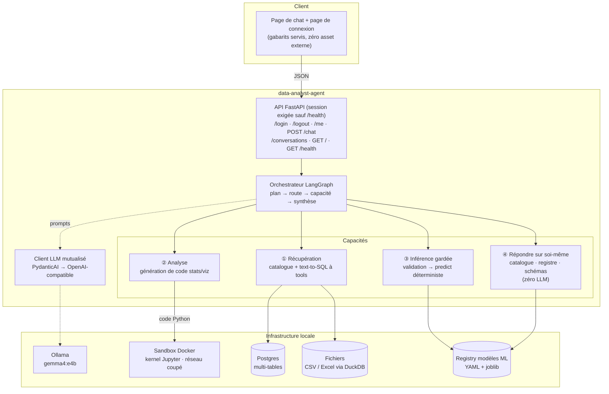
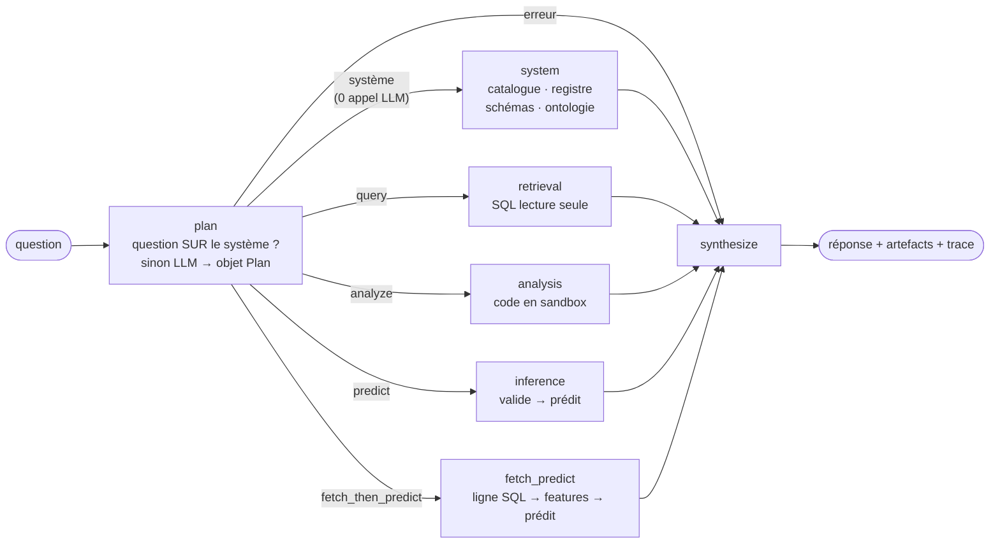
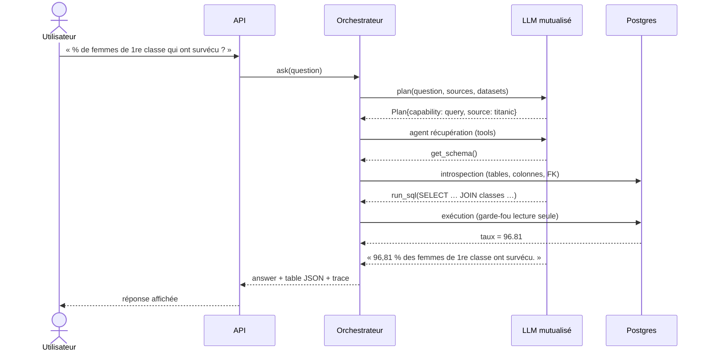

# Architecture — data-analyst-agent

Document de référence technique. Le *pourquoi* (contraintes, décisions, roadmap) est
dans [CADRAGE.md](CADRAGE.md) ; ici on décrit le *comment* : les schémas d'ensemble,
puis chaque service du package.

## 1. Principes directeurs

- **Orchestration explicite** : un graphe LangGraph typé, inspectable, tracé. La règle
  de routage est du code, pas du prompt.
- **Un seul LLM mutualisé** pour tous les rôles langage : planification, SQL, code
  d'analyse, synthèse. Il est joint par un endpoint OpenAI-compatible et n'est pas
  nommé dans le code (§4.3) ; le service en place sert `gemma4:e4b`. Les modèles ML
  métier (predict) sont des artefacts scikit-learn séparés — aucun LLM dans le calcul.
- **Les prompts système vivent hors du code**, dans `prompts/*.txt` : ce dépôt est un
  socle, et le prompt est le premier endroit qu'on ajuste par cas d'usage (§4.9).
- **Tout code généré s'exécute en sandbox durcie** : conteneur éphémère, réseau coupé,
  rootfs en lecture seule.
- **Contrats Pydantic aux frontières** : les erreurs éclatent à la frontière du nœud,
  avec un message clair, sans faire tomber le graphe.
- **Licences permissives uniquement** (MIT / Apache-2.0 / BSD) — produit on-premise et
  commercialisable.

## 2. Schéma architectural (composants)


```mermaid
flowchart TB
    subgraph client["Client"]
        UI["Page de chat + page de connexion<br/>(gabarits servis, zéro asset externe)"]
    end

    subgraph app["data-analyst-agent"]
        API["API FastAPI (session exigée sauf /health)<br/>/login · /logout · /me · POST /chat<br/>/conversations · GET / · GET /health"]
        ORCH["Orchestrateur LangGraph<br/>plan → route → capacité → synthèse"]
        LLM["Client LLM mutualisé<br/>PydanticAI → OpenAI-compatible"]

        subgraph caps["Capacités"]
            RET["① Récupération<br/>catalogue + text-to-SQL à tools"]
            ANA["② Analyse<br/>génération de code stats/viz"]
            INF["③ Inférence gardée<br/>validation → predict déterministe"]
            SYS["④ Répondre sur soi-même<br/>catalogue · registre · schémas<br/>(zéro LLM)"]
        end
    end

    subgraph infra["Infrastructure locale"]
        OLLAMA["Ollama<br/>gemma4:e4b"]
        SBX["Sandbox Docker<br/>kernel Jupyter · réseau coupé"]
        PG[("Postgres<br/>multi-tables")]
        FILES[("Fichiers<br/>CSV / Excel via DuckDB")]
        REG[("Registry modèles ML<br/>YAML + joblib")]
    end

    UI -->|JSON| API --> ORCH
    ORCH --> RET & ANA & INF & SYS
    ORCH -.->|prompts| LLM -.-> OLLAMA
    RET --> PG & FILES
    ANA -->|code Python| SBX
    INF --> REG
    SYS --> REG
```

Réponse renvoyée au client : `{answer, artifacts[{mime,data}], plan, error, trace}` —
le texte en langage naturel plus les objets affichables (figure PNG en base64, table
JSON) et la trace d'exécution.

## 3. Schéma fonctionnel (le graphe)


```mermaid
flowchart LR
    Q(["question"]) --> PLAN["plan<br/>question SUR le système ?<br/>sinon LLM → objet Plan"]
    PLAN -->|"système<br/>(0 appel LLM)"| SYS["system<br/>catalogue · registre<br/>schémas · ontologie"]
    PLAN -->|"query"| RETR["retrieval<br/>SQL lecture seule"]
    PLAN -->|"analyze"| ANAL["analysis<br/>code en sandbox"]
    PLAN -->|"predict"| INFE["inference<br/>valide → prédit"]
    PLAN -->|"fetch_then_predict"| FP["fetch_predict<br/>ligne SQL → features → prédit"]
    PLAN -->|"erreur"| SYN
    SYS --> SYN["synthesize"]
    RETR --> SYN
    ANAL --> SYN
    INFE --> SYN
    FP --> SYN
    SYN --> R(["réponse + artefacts + trace"])
```

**La branche `system` est la seule qui ne vient pas d'un `Plan`**, et c'est ce qui la
rend gratuite : une question SUR le système est reconnue par du code *avant* l'appel
au planificateur, et le routage se fait sur `system_topic` posé dans le state. Cinq
sujets — sources, schéma, modèles, features, capacités — dont quatre se répondent
sans même ouvrir une connexion (§4.10).

Le planificateur classe la demande dans une capacité et en extrait les paramètres
(source, dataset, features). Le plan qu'il rend est ensuite passé dans une suite de
**règles nommées** — source imposée par l'appelant, dégradations, reprise des
features acquises, questions de clarification (§4.2) — puis le routage est
mécanique. Chaque nœud est « gardé » : une exception renseigne `error` dans le state
et la synthèse produit une réponse d'échec honnête au lieu d'un crash.

La synthèse choisit le mode le moins coûteux et le plus sûr — **le LLM ne rédige que
pour une analyse réussie**, tout le reste est déterministe :

| Situation | Mode de synthèse |
|---|---|
| Question SUR le système | la réponse lue dans la configuration, **telle quelle** (§4.10) |
| Erreur d'un nœud | phrase normalisée + référence d'incident (le détail reste dans la trace) |
| Clarification demandée par une règle du plan | la question, telle quelle |
| Features invalides/incomplètes | la relance structurée, telle quelle |
| Prédiction réussie | template déterministe (classe, probabilité, unité) |
| Prédiction en lot | template déterministe (répartition des classes, ou moyenne et bornes) |
| Requête SQL — aucune ligne | phrase déterministe : un tableau vide doit se dire vide, sinon le LLM raconte le résultat qu'il attendait |
| Requête SQL — plusieurs lignes | phrase déterministe qui renvoie au tableau (le recopier ferait doublon) |
| Requête SQL — un agrégat d'une ligne | le résumé déjà produit par l'agent récupération |
| Requête SQL sans aucun appel d'outil | **réponse écartée** : le modèle a répondu de mémoire, pas d'après la source |
| Analyse réussie | LLM (transforme le stdout du code en 1-4 phrases) |

### Séquence type — scénario golden n°1 (requête SQL)


```mermaid
sequenceDiagram
    actor U as Utilisateur
    participant A as API
    participant O as Orchestrateur
    participant L as LLM mutualisé
    participant P as Postgres

    U->>A: « % de femmes de 1re classe qui ont survécu ? »
    A->>O: ask(question)
    O->>L: plan(question, sources, datasets)
    L-->>O: Plan{capability: query, source: titanic}
    O->>L: agent récupération (tools)
    L-->>O: get_schema()
    O->>P: introspection (tables, colonnes, FK)
    L-->>O: run_sql(SELECT … JOIN classes …)
    O->>P: exécution (garde-fou lecture seule)
    P-->>O: taux = 96.81
    L-->>O: « 96,81 % des femmes de 1re classe ont survécu. »
    O-->>A: answer + table JSON + trace
    A-->>U: réponse affichée
```

En cas d'erreur SQL, le tool `run_sql` renvoie le message d'erreur au modèle qui
corrige sa requête — borné par `retrieval_request_limit` pour couper toute boucle.

## 4. Les services, un par un

### 4.1 `api/` — serveur HTTP, authentification et chat

`app.py` est la couche HTTP, et rien d'autre : les pages sont des gabarits servis
depuis `api/templates/` par `api/pages.py` (substitution `{{cle}}` à valeurs
systématiquement échappées), pas des chaînes Python. L'orchestrateur est construit
paresseusement au premier appel : le serveur démarre sans serveur LLM ni Docker.

**Toutes les routes exigent une session valide, sauf `GET /health`** — une sonde de
disponibilité n'en a pas, et lui refuser l'accès ferait passer le service pour tombé.
Sans session : `401` sur l'API, page de connexion en navigation. Les routes qui
modifient l'état exigent en plus l'en-tête `X-CSRF-Token`, repris du cookie posé à la
connexion. Deux middlewares encadrent tout : l'un exige la session, l'autre borne la
taille du corps (`DAA_API_MAX_BODY_BYTES`).

| Méthode | Route | Session | Rôle |
|---|---|---|---|
| `GET` | `/health` | non | sonde de vie |
| `GET` | `/login` | non | page de connexion (formulaire HTML, sans JavaScript) |
| `POST` | `/login` | non | ouvre une session ; pose le cookie de session et le jeton anti-CSRF. Anti-force brute par compte et par adresse (`DAA_LOGIN_*`) |
| `POST` | `/logout` | oui | révoque la session **côté serveur** et efface les cookies |
| `GET` | `/me` | oui | le compte de la session en cours (`{"login": …}`) |
| `POST` | `/chat` | oui | question → `ChatAnswer` complet (réponse, artefacts, plan, trace, `pending`). Longueur bornée (`DAA_CHAT_MESSAGE_MAX_CHARS`) et débit limité par compte (`DAA_CHAT_RATE_LIMIT_*`) |
| `GET` | `/` | oui | page de chat (rendu des PNG base64 et des tables JSON, zéro asset externe) |
| `GET` | `/conversations` | oui | **ses** résumés (id, titre, horodatages, nb de messages), du plus récent au plus ancien |
| `GET` | `/conversations/{id}` | oui | le fil complet — messages, artefacts et `pending` : de quoi reprendre où on en était |
| `POST` | `/conversations/{id}/duplicate` | oui | copie sous un nouvel id |
| `DELETE` | `/conversations/{id}` | oui | supprime le fil **et** sa mémoire |

`/docs`, `/redoc` et `/openapi.json` sont **éteints** par défaut
(`DAA_API_DOCS_ENABLED`, §7).

**Chacun ne voit que ses conversations** : les routes `/conversations…` et le
`conversation_id` accepté par `POST /chat` sont résolus sous le dossier de
l'utilisateur de la session, et il n'existe pas de vue plus large. Le fil d'un autre
compte répond **`404`, jamais `403`** — un `403` confirmerait son existence.

**Multi-tours** : chaque réponse porte un `conversation_id` (généré si absent de la
requête) ; le serveur y associe l'éventuelle *prédiction en attente de features*
(`pending`). Quand l'utilisateur répond à une relance (« elle a 28 ans, billet à
80 livres... »), le planificateur reçoit le contexte (dataset, features déjà
connues, features manquantes), extrait les nouvelles valeurs, et l'orchestrateur
fusionne — le nouveau message prime sur l'acquis, ce qui permet aussi de corriger
une valeur refusée. Une digression solde le contexte.

**Persistance des conversations** (barre latérale) : le fil est écrit sur disque, il
survit donc au rechargement de la page comme au redémarrage du serveur.

Le titre est tiré du premier message. Une conversation est un **dossier unique**
(`workspace_dir/<utilisateur>/<id>/`) : `transcript.json` y voisine le manifeste et
les CSV des tableaux intermédiaires (§4.2). D'où deux propriétés : dupliquer est une
copie de dossier, donc la copie hérite de la mémoire de l'originale (« prédis ces
lignes » fonctionne encore) et évolue ensuite indépendamment ; supprimer efface aussi
les CSV, sans laisser de données orphelines.

### 4.2 `orchestrator/` — plan et graphe

- `plan.py` — le modèle `Plan` (capability, source, dataset, features,
  data_question) et l'agent planificateur PydanticAI à **sortie structurée** : le
  prompt liste les sources du catalogue et les modèles ML avec leurs features
  attendues ; le LLM n'a le droit de choisir que dans ces listes. Le prompt est
  **composé (`planner_system_prompt`) avant d'être confié à l'agent
  (`planner_agent`)** : entre les deux, l'orchestrateur le pèse, parce qu'un
  budget de tokens se décompte sur le prompt réel.
- `introspection.py` — les réponses aux questions **sur le système**, construites
  depuis le catalogue, le registre, les schémas de features et l'ontologie des
  sources (§4.10). Module pur : aucun fichier, aucune connexion, aucun LLM.
- `context_budget.py` — ce qui entre dans le contexte : la fenêtre glissante et
  le budget de tokens (§7), le compteur approché, et la détection d'un
  débordement — plafonnement constaté sur `prompt_eval_count`, ou refus HTTP
  explicite d'un serveur qui rejette au lieu de tronquer.
- `conversations.py` + `workspace.py` — la persistance d'un fil et sa mémoire
  (transcription, manifeste des tableaux intermédiaires, contexte du tour
  précédent), rangées **par utilisateur** ; écritures atomiques et verrou par
  conversation.
- `graph.py` — le `StateGraph` LangGraph : state typé (`TypedDict` avec accumulation
  des artefacts et de la trace), nœuds gardés, routage code, chaînage
  `fetch_then_predict` (lignes SQL → intersection avec les champs du schéma de
  features, insensible à la casse → validation → predict ; ce que l'utilisateur a
  fourni explicitement prime sur la ligne lue). **Une ligne récupérée → prédiction
  unitaire ; plusieurs lignes (« toutes les femmes ») → prédiction en lot** :
  chaque ligne validée, les valides prédites en un seul appel modèle vectorisé,
  les invalides écartées et comptées, réponse agrégée (répartition des classes ou
  moyenne) + table de détail ligne à ligne en artefact. Chaque nœud produit un
  `TraceStep{node, detail, duration_ms, prompt_tokens, server_prompt_tokens,
  truncated, truncation}` et journalise (logger
  `data_analyst_agent.orchestrator`). Une troncature de contexte est en outre
  ajoutée à la réponse rendue à l'utilisateur : la trace n'est pas dépliée par
  défaut, et une perte de contexte ne doit pas se deviner à la qualité des
  réponses.

**Le nœud `plan` commence par une question qui n'en appelle aucune autre** : la
demande porte-t-elle sur le système plutôt que sur les données ? Si oui
(`introspection.sujet_de`), le graphe part sur le nœud `system` sans qu'un seul token
soit envoyé — la réponse à « quelles sources possèdes-tu ? » est connue avant même
que la question soit lue (§4.10). Sinon, le planificateur est appelé comme avant.

**Puis le nœud `plan` est une suite de règles nommées**, et l'ordre en est explicite. Le
plan que rend le LLM est rarement utilisable tel quel : il faut y imposer la source
choisie par l'appelant, dégrader un chaînage faute de source, y refusionner les
features déjà obtenues, normaliser un nom de source décoré, demander de préciser
quand la source ou le modèle est ambigu, promouvoir un `predict` sans features en
chaînage sur le dernier tableau affiché. Chacune de ces règles répare un incident
réel, chacune porte son nom et sa docstring, et `_REGLES_DU_PLAN` — sept lignes —
est la seule chose à lire pour connaître leur ordre, qui est significatif. Une règle
rend soit rien (le plan continue), soit la question à poser, qui court-circuite les
suivantes.

Ces règles ajustent un plan que le LLM a **déjà** rendu : l'aller-retour est derrière
elles. C'est pourquoi le cas « question sur le système » ne pouvait pas y être traité
— il fallait une étape *avant*, et non une règle de plus
([surface-conversationnelle.md](surface-conversationnelle.md) §5).

Quand le planificateur échoue à produire un `Plan` structuré et qu'il n'y a aucun tour
précédent à reprendre, le repli **rend l'inventaire réel** — sources et modèles lus
dans le catalogue et le registre — avant de redemander de préciser. Il citait
auparavant « titanic, iris… » recopiés en dur dans la chaîne : il déclarait ne pas
comprendre tout en nommant la source qu'on lui demandait, et se trompait dès qu'un
déploiement changeait de catalogue.

### 4.3 `llm.py` + `config.py` — LLM mutualisé et réglages

`build_model()` fabrique l'unique modèle PydanticAI, pointé sur un endpoint
**OpenAI-compatible**, température 0 par défaut. Le moteur n'est pas nommé :
`/v1/chat/completions` est servi aussi bien par Ollama (en service) que par vLLM
(la cible, [VLLM.md](VLLM.md)) — passer de l'un à l'autre ne change que
`DAA_LLM_BASE_URL`. Le client HTTP est construit explicitement pour porter la
clé d'API (`DAA_LLM_API_KEY`, exigée par un vLLM lancé avec `--api-key`), le
délai et le nombre de réessais : laissés aux défauts du SDK OpenAI (600 s,
2 réessais), un appel bloqué retenait un thread ~30 min. `Settings`
(pydantic-settings) centralise tous les réglages, surchargeables par variables
d'environnement `DAA_*` ou `.env` (tableau complet en §7).

### 4.4 `agents/retrieval/` — capacité ① Récupération

- `catalog.py` — catalogue **déclaratif** des sources (`sources/catalogue.yaml`) :
  `postgres` (DSN SQLAlchemy, `${VARIABLES}` d'environnement autorisées) ou `file`
  (CSV/Excel, chemin relatif au YAML). `open_source()` renvoie l'adaptateur adapté.
  Toute source peut déclarer un `dictionary` **facultatif** : un Markdown qui dit ce
  que les données *veulent dire*, là où le DDL ne dit que des types. C'est lui qu'on
  cite quand on demande le sens d'une colonne (§4.10).
- `sql.py` — l'ontologie (tables, colonnes, types, clés primaires/étrangères) rendue
  en DDL compact pour le prompt, valeurs des colonnes à faible cardinalité comprises
  (sans quoi le modèle devine les littéraux, et il les devine dans sa langue) ; le
  **garde-fou lecture seule** (une seule instruction, `SELECT`/`WITH` uniquement,
  mots-clés d'écriture bloqués), appliqué sur la requête **masquée** — littéraux,
  identifiants cités et commentaires blanchis, parce qu'un point-virgule dans une
  valeur n'est pas une instruction ;
  l'adaptateur Postgres via **pg8000** (BSD — psycopg est LGPL, écarté par la règle
  licences) ; les résultats normalisés (`Decimal`→float, dates→ISO) et tronqués à
  `retrieval_max_rows`.
- `duckdb_excel.py` — les fichiers requêtés en SQL : CSV nativement
  (`read_csv_auto`), Excel lu par pandas/openpyxl puis chaque feuille enregistrée
  comme table DuckDB (une feuille = une table, jointures inter-feuilles possibles).
  Aucune extension DuckDB à télécharger — compatible on-prem.
- `agent.py` — l'agent text-to-SQL à **tools typés** (`list_tables`, `get_schema`,
  `run_sql`). Une erreur SQL revient au modèle en texte pour self-correction ;
  `UsageLimits` borne les allers-retours. Renvoie le SQL exécuté, le résultat, le
  résumé en français et la trace des tentatives.

### 4.5 `agents/analysis/` — capacité ② Analyse

`agent.py` : le LLM reçoit la question, la liste des fichiers montés sous `/data/`
et le contexte (schéma), et répond par un bloc de code Python (pandas, scipy,
statsmodels, prince, matplotlib…). Le code est exécuté dans la sandbox ; en cas
d'erreur, le traceback est renvoyé au modèle qui corrige — jusqu'à
`analysis_max_attempts`. Pour une source SQL, l'orchestrateur matérialise d'abord
chaque table en CSV (borné par `analysis_table_max_rows`) et les monte en lecture
seule ; **une table coupée par ce plafond est annoncée** au code généré comme à
l'utilisateur, un CSV tronqué ne se distinguant en rien d'un CSV complet et un
agrégat calculé dessus étant faux sans en avoir l'air. Les figures reviennent en
`image/png` (base64) via le protocole MIME du kernel.

### 4.6 `agents/inference/` — capacité ③ Inférence gardée

- `schemas/` — **la source de vérité** : un schéma Pydantic par dataset (bornes,
  valeurs autorisées, descriptions, `extra="forbid"`). Ajouter un dataset = 1 schéma
  + 1 artefact + 1 entrée de registre.
- `validation.py` — `validate_features()` accepte n'importe quel payload (dump
  partiel comme formulaire complet) et renvoie des anomalies **structurées** :
  `manquant`, `hors_bornes`, `valeur_non_autorisee`, `type_invalide`,
  `champ_inconnu` — plus la question de relance en français. **Pas de predict tant
  que ça ne valide pas.**
- `registry.py` — registre YAML (`models/registry.yaml`) : dataset → artefact
  joblib, tâche, libellés de classes, unité. Cache de chargement. Cible d'évolution :
  MLflow Model Registry, même interface.
- `predict.py` — predict **100 % déterministe, sans LLM** : classification → classe
  + libellé + probabilités ; régression → valeur + unité.

### 4.7 `sandbox/` — exécution durcie de code

- `image/` — le Dockerfile (python 3.12-slim + socle scientifique verrouillé par
  `uv pip compile`) et `bridge.py` : un pont stdio↔kernel Jupyter qui parle un
  protocole JSON ligne à ligne (`execute`/`ping` → `{status, stdout, results[{mime,
  data}], error}`). Le kernel donne les sorties riches (PNG matplotlib) via les
  messages MIME Jupyter standard.
- `client.py` — `SandboxSession` : lance `docker run` **durci** et dialogue avec le
  bridge. Timeout à deux étages : le bridge interrompt d'abord le kernel
  (l'exécution suivante reste possible) ; si le conteneur ne répond plus, l'hôte le
  tue (`sandbox_kill_grace`).

| Durcissement appliqué au `docker run` | Effet |
|---|---|
| `--network=none` | aucun accès réseau, même DNS |
| `--read-only` + `--tmpfs /tmp` | rootfs immuable, /tmp éphémère |
| `--cap-drop=ALL`, `--security-opt=no-new-privileges` | aucun privilège |
| `--memory`, `--cpus`, `--pids-limit` | quotas ressources |
| montages `-v …:ro` sous `/data/` | données en lecture seule |
| `--rm`, conteneur par session | rien ne persiste |

À quoi s'ajoutent deux garde-fous qui ne viennent pas du `docker run` :

- **utilisateur non-root** : il vient de l'`USER 1000:1000` de l'image, et de là
  seulement. `docker_run_command` ne passe **pas** de `--user` — le commentaire du
  Dockerfile l'affirmait, c'était faux. La propriété tient donc tant que l'image
  servie est bien celle du dépôt : une image tierce désignée par
  `DAA_SANDBOX_IMAGE` tournerait en root ;
- **plafond du nombre de conteneurs** : `SandboxPlaces` (sémaphore de portée
  process) borne les sessions vivantes à `DAA_SANDBOX_MAX_SESSIONS`. Les quotas
  *par* conteneur ne disent rien de leur *nombre* : dix analyses simultanées, c'était
  dix gigaoctets réservés. Au-delà du plafond, une session attend, puis se voit
  **refusée** au bout de `DAA_SANDBOX_QUEUE_TIMEOUT`.

**L'image n'est pas construite automatiquement.** `ensure_image()` existe et sait le
faire, mais rien dans le chemin applicatif ne l'appelle — seuls les tests
d'intégration et e2e s'en servent. Une sandbox lancée sans image se solde par un
échec du `docker run`, pas par un build. Elle se construit donc à la main, une fois :

```bash
docker build -t data-analyst-agent-sandbox:0.1 src/data_analyst_agent/sandbox/image/
```

### 4.8 `auth/` — comptes, sessions, anti-force brute

- `accounts.py` — magasin YAML non versionné (`var/users.yaml`, `0600`), empreintes
  **argon2id** (lent et à mémoire dure, là où un sha256 s'essaie par milliards par
  seconde sur un GPU). Peuplé uniquement par `scripts/manage_users.py` : il n'y a ni
  inscription ouverte ni compte par défaut. Le login est normalisé (NFKC, bords
  retirés, `casefold`) à la création comme à la connexion — il sert aussi de nom de
  dossier.
- `sessions.py` — sessions **côté serveur** : le navigateur ne reçoit qu'un
  identifiant opaque, tout l'état est sur disque. C'est ce qui rend la déconnexion
  effective et permet à `manage_users.py disable` de couper immédiatement les onglets
  déjà ouverts. Deux échéances : inactivité et durée absolue (§7).
- `throttle.py` + `rate_limit.py` — verrouillage temporisé après N échecs de
  connexion (par compte **et** par adresse), et débit de `POST /chat` par compte.
- `current_user.py` — la dépendance FastAPI qui résout la session en compte.

### 4.9 `prompts/` — les prompts système, hors du code

Les quatre prompts (planificateur, agent SQL, agent d'analyse, synthèse) sont des
fichiers `.txt` servis par un chargeur de trente lignes, sur le modèle d'`api/pages.py`.
Ce dépôt est un socle : le prompt est le premier endroit qu'on voudra adapter par cas
d'usage, et il ne doit pas demander une modification de source.

Trois détails qui ont leur raison :

- la substitution est un **remplacement littéral** de `{cle}`, pas un `str.format` :
  un prompt qu'on édite sans relancer la suite invite à y montrer un exemple JSON au
  modèle, et `str.format` lèverait alors en pleine requête ;
- **aucun échappement**, contrairement aux gabarits HTML : la destination est un
  modèle de langage, et échapper le schéma d'une base le rendrait illisible ;
- extension `.txt` et non `.md` : ruff reformate les blocs de code des fichiers
  Markdown, et le prompt d'analyse montre du Python au modèle.

`prompts.marqueur()` en tire la ligne qui identifie chaque prompt : c'est par elle
que la doublure de test route ses réponses vers le bon agent (§6), au lieu d'une
formulation recopiée à la main.

### 4.10 `orchestrator/introspection.py` — capacité ④ Répondre sur soi-même

Les quatre capacités précédentes agissent **sur** les données. Celle-ci répond aux
questions **sur le système** : quelles sources, quelles tables, quelles colonnes, le
sens d'une colonne, quels modèles, quels attributs ils attendent, ce que l'agent sait
faire. Elle n'existait pas, et son absence ne se lisait pas comme une erreur de
classement : la demande n'avait aucune case où être rangée, et tombait dans le repli
« je n'ai pas bien compris » — **une question méta sur trois**, mesuré
([surface-conversationnelle.md](surface-conversationnelle.md)).

**Chaque réponse est lue, jamais racontée.** Le catalogue, le registre, les schémas de
features (`describe_features`), l'ontologie que la source rend elle-même, et son
dictionnaire quand elle en déclare un. **Rien depuis la mémoire du modèle** : c'est le
défaut corrigé par `acfd8f5`, où « décris le dataset iris » recevait une prose de
culture générale servie comme une lecture de la source. Le nœud `system` ne fait donc
appel à **aucun LLM**, et la synthèse rend sa réponse telle quelle.

Le module est **pur** — il n'ouvre ni fichier ni connexion, un test le vérifie sur son
propre code source. L'entrée/sortie appartient au nœud, comme pour toute autre
capacité.

| Sujet | Source de vérité | Connexion ? |
|---|---|---|
| `sources` | `sources/catalogue.yaml` | non |
| `modeles` | `models/registry.yaml` | non |
| `features` | `SCHEMAS` + `describe_features` | non |
| `capacites` | les valeurs de `Capability`, plus l'inventaire | non |
| `schema` | l'ontologie de la source (+ son dictionnaire) | **oui** |

`schema` se décline à quatre niveaux de détail, selon ce que la question nomme : une
colonne (sa fiche, avec la clé étrangère — le nom `class_id` n'apprend rien, la table
`classes` qu'il référence tout), une table (ses colonnes), une source (toutes ses
tables), rien de décidable (le tour d'horizon : les tables de chaque source, sans les
colonnes).

**La reconnaissance est du code, pas un prompt.** Un lexique de tournures, précis
plutôt qu'exhaustif, qui **s'abstient** dès qu'un marqueur de calcul paraît
(`combien`, `moyenne`, `manquant`, `histogramme`…) : « quelles colonnes de passengers
contiennent des valeurs manquantes ? » a la tournure d'une question de schéma et la
réponse est un `SELECT`. Se tromper de ce côté coûte un appel LLM ; se tromper de
l'autre donne une réponse fausse à une question sur les données, sans le dire.

**La frontière tient en une phrase** : `describe_system` répond sur ce que l'agent
EST, jamais sur ce que les données CONTIENNENT. « Sur quelle période portent les
données ? » et « combien de lignes ? » exigent un `MIN`/`MAX` ou un `COUNT` : elles
restent du ressort de `query`.

**Cette capacité n'est PAS une valeur de `Capability`, et c'est mesuré.** Le `Literal`
est le JSON Schema de la sortie structurée du planificateur : l'élargir change le
contrat que lit le modèle, même sans toucher au prompt, et dégrade son extraction sur
les capacités voisines (`pcass` au lieu de `pclass`, donc une relance au lieu d'une
prédiction). Le graphe route donc sur `system_topic`, posé dans le state par le
court-circuit. `ChatAnswer.plan` reste **vide** pour une question méta : il n'y a pas
eu de planification. Le détail des deux expériences est dans
[surface-conversationnelle.md](surface-conversationnelle.md) §6.

## 5. Sécurité — récapitulatif des garde-fous

1. **Identité** : hormis `GET /health`, aucune route n'est atteignable sans session
   (§4.1) ; les fils sont rangés par utilisateur, et celui d'un autre compte répond
   `404`. Mots de passe en argon2id, sessions côté serveur, anti-force brute (§4.8).
2. **SQL** : lecture seule vérifiée *avant* exécution (première instruction
   `SELECT`/`WITH`, une seule instruction, mots-clés d'écriture refusés) — sur la
   requête **masquée**, ce qui vit dans un littéral ou un commentaire étant une
   donnée, pas une instruction. Et DuckDB tournant dans le process de l'API, tout
   accès disque et réseau de la connexion est coupé dès sa remise à l'adaptateur
   (`lock_external_access`), sans quoi un `SELECT` lirait n'importe quel fichier de
   l'hôte.
3. **Code généré** : jamais exécuté sur l'hôte — uniquement dans la sandbox du §4.7,
   dont le nombre de conteneurs simultanés est plafonné.
4. **Prédiction** : features validées par schéma strict (`extra="forbid"`), aucune
   valeur inventée, relance sinon.
5. **LLM** : boucles bornées partout (`retrieval_request_limit`,
   `analysis_max_attempts`) ; le planificateur ne choisit que dans les listes
   fournies ; le contexte injecté est plafonné et la coupe s'annonce (§8).
6. **Surface HTTP** : documentation interactive éteinte, corps de requête borné,
   longueur de question bornée, débit de `/chat` limité par compte (§7).
7. **Erreurs** : l'utilisateur reçoit une phrase et une référence d'incident ; le
   type et le message de l'exception restent dans la trace et les logs.

> **Ce récapitulatif vaut pour `main`. La branche `Maxizoo` n'est pas authentifiée,
> et c'est voulu** — voir « Deux branches durables » dans le [README](../README.md).
> Ne pas y « rétablir » l'authentification sans avoir lu ce passage.

## 6. Stratégie de tests

```
tests/
├── unit/          # rapide, sans Docker ni réseau : LLM scripté, sandbox doublée
├── integration/   # Docker : sandbox réelle, Postgres testcontainers, artefacts ML réels
├── e2e/           # les scénarios golden, du message à la réponse (LLM scripté)
├── fakes/         # faux bridge de sandbox (protocole, sans conteneur)
└── helpers/       # ScriptedLLM (réponses par agent), doublures, seed + oracle Titanic
```

- Le **LLM est scripté** dans toute la suite (déterminisme, zéro réseau en CI) : le
  helper `ScriptedLLM` route des réponses préparées vers chaque agent via un
  marqueur de son prompt système. Ce marqueur est **dérivé du fichier de prompt**
  (`prompts.marqueur`, §4.9) et non recopié : la formulation d'un prompt était
  devenue un contrat de test invisible, qu'une reformulation faisait tomber sans
  rien expliquer. Le test « live » (`-m live`) parle au vrai serveur LLM, exclu par
  défaut.
- Le scénario golden n°1 est vérifié contre un **oracle pandas** calculé
  indépendamment du pipeline.
- Deux runners vivent **hors de la suite**, parce qu'ils interrogent le vrai système
  et qu'un verdict rendu par un modèle n'a rien à faire dans une CI déterministe :
  `scripts/live_scenarios.py` (cinq conversations en cascade contre l'API en marche)
  et `scripts/mesure_surface_conversationnelle.py` (la batterie de questions **sur le
  système**, oracle tiré des sources de vérité et compteur d'appels LLM —
  [surface-conversationnelle.md](surface-conversationnelle.md)). Le second est fait
  pour être **rejoué** : avant/après une correction, ou après un changement de
  modèle.
- CI GitHub Actions : lint (ruff) + suite complète avec build de l'image sandbox
  (cache buildx) — couverture exigée ≥ 85 %.

## 7. Configuration (`DAA_*`)

Tout se règle par variable d'environnement ou par `.env` ; `Settings`
(pydantic-settings) est la source de vérité, ce tableau la reflète. Les tables
sont découpées par domaine parce qu'il y en a désormais une quarantaine — le
tableau plat en avait ignoré seize (authentification, surface HTTP, débit,
plafonds de la sandbox).

### LLM mutualisé

| Variable | Défaut | Rôle |
|---|---|---|
| `DAA_LLM_BASE_URL` | `http://localhost:11434/v1` | endpoint OpenAI-compatible du serveur LLM (Ollama ou vLLM) |
| `DAA_OLLAMA_BASE_URL` | — | **déprécié** : ancien nom du précédent, encore honoré (avertissement au démarrage) |
| `DAA_LLM_API_KEY` | *(vide)* | clé envoyée en `Authorization` ; exigée par un vLLM lancé avec `--api-key` |
| `DAA_LLM_MODEL` | `gemma4:e4b` | le modèle mutualisé, tel que le sert le central |
| `DAA_LLM_TEMPERATURE` | `0.0` | déterminisme des générations |
| `DAA_LLM_TIMEOUT` | `120.0` s | délai d'un appel LLM |
| `DAA_LLM_MAX_RETRIES` | `2` | réessais du SDK sur le transitoire (429, 5xx, coupure) |

### Sources et capacités

| Variable | Défaut | Rôle |
|---|---|---|
| `DAA_CATALOG_PATH` | `sources/catalogue.yaml` | catalogue des sources |
| `DAA_RETRIEVAL_MAX_ROWS` | `200` | lignes max renvoyées par requête |
| `DAA_RETRIEVAL_REQUEST_LIMIT` | `10` | allers-retours LLM max (anti-boucle) |
| `DAA_ANALYSIS_MAX_ATTEMPTS` | `3` | essais de self-debug du code |
| `DAA_ANALYSIS_TABLE_MAX_ROWS` | `10000` | lignes matérialisées par table pour l'analyse. **Au-delà, la table est coupée** et l'avertissement part dans le contexte du code généré, dans la trace et dans la réponse : un agrégat calculé sur un échantillon ne doit pas se présenter comme complet |
| `DAA_MODELS_REGISTRY_PATH` | `models/registry.yaml` | registre des modèles ML |

### Mémoire de conversation et contexte du modèle

| Variable | Défaut | Rôle |
|---|---|---|
| `DAA_WORKSPACE_DIR` | `var/workspaces` | racine de la mémoire de conversation (par utilisateur) |
| `DAA_CONTEXT_ARTIFACT_WINDOW` | `8` | tableaux intermédiaires réinjectés (0 = pas de fenêtre) |
| `DAA_CONTEXT_TOKEN_BUDGET` | `8000` | budget du prompt du planificateur, décompté avant l'appel (0 = pas de budget) |
| `DAA_CONTEXT_MODEL_WINDOW` | `32768` | fenêtre réellement servie par le serveur — sert à **constater** un débordement (0 = inconnue) |
| `DAA_CONTEXT_OVERFLOW_RATIO` | `0.4` | filet de détection quand la fenêtre est inconnue ou mal déclarée |

### Authentification et sessions

| Variable | Défaut | Rôle |
|---|---|---|
| `DAA_AUTH_ACCOUNTS_PATH` | `var/users.yaml` | magasin des comptes (logins + empreintes argon2id), écrit en `0600`, peuplé uniquement par `scripts/manage_users.py` |
| `DAA_AUTH_STATE_DIR` | `var/auth` | état d'authentification : sessions ouvertes et compteurs d'échecs |
| `DAA_SESSION_COOKIE_NAME` | `daa_session` | nom du cookie portant l'identifiant opaque de session |
| `DAA_CSRF_COOKIE_NAME` | `daa_csrf` | nom du cookie portant le jeton anti-CSRF |
| `DAA_SESSION_COOKIE_SECURE` | `true` | cookie de session réservé à HTTPS. À passer à `false` **uniquement** pour un développement local en http |
| `DAA_SESSION_IDLE_TIMEOUT` | `3600.0` s | inactivité au-delà de laquelle la session se ferme (poste laissé ouvert) |
| `DAA_SESSION_ABSOLUTE_TIMEOUT` | `43200.0` s | durée de vie maximale d'une session, qu'un onglet maintiendrait sinon indéfiniment |
| `DAA_LOGIN_MAX_FAILURES` | `5` | échecs avant verrouillage temporisé, comptés par compte **et** par adresse |
| `DAA_LOGIN_LOCKOUT_SECONDS` | `300.0` s | durée du verrouillage |

### Surface HTTP exposée et débit

| Variable | Défaut | Rôle |
|---|---|---|
| `DAA_API_DOCS_ENABLED` | `false` | `/docs`, `/redoc`, `/openapi.json`. **Éteints par défaut** : ils décrivent la surface d'attaque à qui atteint le port, et chargent Swagger/ReDoc depuis un CDN — qu'un déploiement au réseau coupé ne peut de toute façon pas servir |
| `DAA_API_MAX_BODY_BYTES` | `65536` | taille maximale du corps d'une requête, tous chemins confondus |
| `DAA_CHAT_MESSAGE_MAX_CHARS` | `4000` | longueur maximale d'une question : `POST /chat` déclenche jusqu'à 11 appels LLM et un conteneur Docker |
| `DAA_CHAT_RATE_LIMIT_REQUESTS` | `20` | requêtes `POST /chat` par fenêtre et **par compte** |
| `DAA_CHAT_RATE_LIMIT_WINDOW` | `60.0` s | largeur de la fenêtre glissante de débit |

### Sandbox d'exécution

| Variable | Défaut | Rôle |
|---|---|---|
| `DAA_SANDBOX_DOCKER_CMD` | `["docker"]` | commande docker (ex. `["wsl","docker"]`) |
| `DAA_SANDBOX_IMAGE` | `data-analyst-agent-sandbox:0.1` | image de la sandbox. **Elle n'est pas construite automatiquement** (cf. §4.7) |
| `DAA_SANDBOX_MEM_LIMIT` / `_CPUS` / `_PIDS_LIMIT` | `1g` / `1.0` / `256` | quotas conteneur |
| `DAA_SANDBOX_START_TIMEOUT` / `_EXEC_TIMEOUT` / `_KILL_GRACE` | `60` / `30` / `10` s | délais sandbox |
| `DAA_SANDBOX_MAX_SESSIONS` | `4` | conteneurs sandbox vivants **simultanément**, par process. Chacun réserve `MEM_LIMIT` : au-delà du plafond, une session attend son tour (0 = pas de plafond) |
| `DAA_SANDBOX_QUEUE_TIMEOUT` | `60.0` s | attente maximale d'une place ; passé ce délai la demande est **refusée** plutôt que mise en attente indéfinie |

Les variables `DAA_PG_*` du `.env` ne sont pas des réglages de `Settings` : elles
sont substituées dans le DSN du catalogue (`${DAA_PG_HOST}`…) et publiées dans
l'environnement du process par `export_env_file()`. Modèle dans `.env.example`.

## 8. Limites connues et pistes V2

- **Mémoire conversationnelle limitée à UN tour**, et non « au slot-filling »
  comme l'annonçait cette section : `ConversationContext` est reconstruit à
  chaque `record_turn`, il n'accumule pas. Ce qui remonte au modèle, c'est le
  tour précédent (question, capacité, source, code de figure, features de la
  dernière prédiction réussie) — deux tours en arrière est déjà oublié. Le
  transcript, lui, n'est jamais renvoyé au modèle. Les références anaphoriques
  générales (« et pour les hommes ? » après une requête SQL) ne sont donc pas
  couvertes au-delà du tour immédiatement précédent.
- **Ce qui entre dans le contexte est plafonné, et le plafond s'annonce** : les
  tableaux intermédiaires sont réinjectés sur trois axes (prompt du
  planificateur, montages de la sandbox, catalogue effectif) et le même
  plafond s'applique aux trois — fenêtre glissante
  (`DAA_CONTEXT_ARTIFACT_WINDOW`) puis budget de tokens décompté avant l'appel
  (`DAA_CONTEXT_TOKEN_BUDGET`), les plus anciens évincés en premier. Les
  tableaux évincés restent sur le disque. La coupe est portée par la trace
  (`prompt_tokens`, `server_prompt_tokens`, `truncated`, `truncation`) et
  ajoutée à la réponse rendue. **Limite restante** : seul le prompt du
  planificateur est budgété ; l'agent SQL, l'agent d'analyse et la synthèse ne
  le sont pas — ils sont bornés par leurs propres limites d'allers-retours, et
  un dépassement chez eux n'est vu qu'au retour (`prompt_eval_count`) ou au
  refus du serveur.
- **Conversations stockées sur le disque local** (un dossier par fil) : simple et
  sans dépendance, mais lié à une instance — à externaliser si multi-instances.
  Ni purge ni quota : les fils s'accumulent jusqu'à suppression explicite, et la
  liste relit chaque `transcript.json` à l'affichage (suffisant pour les 10-20
  utilisateurs de la V1, à indexer au-delà).
- **Lot borné par `retrieval_max_rows`** : une prédiction en lot porte sur au plus
  `DAA_RETRIEVAL_MAX_ROWS` lignes (200 par défaut) ; au-delà, le résultat est
  tronqué et la réponse le signale.
- **Registry maison** → migration MLflow prévue (même interface).
- **Mémoire RAG de paires question→SQL validées** (idée retenue du
  [spike Vanna](spike-vanna.md)) pour améliorer les questions récurrentes.
- **Extension de la sandbox en prod** : prévoir un miroir PyPI local (l'image est
  figée par lockfile, rien ne s'installe au runtime).

### Points connus, relevés et non traités

Recensés au fil du durcissement, laissés en l'état à dessein : aucun ne se
manifeste à l'échelle visée (10-20 utilisateurs), et les corriger sans besoin
mesuré coûterait plus de complexité que de sûreté. À rouvrir si l'échelle change.

- `fit_to_budget` est quadratique dans le cas dégénéré (beaucoup d'objets, budget
  très serré).
- Tolérance à la corruption asymétrique : `_load()` du manifeste ignore un fichier
  illisible, `ConversationStore.load()` propage.
- `safe_dir_name` distingue la casse — hypothèse de déploiement Linux, à revoir sur
  un système de fichiers insensible.
- `resolve()` réécrit `sessions.json` à chaque requête authentifiée.
- argon2id réserve 64 Mio par vérification : à confronter au nombre de threads du
  serveur avant d'ouvrir la connexion à une rafale.
- Le corps de requête n'est borné que sur `Content-Length` : un envoi en
  `Transfer-Encoding: chunked` passe le middleware.
- La trace renvoie encore le détail technique au porteur d'une session valide (le
  masquage porte sur la réponse rendue, pas sur la trace).
