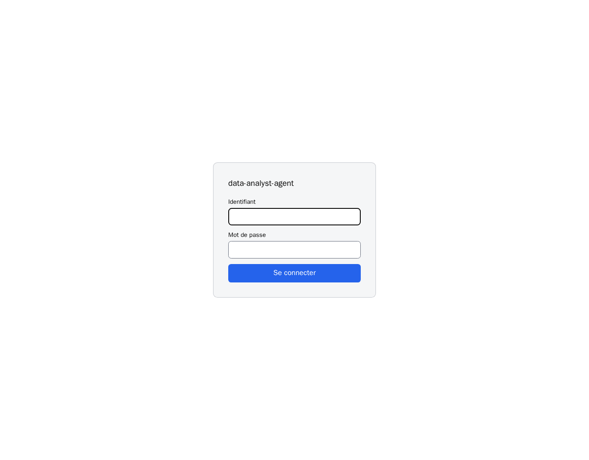

# Démonstration : une matinée avec l'agent

Camille dirige le service commercial des **Cycles du Ponant**, un fabricant de
vélos. Ce matin, Camille ouvre l'agent pour la première fois.

Ce qui suit est **une seule conversation**, du premier message au dernier.
Chaque échange montre une capacité de l'agent.
Les captures viennent du service installé, prises le 25 septembre 2026 : la
question est celle qui a été tapée, la réponse celle qui a été rendue, sans
retouche.

Pour se servir de l'agent pas à pas : [Guide utilisateur](GUIDE-UTILISATEUR.md).
Pour ce qu'il ne sait pas faire : [Livraison, §3](LIVRAISON.md#3-les-limites-connues).

---

## 0. Se connecter

Un identifiant, un mot de passe. Les comptes sont créés par l'exploitant.

## 1. Faire connaissance

Camille commence par demander à l'agent ce qu'il sait faire.

**Ce que ça montre :** l'agent décrit ses capacités réelles : interroger une
source, analyser et tracer, prédire.

## 2. Découvrir les sources

**Ce que ça montre :** l'agent liste les sources déclarées, et leur type.
Il n'en invente aucune.

## 3. Choisir sa source, en le disant

Camille n'a pas de menu à ouvrir : il suffit de dire sur quoi travailler.

**Ce que ça montre :** l'agent garde la source pour toute la conversation, et
annonce ce qu'elle contient : 4 tables, 180 commandes, l'année 2025.

## 4. Comprendre la source

**Ce que ça montre :** chaque table, chaque colonne, son type, ses clés, et les
liens entre les tables. Les valeurs possibles d'une colonne sont données quand
elles sont peu nombreuses.

## 5. Compter

**Attendu : 180.**

**Ce que ça montre :** l'agent écrit le SQL, l'exécute, et suit le dictionnaire
de la source : un comptage de commandes ne filtre pas sur leur statut.

## 6. Additionner, sans tomber dans le piège

**Attendu : 1 496 743,00 €.** Une somme naïve rendrait 1 636 093 €.

**Ce que ça montre :** 16 commandes ont été annulées et n'ont jamais été
facturées. Le dictionnaire exige de les écarter de toute somme en euros.
L'agent le fait, et le dit.

## 7. Joindre plusieurs tables

**Attendu : ACC-03, le porte-bagages Cargo léger, 264 unités.**

**Ce que ça montre :** la réponse traverse trois tables (produits, lignes de
commande, commandes). Camille n'a rien eu à savoir de leur structure.

## 8. Tracer un graphique

**Attendu : magasin 862 229 €, en ligne 331 499 €, grossiste 303 015 €.**

**Ce que ça montre :** l'agent écrit du Python et l'exécute dans un bac à sable
isolé du réseau. La réponse redonne les chiffres du graphique.

## 9. Modifier le graphique

Camille ne veut comparer que deux canaux.

**Ce que ça montre :** « refais-le » suffit. L'agent sait de quel graphique il
s'agit, et le refait avec la modification demandée.

## 10. Demander ce qu'une donnée veut dire

**Attendu : annulée avant expédition.**

**Ce que ça montre :** le sens vient du dictionnaire de la source, et l'agent y
ajoute le décompte : 16 commandes.

## 11. Croiser deux sources

**Attendu : 4 413 unités fabriquées, 1 828 vendues.**

**Ce que ça montre :** la question porte à la fois sur les ventes et sur la
fabrication. L'agent ajoute lui-même la source `production`, relie les deux par
le code produit, et écarte les commandes annulées des ventes.

## 12. Changer de source en cours de route

**Attendu : M-009, 16 arrêts.**

**Ce que ça montre :** on change de source comme on l'a choisie, en le disant.
L'agent annonce la bascule, puis répond sur la nouvelle source.

## 13. Prédire

**Attendu : n'a pas survécu.**

**Ce que ça montre :** l'agent lit les caractéristiques dans la phrase et
interroge un modèle de machine learning déclaré. Il rend la prédiction et sa
probabilité, 91,1 %.

---

## Refaire cette démonstration

Poser les mêmes questions, dans cet ordre, dans une nouvelle conversation.
Si un chiffre diffère de celui annoncé ci-dessus, ce n'est pas la page qu'il
faut corriger : c'est une régression à mesurer
([Relevé de livraison](releve-de-livraison.md)).
