# Démonstration de data-analyst-agent

## Ce que fait l'agent

| # | Capacité | Question posée |
|---|---|---|
| [1](#1-présenter-ses-capacités) | Présenter ses capacités | « Bonjour ! Que sais-tu faire ? » |
| [2](#2-lister-les-sources) | Lister les sources | « Sur quelles sources pouvons-nous travailler ? » |
| [3](#3-choisir-une-source-en-parlant) | Choisir une source en parlant | « J'aimerais travailler sur les ventes. » |
| [4](#4-décrire-une-source) | Décrire une source | « Tu peux me la décrire ? » |
| [5](#5-compter) | Compter | « Combien de commandes avons-nous reçues en 2025 ? » |
| [6](#6-additionner-selon-les-règles-de-la-source) | Additionner selon les règles de la source | « Quel chiffre d'affaires avons-nous réalisé en 2025 ? » |
| [7](#7-joindre-plusieurs-tables) | Joindre plusieurs tables | « Quel produit s'est le plus vendu en nombre d'unités en 2025 ? » |
| [8](#8-tracer-un-graphique) | Tracer un graphique | « Fais-moi un graphique du chiffre d'affaires 2025 par canal de vente. » |
| [9](#9-modifier-un-graphique) | Modifier un graphique | « Refais-le en ne gardant que les canaux magasin et en ligne. » |
| [10](#10-expliquer-une-donnée) | Expliquer une donnée | « Que veut dire le statut ANN ? » |
| [11](#11-croiser-deux-sources) | Croiser deux sources | « Est-ce qu'on vend plus que ce qu'on produit ? » |
| [12](#12-changer-de-source) | Changer de source | « Passons sur production. Quelle machine a connu le plus d'arrêts en 2025 ? » |
| [13](#13-prédire) | Prédire | « Un homme de 30 ans en 3e classe… aurait-il survécu ? » |

## Le cas d'usage

Un fabricant de vélos, les Cycles du Ponant, veut analyser son activité 2025 :
ses ventes, sa fabrication, ses machines.
Ses données sont réparties dans plusieurs sources : une base Postgres pour les
ventes, une base DuckDB pour l'atelier, un classeur Excel pour les stocks.

Les treize échanges ci-dessous forment **une seule conversation**, dans l'ordre.
Les captures viennent du service installé, le 25 septembre 2026, sans
retouche. Chaque réponse porte un chiffre vérifiable, indiqué sous la capture.

Mode d'emploi : [Guide utilisateur](GUIDE-UTILISATEUR.md).
Limites connues : [Livraison, §3](LIVRAISON.md#3-les-limites-connues).

---

## 1. Présenter ses capacités

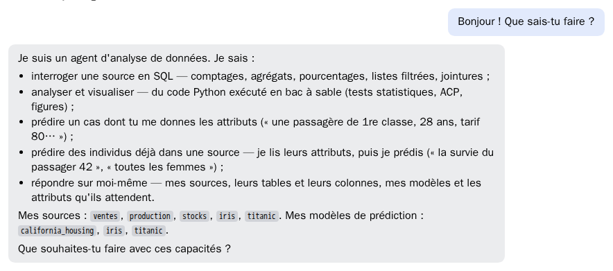

L'agent décrit ce qu'il sait faire : interroger une source, analyser et tracer,
prédire.

## 2. Lister les sources

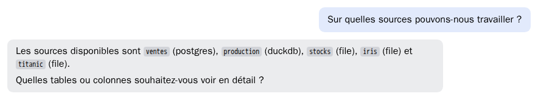

L'agent liste les sources déclarées et leur type. Il n'en invente aucune.

## 3. Choisir une source en parlant

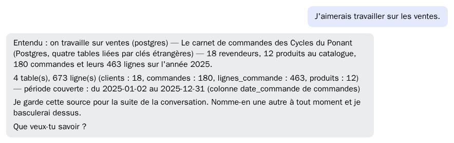

Aucun menu : la source se choisit en le disant.
L'agent la garde pour toute la conversation et annonce son contenu : 4 tables,
180 commandes, l'année 2025.

## 4. Décrire une source

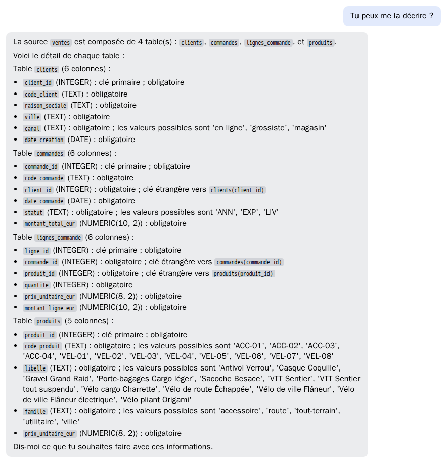

Chaque table, chaque colonne, son type, ses clés et les liens entre tables.
Les valeurs possibles d'une colonne sont données quand elles sont peu nombreuses.

## 5. Compter

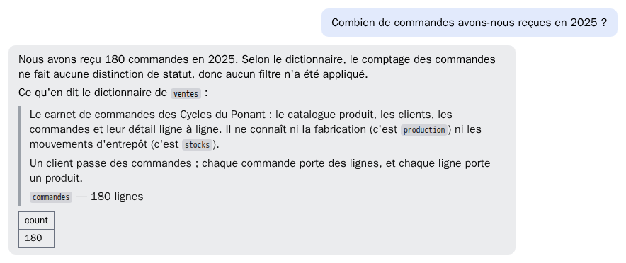

**Attendu : 180.**
L'agent écrit le SQL, l'exécute, et suit le dictionnaire de la source : un
comptage de commandes ne filtre pas sur leur statut.

## 6. Additionner selon les règles de la source

**Attendu : 1 496 743,00 €.** Une somme naïve rendrait 1 636 093 €.
Les 16 commandes annulées n'ont jamais été facturées. Le dictionnaire impose de
les écarter de toute somme en euros : l'agent le fait, et le dit.

## 7. Joindre plusieurs tables

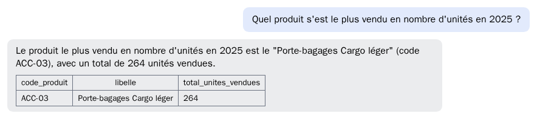

**Attendu : ACC-03, porte-bagages Cargo léger, 264 unités.**
La réponse traverse trois tables : produits, lignes de commande, commandes.

## 8. Tracer un graphique

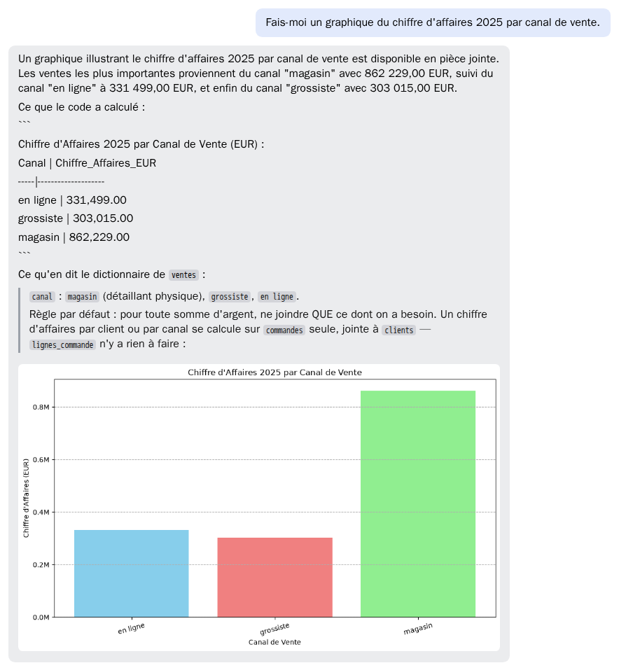

**Attendu : magasin 862 229 €, en ligne 331 499 €, grossiste 303 015 €.**
L'agent écrit du Python et l'exécute dans un bac à sable isolé du réseau.
La réponse redonne les chiffres du graphique.

## 9. Modifier un graphique

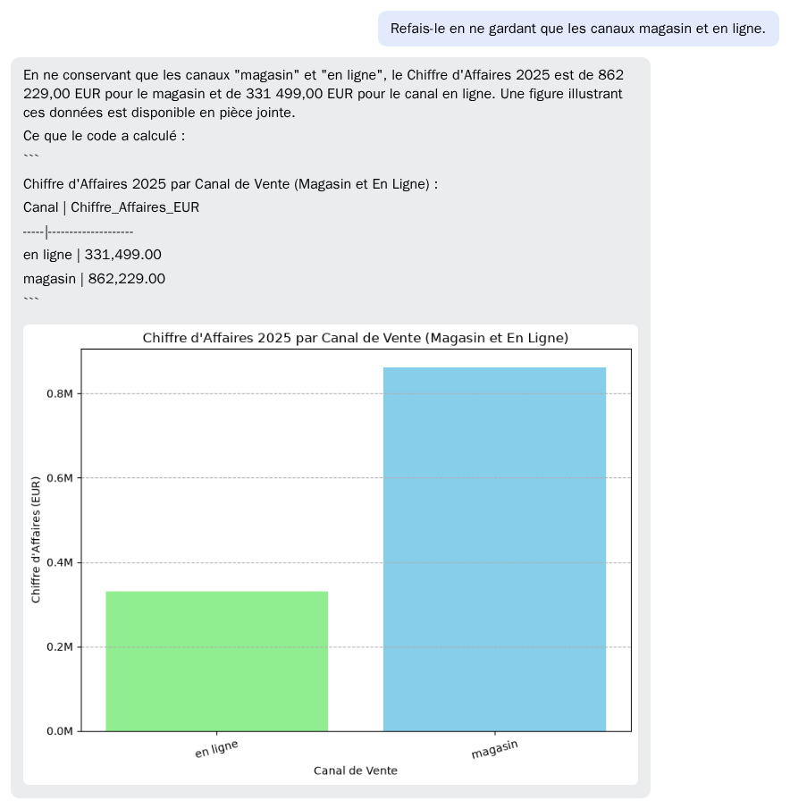

« Refais-le » suffit : l'agent sait de quel graphique il s'agit et applique la
modification demandée.

## 10. Expliquer une donnée

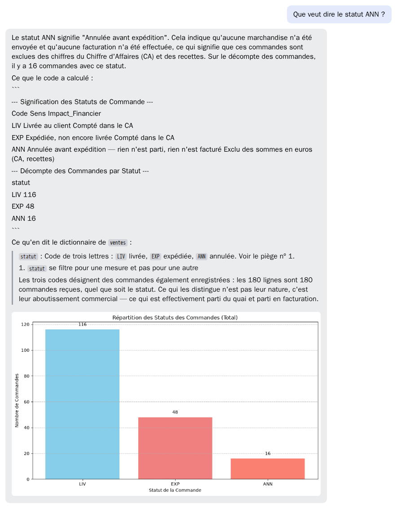

**Attendu : annulée avant expédition.**
Le sens vient du dictionnaire de la source ; l'agent y ajoute le décompte :
16 commandes.

## 11. Croiser deux sources

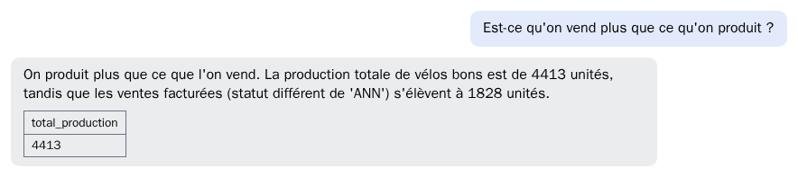

**Attendu : 4 413 unités fabriquées, 1 828 vendues.**
La question porte sur les ventes et sur la fabrication. L'agent ajoute la
source `production`, relie les deux par le code produit, et écarte les
commandes annulées des ventes.

## 12. Changer de source

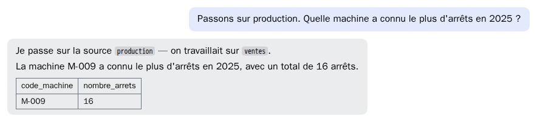

**Attendu : M-009, 16 arrêts.**
La source change en le disant. L'agent annonce la bascule, puis répond sur la
nouvelle source.

## 13. Prédire

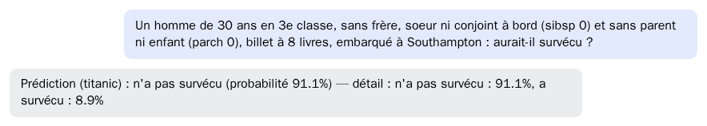

**Attendu : n'a pas survécu (91,1 %).**
L'agent lit les caractéristiques dans la phrase, interroge le modèle de
machine learning déclaré, et rend la prédiction avec sa probabilité.

---

## Rejouer la démonstration

Poser les mêmes questions, dans cet ordre, dans une nouvelle conversation.
Un chiffre différent de celui indiqué signale une régression à mesurer :
[Relevé de livraison](releve-de-livraison.md).
