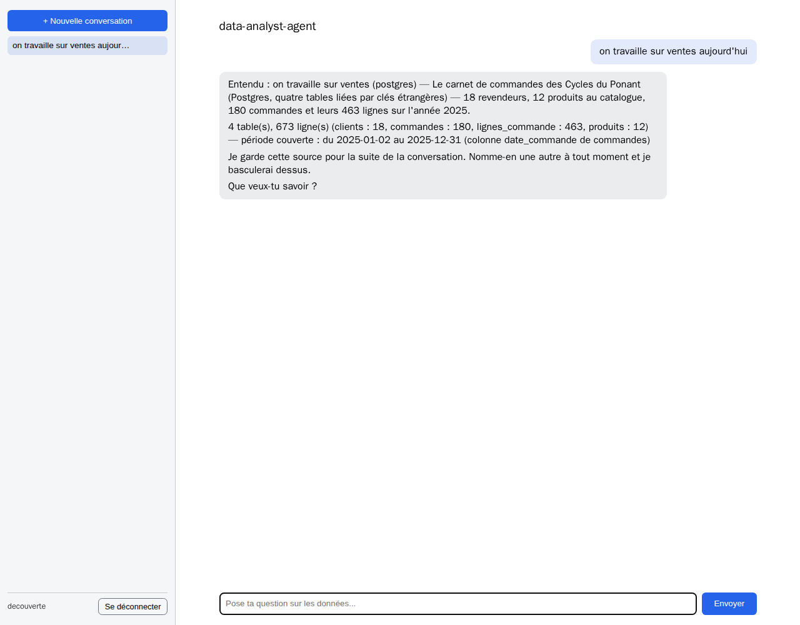
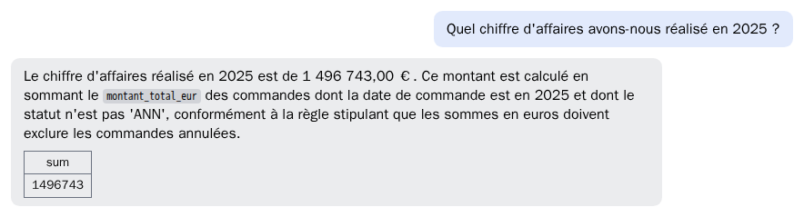
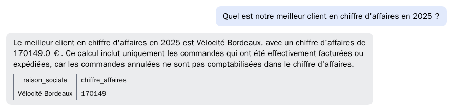
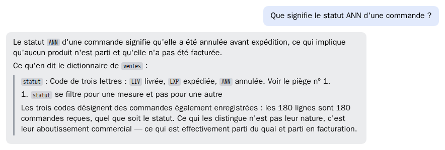
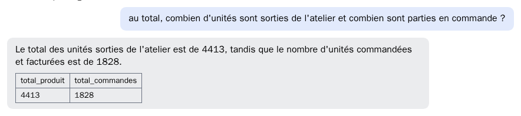
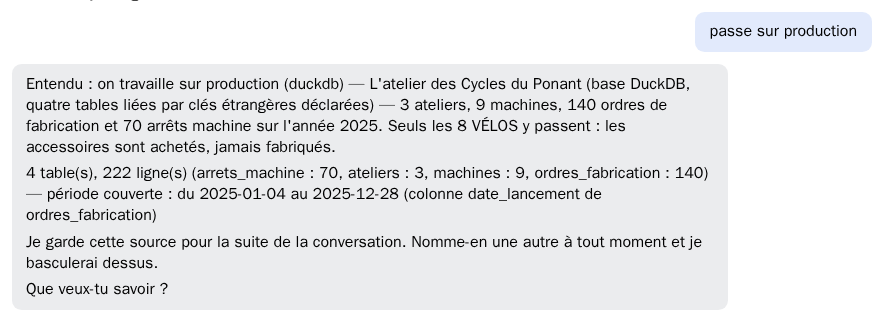
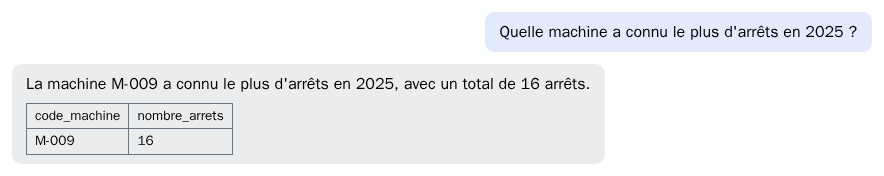
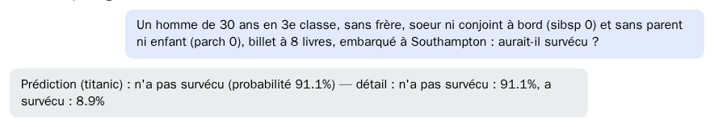

# Ce que l'application sait faire, en images

Chaque image de cette page est une capture du **service installé**.
Prise le 25 septembre 2026, en HTTPS, sur `acbe37e`, avec un compte ordinaire.
Rien n'est retouché : la question est celle qui a été tapée, la réponse celle
qui a été rendue.

Le catalogue en service est celui des **Cycles du Ponant**, un fabricant de
vélos (voir [sources-metier.md](sources-metier.md)).
Chaque réponse porte un chiffre que l'on peut vérifier de tête, donné sous
l'image.

Pour se servir de l'application pas à pas : [GUIDE-UTILISATEUR.md](GUIDE-UTILISATEUR.md).
Pour ce qu'elle ne sait pas faire : [LIVRAISON.md §3](LIVRAISON.md#3-les-limites-connues).

## 1. Se connecter

Un identifiant et un mot de passe.
Les comptes sont créés par l'exploitant (voir [EXPLOITATION.md](EXPLOITATION.md)).

## 2. Choisir sa source, en parlant

Il n'y a pas de menu : on dit sur quoi on travaille.
L'agent lie la source à la conversation et dit ce qu'elle contient : ses tables,
ses lignes, la période qu'elle couvre.
Les conversations restent à gauche, et se rouvrent.

## 3. Compter

Source : `ventes`. Attendu : **180**.
Le dictionnaire de la source dit qu'un comptage ne filtre pas sur le statut.
L'agent l'applique, et le dit.

## 4. Additionner, en respectant les règles de la source

Source : `ventes`. Attendu : **1 496 743,00 €**.
Le piège : 16 commandes annulées pèsent 139 350 €. Une somme naïve rend
1 636 093 €.
L'agent écarte les annulées, parce que le dictionnaire l'exige pour toute somme
en euros, et il le dit.

## 5. Classer

Source : `ventes`. Attendu : **Vélocité Bordeaux, 170 149 €**.
Un classement en euros suit la même règle : seules les commandes facturées
comptent.

## 6. Tracer un graphique

Source : `ventes`. Attendu : **magasin 862 229 €, en ligne 331 499 €,
grossiste 303 015 €**.
Le graphique est calculé dans un bac à sable isolé du réseau.
La réponse redonne les chiffres du graphique, et ce qu'en dit le dictionnaire.

## 7. Demander ce qu'une donnée veut dire

Source : `ventes`. Attendu : **annulée avant expédition**.
Une question de sens reçoit un sens, pris dans le dictionnaire, et pas un
tableau de valeurs.

## 8. Croiser deux sources

Sources : `production` et `ventes`. Attendu : **4 413 unités fabriquées,
1 828 vendues**.
La question ne nomme aucune source : l'agent trouve lui-même les deux, les monte
ensemble, et les relie par le code produit.
Les 1 828 unités vendues écartent les commandes annulées (2 006 sans le filtre).

## 9. Changer de source en cours de route

Source : `production`. Attendu : **M-009, 16 arrêts**.
On change de source comme on l'a choisie : en le disant.
La question suivante porte sur la nouvelle source.

## 10. Prédire

Source : `titanic`, modèle déclaré au registre. Attendu : **n'a pas survécu**.
L'agent extrait les caractéristiques de la phrase et interroge le modèle.
Il rend la classe prédite et sa probabilité.

## 11. Demander ce qui est disponible

L'agent répond avec les sources réellement déclarées.
Il n'en invente pas.

## Refaire ces captures

Les captures se refont contre le service, avec un compte ordinaire et un
navigateur sans écran.
Chaque question est posée une fois, et la capture prise quand la réponse est
arrivée.
Si un chiffre sort différent de celui écrit sous l'image, ce n'est pas l'image
qu'il faut changer : c'est une régression à mesurer (voir
[releve-de-livraison.md](releve-de-livraison.md)).
