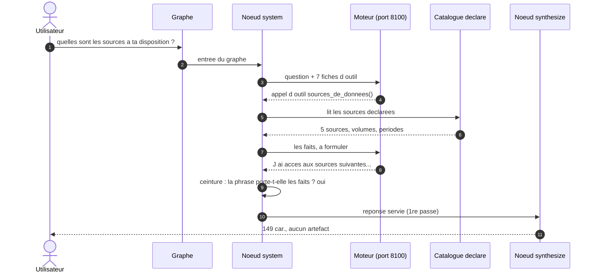
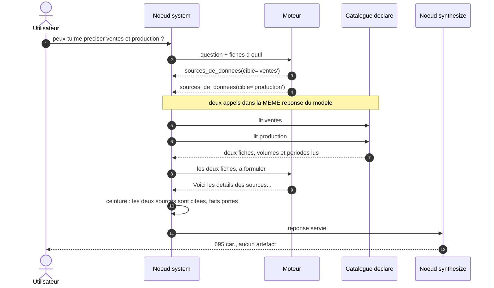
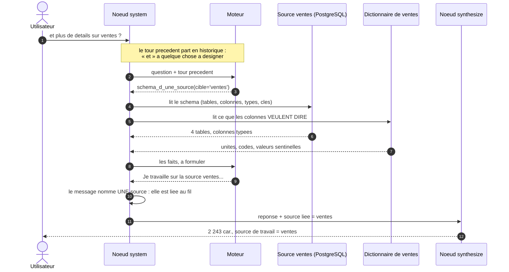
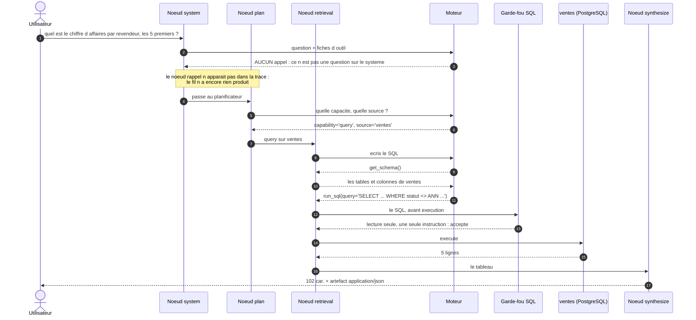
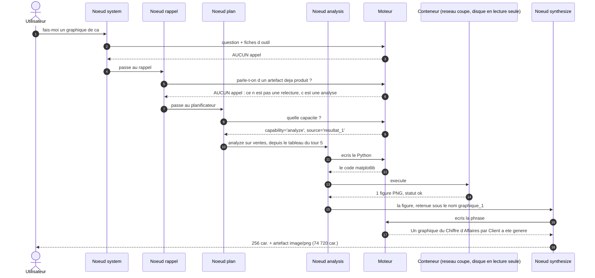
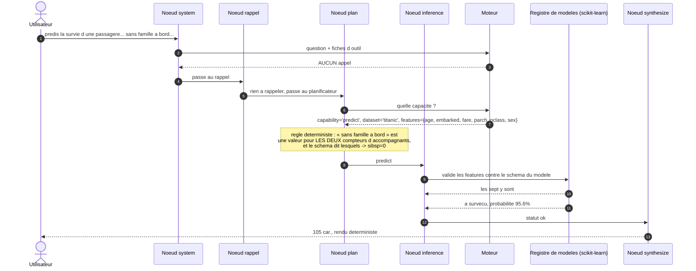
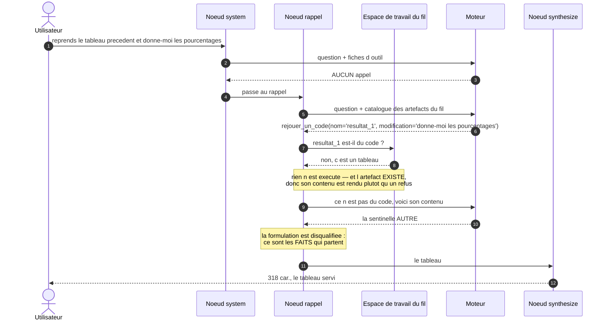

# Le parcours de l'agent, en huit conversations

Ce document montre ce que l'application fait **réellement** quand on lui parle :
quel nœud est traversé, quel outil est appelé, combien d'allers-retours avec le
moteur, qui écrit la phrase finale.

Rien n'y est dessiné de mémoire. Chaque diagramme est établi à partir d'une
trace relevée, et le relevé se rejoue :

```bash
uv run python scripts/releve_des_parcours.py --markdown docs/releve-des-parcours.md
```

Le relevé obtenu est dans [`docs/releve-des-parcours.md`](releve-des-parcours.md).
Les chiffres cités ici en sortent. Ils ont été relevés le 2026-09-17 sur le
catalogue `sources/metier/catalogue.yaml`. Un autre tirage donnera d'autres
phrases : le modèle n'est pas déterministe. Les chemins, eux, sont stables.

---

## Les huit nœuds

Le graphe est construit dans
[`src/data_analyst_agent/orchestrator/graph.py`](../src/data_analyst_agent/orchestrator/graph.py).
Un tour de conversation le traverse une fois, de l'entrée à la fin.

| nœud | ce qu'il fait |
|---|---|
| `system` | Demande au modèle : « est-ce une question sur moi ? ». S'il appelle un outil de faits, la question était sur le système et le tour s'arrête là. |
| `rappel` | Demande : « parle-t-on de quelque chose que ce fil a déjà produit ? ». Se retire sans appeler le modèle quand le fil n'a rien produit. |
| `plan` | Choisit la capacité — interroger, analyser, prédire — et la source. |
| `retrieval` | Écrit du SQL et l'exécute sur la source. |
| `analysis` | Écrit du Python et l'exécute dans un conteneur. |
| `inference` | Appelle un modèle de prédiction du registre. |
| `fetch_predict` | Va chercher une ligne dans une source, puis prédit dessus. |
| `synthesize` | Écrit la phrase que l'utilisateur lit — ou sert un texte déterministe. |

L'ordre n'est pas libre : `system` est l'entrée, `rappel` vient ensuite, `plan`
n'est atteint que si les deux se sont retirés, et tout finit par `synthesize`.

## Les sept outils de l'agent système

Ce sont les seuls outils du nœud `system`. Ils lisent la configuration et les
sources déclarées ; aucun n'écrit ni ne calcule. Ils sont définis dans
[`src/data_analyst_agent/orchestrator/systeme.py`](../src/data_analyst_agent/orchestrator/systeme.py).

| outil | ce qu'il rend |
|---|---|
| `capacites_de_l_agent` | ce que l'agent sait faire, et sur quoi |
| `sources_de_donnees` | les sources déclarées : nom, type, description, volume, période |
| `chercher_une_source` | la source qui parle d'un sujet, quand la question ne la nomme pas |
| `schema_d_une_source` | les tables, colonnes et types d'une source, et ce que son dictionnaire dit de leur sens |
| `travailler_sur_une_source` | retient une source comme source de travail du fil |
| `modeles_de_prediction` | les modèles du registre : tâche, cible, classes, unité |
| `attributs_d_un_modele` | les attributs qu'un modèle attend pour prédire |

---

# Le fil, tour par tour

Les huit messages s'enchaînent dans une seule conversation. Chaque tour reçoit
ce que le précédent a laissé : la source liée, l'échange précédent, la
prédiction en attente. C'est ce que fait la route `/chat` de
[`src/data_analyst_agent/api/app.py`](../src/data_analyst_agent/api/app.py), et
c'est ce que le runner refait.

## 1 — « quelles sont les sources à ta disposition ? »



**Trace relevée.** `system` → `synthesize`. Un seul outil appelé :
`sources_de_donnees` sans argument. **2 appels LLM** — un pour décider et
appeler l'outil, un pour formuler. Réponse de 149 caractères, aucun artefact.

> J'ai accès aux sources suivantes : `ventes`, `production`, `stocks`, `iris`,
> et `titanic`. Que souhaitez-vous savoir sur une source en particulier ?

**Ce qui ne se passe pas.** Aucune base n'est ouverte pour répondre. Aucun SQL
n'est écrit. Aucun Python n'est exécuté. Les nœuds `plan`, `retrieval` et
`analysis` ne sont pas atteints — le tour s'est arrêté à `system`.

## 2 — « peux-tu me préciser ventes et production ? »



**Trace relevée.** `system` → `synthesize`. **Deux appels de
`sources_de_donnees` dans la même réponse du modèle**, l'un avec
`cible='ventes'`, l'autre avec `cible='production'`. **2 appels LLM** : le
modèle demande les deux fiches en une fois, puis formule.

> Voici les détails des sources `ventes` et `production` : La source `ventes`
> est une base de données PostgreSQL qui contient le carnet de commandes des
> Cycles du Ponant. Elle comprend 4 tables, 673 lignes, et couvre la
> période […]

## 3 — « et plus de détails sur ventes ? » — la source se lie au fil



**Trace relevée.** `system` → `synthesize`. Un appel :
`schema_d_une_source(cible='ventes')`. **2 appels LLM**. Réponse de 2 243
caractères. **Après ce tour, la source liée au fil est `ventes`** — elle le
restera pour tous les tours suivants.

Lire le schéma ouvre la source. C'est le premier tour du fil qui le fait, et il
ne lit que la structure : aucune ligne de donnée n'est ramenée.

## 4 — « parle-moi un peu de stocks et de titanic, en deux mots » — la ceinture

```mermaid
sequenceDiagram
    autonumber
    actor U as Utilisateur
    participant S as Noeud system
    participant M as Moteur
    participant P as plancher des sources nommees
    participant Y as Noeud synthesize

    U->>S: parle-moi un peu de stocks et de titanic, en deux mots
    S->>M: question + fiches d outil
    M-->>S: AUCUN appel d outil, une phrase libre
    S->>P: le message nomme 2 sources declarees et rien n a ete appele
    P-->>S: les fiches de stocks et titanic, servies d office
    S->>S: ceinture : la 1re formulation ne porte pas ces faits
    Note over S,M: 1re passe ECARTEE (reponse hors sujet)
    S->>M: les memes faits, la meme question : RECOMMENCE
    M-->>S: Stocks : entrepots, mouvements ; Titanic : survie, age.
    S->>S: ceinture : la 2e formulation porte les faits
    S->>Y: reponse servie (2e passe)
    Y-->>U: 92 car.
```

**Trace relevée.** `system` → `synthesize`. Détail du nœud :
`plancher_des_sources_nommees — reformulé au second tour (réponse hors sujet)`.
**Aucun appel d'outil émis par le modèle** — c'est le plancher, un mécanisme
déterministe, qui a servi les fiches. **2 appels LLM** : la première
formulation, puis la seconde. Réponse de 92 caractères.

> Stocks : entrepôts, mouvements ; Titanic : survie, âge.
> Que souhaitez-vous savoir d'autre ?

**Ce que la ceinture compare.** Elle prend les faits que les outils (ou le
plancher) ont rendus, et la phrase que le modèle a écrite. Elle refuse une
phrase qui invente un nom, qui omet un nom rendu par l'outil, ou qui cite une
source sans porter un seul fait de sa fiche.

**Ce qui arrive ensuite.** Trois voies, dans cet ordre :

1. **1re passe** — la formulation passe, elle part telle quelle ;
2. **2e passe** — elle est écartée, on rend au modèle les mêmes faits et la
   même question pour qu'il recommence ; c'est ce qui s'est passé ici ;
3. **repli** — la seconde échoue aussi : les faits sont servis tels quels, sans
   phrase de modèle.

## 5 — « quel est le chiffre d'affaires par revendeur, les 5 premiers ? »



**Trace relevée.** `system` → `plan` → `retrieval` → `synthesize`. **5 appels
LLM.** Trois appels d'outil émis : `final_result` (le plan : `capability='query'`,
`source='ventes'`), puis `get_schema()` et `run_sql(...)`. Un artefact
`application/json` de 247 caractères. La phrase finale est déterministe —
« résumé déterministe (multi-lignes) » — le modèle n'y touche pas.

Le SQL relevé :

```sql
SELECT c.raison_sociale, SUM(o.montant_total_eur) AS chiffre_affaires
FROM commandes o JOIN clients c ON o.client_id = c.client_id
WHERE o.statut <> 'ANN'
GROUP BY c.raison_sociale ORDER BY chiffre_affaires DESC LIMIT 5;
```

Deux choses s'y lisent. La **jointure** : « revendeur » n'est pas une colonne de
`commandes`, il a fallu aller chercher `clients`. Et le **`statut <> 'ANN'`** :
rien dans la question ne le demande ; il vient du dictionnaire de la source, qui
écrit qu'une somme d'argent exclut les commandes annulées.

**Le SQL est écrit par le modèle et vérifié chez nous avant exécution.** Le
garde-fou est dans
[`src/data_analyst_agent/agents/retrieval/sql.py`](../src/data_analyst_agent/agents/retrieval/sql.py) :
il refuse ce qui n'est pas une lecture. Ce n'est pas le modèle qui décide de ce
qui part à la base.

## 6 — « fais-moi un graphique de ça »



**Trace relevée.** `system` → `rappel` → `plan` → `analysis` → `synthesize`.
**5 appels LLM.** Le nœud `analysis` relève « 1 essai(s), 1 figure(s), statut
ok — retenu sous le nom `graphique_1` ». Un artefact `image/png` de 74 720
caractères.

Le plan désigne `source='resultat_1'` : ce n'est pas une source du catalogue,
c'est le **tableau produit au tour 5**, réexposé au fil. « ça » a trouvé quelque
chose à désigner.

**Le Python tourne en conteneur, réseau coupé, disque en lecture seule.** Le
contrat est dans
[`src/data_analyst_agent/sandbox/client.py`](../src/data_analyst_agent/sandbox/client.py)
et le cadrage dans [`docs/CADRAGE.md`](CADRAGE.md). Le code écrit par le modèle
ne s'exécute jamais dans le processus de l'application.

C'est le seul tour du fil où `synthesize` appelle le modèle. Ailleurs, la phrase
est déterministe ou vient déjà de `system`.

## 7 — « prédis la survie d'une passagère de 1re classe de 28 ans… »



**Trace relevée.** `system` → `rappel` → `plan` → `inference` → `synthesize`.
**3 appels LLM.** Le nœud `inference` relève « statut ok ». Rien n'est en
attente après le tour.

> Prédiction (titanic) : a survécu (probabilité 95.6%) — détail : n'a pas
> survécu : 4.4%, a survécu : 95.6%

**« Sans famille à bord » est lu, et ce n'est pas le modèle qui le lit.** Le
planificateur en tire `parch=0` et laisse `sibsp` de côté — c'est ce que le
relevé montre, et c'est ce qu'il montrait avant. Ce qui a changé est en aval :
le schéma
([`titanic.py`](../src/data_analyst_agent/agents/inference/schemas/titanic.py))
DÉCLARE que `sibsp` et `parch` comptent tous deux des accompagnants, une
construction fermée reconnaît dans le message qu'il n'y en a aucun
([`accompagnants.py`](../src/data_analyst_agent/agents/inference/accompagnants.py)),
et une règle du plan remplit ce que l'utilisateur n'a pas donné autrement. Ce
que l'utilisateur a donné explicitement prime toujours : la règle ne peut
qu'ajouter.

**Le modèle de prédiction n'est pas le moteur de langage.** C'est un modèle
scikit-learn du registre
[`src/data_analyst_agent/agents/inference/registry.py`](../src/data_analyst_agent/agents/inference/registry.py),
chargé depuis le disque, avec un schéma de features déclaré. Le moteur de
langage lit la phrase et en extrait les features ; c'est tout ce qu'il fait ici.

## 8 — « reprends le tableau précédent et donne-moi les pourcentages »



**Trace relevée.** `system` → `rappel` → `synthesize`. **4 appels LLM.** Le
nœud `rappel` relève « rejouer_un_code — faits servis (sentinelle rendue alors
qu'un outil a été appelé) ». Le tour ne va pas jusqu'au planificateur : le
rappel a servi.

> resultat_1 (tableau de 5 ligne(s) ; colonnes : raison_sociale,
> chiffre_affaires) — ce n'est pas du code : rien n'a été exécuté, et voici son
> contenu :
> raison_sociale,chiffre_affaires
> Vélocité Bordeaux,170149.0 […]

**Le modèle demande à REJOUER un tableau.** C'est une erreur de sa part — on ne
réexécute pas un CSV — et l'outil ne l'exécute pas. Ce qu'il fait à la place :
il rend le contenu. Un artefact qui existe ne se cache pas derrière un refus ;
la demande porte sur ce que le tableau contient, et ce contenu part.

**Puis le modèle renonce**, et rend la sentinelle. La ceinture
(``defaut_de_formulation``) la disqualifie — un tour où un outil a répondu
n'est plus « pas pour moi » — et ce sont les faits qui sont servis. C'est ce
qu'on voit ici : le tableau, sans les pourcentages. Sur un tableau plus court,
le même tour formule et les calcule ; sur celui-ci, mesuré 5 tirages sur 5, le
modèle rend d'abord une réponse vide, puis la sentinelle. Ce qui est garanti
est que **le tableau est retrouvé et servi** — ce qui l'est moins est que le
modèle sache en tirer un pourcentage.

---

# Ce qui ne se passe pas

- Une question sur les sources — tours 1 à 4 — **n'ouvre aucune base pour
  répondre**, **n'écrit aucun SQL**, **n'exécute aucun Python**. Le tour
  s'arrête au nœud `system`. Lire un schéma (tour 3) ouvre la source pour en
  lire la structure, et ne ramène aucune ligne.
- Le nœud `rappel` **n'appelle pas le modèle** quand le fil n'a rien produit.
  Au tour 5, il n'apparaît même pas dans la trace.
- Le nœud `synthesize` **n'appelle pas le modèle** dans les huit tours. La
  phrase vient de `system` (tours 1 à 4), d'un résumé déterministe (tour 5), du
  rendu du modèle de prédiction (tour 7) ou des faits d'un outil de rappel
  (tour 8).
- Le tour 8 **n'atteint pas le planificateur** : le rappel a servi, et le
  graphe va directement à la synthèse.
- **Un seul service d'inférence est appelé, et il est sur cette machine** :
  celui que `DAA_LLM_BASE_URL` désigne, port 8100. Il n'y en a pas d'autre. Le
  relevé le nomme en tête de chaque exécution.

# Le coût, en appels LLM

| tour | message | nœuds | appels LLM |
|---|---|---|---|
| 1 | quelles sont les sources à ta disposition ? | `system` → `synthesize` | 2 |
| 2 | peux-tu me préciser ventes et production ? | `system` → `synthesize` | 2 |
| 3 | et plus de détails sur ventes ? | `system` → `synthesize` | 2 |
| 4 | parle-moi un peu de stocks et de titanic | `system` → `synthesize` | 2 |
| 5 | quel est le chiffre d'affaires par revendeur ? | `system` → `plan` → `retrieval` → `synthesize` | 5 |
| 6 | fais-moi un graphique de ça | `system` → `rappel` → `plan` → `analysis` → `synthesize` | 7 |
| 7 | prédis la survie d'une passagère… | `system` → `rappel` → `plan` → `inference` → `synthesize` | 3 |
| 8 | reprends le tableau précédent… | `system` → `rappel` → `synthesize` | 4 |

**27 appels LLM pour huit tours.** Le nœud `system` en coûte un en tête de
chaque question, y compris celles qui ne le concernent pas : c'est le prix de ne
pas reconnaître les questions méta par un lexique, et il est assumé
([`docs/surface-conversationnelle.md`](surface-conversationnelle.md)).

---

# Trois défauts corrigés, et ce qui reste

Ce document décrivait trois défauts relevés ici même. Ils sont corrigés, et le
relevé ci-dessus est celui d'APRÈS. Ce qui suit dit ce qui a changé, et ce qui
n'a pas changé.

**Une prédiction en attente ne confisque plus le fil.** Les nœuds `system` et
`rappel` se retirent quand une prédiction attend des features : c'est
délibéré — un « oui » ou « une femme » doit aller compléter la prédiction, et
non se faire attraper par un autre agent. Ce retrait n'était pas borné, et il
emportait tout : sur un fil qui avait produit un tableau, « reprends le tableau
précédent » ne trouvait plus rien, le planificateur partait en `query` sur un
objet qu'il n'interroge pas, et l'utilisateur lisait « je n'ai pas interrogé la
source ». Le retrait du nœud `rappel` est maintenant borné par
``designation_dun_artefact_passe`` — la construction que ce nœud emploie déjà :
un message qui désigne un artefact déjà produit ne complète pas une prédiction.
Et un tour qui ne s'est pas prononcé sur la prédiction ne l'efface plus
(``Orchestrator._pending_retenu``) : sans cela, borner le retrait n'aurait fait
que déplacer la confiscation — le tableau redevenait atteignable et c'est la
prédiction qui se perdait.

**La prédiction aboutit.** « Sans famille à bord » fixe les deux compteurs
d'accompagnants, et non un seul (tour 7). La clause est en outre retirée d'une
SECONDE lecture quand la première laisse la prédiction incomplète : mesuré, sa
seule présence faisait perdre au planificateur `age`, qu'il extrayait 5 tirages
sur 5 sans elle. Le coût est d'un appel LLM, et seulement sur le chemin qui,
sans lui, ne rendait rien.

**Le rappel d'un tableau ne nie plus ce qu'il sert.** L'outil de rejeu passait
au refus des noms inconnus un nom qu'il venait de décorer — « resultat_1 (ce
n'est pas du code) » — et la phrase rendue niait l'artefact qu'elle énumérait
dans la même haleine. Deux choses ont changé : la contradiction est devenue
impossible quelle que soit la main qui appelle (``refus_dartefact`` lit la
désignation, pas le nom nu), et un artefact qui existe ne se cache plus derrière
un refus — rien n'est exécuté, et son contenu est rendu.

**Comment ces trois-là se mesurent.** Pas ici : ce document relève UN fil de
huit messages, et ces défauts demandent des fils construits pour eux — un
tableau, puis une prédiction incomplète, puis un rappel.
[`scripts/mesure_fils_de_prediction.py`](../scripts/mesure_fils_de_prediction.py)
joue huit fils, dont trois témoins, en reportant d'un tour à l'autre ce que la
route `/chat` reporte.

    DAA_CATALOG_PATH=sources/metier/catalogue.yaml \
      uv run python scripts/mesure_fils_de_prediction.py --tirages 3

Avant : `a` 0/3, `d` 0/3, `f` 0/3, `g` 0/3. Après : **8 fils sur 8, 3 tirages
chacun**.

**Ce qui reste, et qui n'est pas de la mécanique du fil.** Au tour 8, le modèle
rend la sentinelle au lieu de formuler ; la ceinture sert alors les faits, donc
le tableau, mais sans les pourcentages. C'est une limite du moteur sur ce
tableau-là — 5 tirages sur 5 — et non du chemin : le tableau est retrouvé et
servi à chaque fois.

---

---

# Vérifier ce document

Un document qui nomme des nœuds et des outils devient faux au premier
renommage, sans que rien ne rougisse.
[`tests/unit/docs/test_parcours_de_l_agent.py`](../tests/unit/docs/test_parcours_de_l_agent.py)
l'en empêche : il vérifie que tout nœud cité existe dans le graphe et que tout
nœud du graphe est cité, que tout outil cité existe parmi les outils de l'agent
système et réciproquement, et que tout fichier cité existe. Un renommage fait
échouer ce test.
